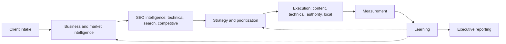
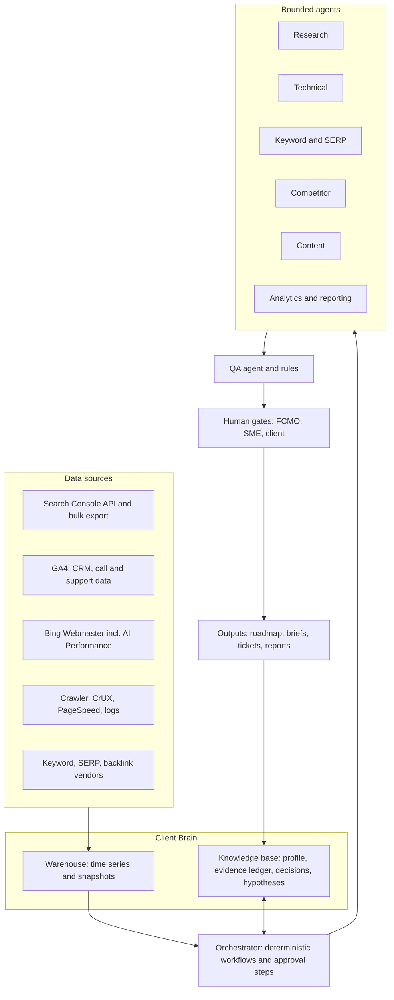

# PHASE 3: The FCMO SEO operating model

## 3.0 Architecture

### The lifecycle



Each stage produces a versioned artifact in the Client Brain. The dotted lines are the point: measurement and learning **rewrite** the business hypotheses and the priority queue. The system is a loop, not a pipeline.

### The system architecture



**Layer responsibilities**

| Layer | Purpose | Typical implementation | Non-negotiables |
|---|---|---|---|
| Data sources | Read-only pulls | Search Console API / BigQuery bulk export; GA4 export; Bing Webmaster API; PageSpeed Insights + CrUX APIs; crawler (Screaming Frog CLI, Sitebulb, or custom); vendor APIs | Least-privilege credentials; per-client isolation; rate and cost budgets |
| Client Brain | Memory and truth | Warehouse (BigQuery/Postgres) for time series; knowledge base (Postgres + vector index, or Notion/Airtable for human-facing registers) | Every record has source, timestamp, confidence, and author (human or agent version) |
| Orchestrator | Determinism | n8n (schedules, webhooks, HTTP/API nodes, AI Agent node, MCP Client Tool, "send and wait" approval steps) [S16] | Deterministic steps wherever the outcome is knowable; agent nodes only for judgment tasks |
| Agents | Bounded reasoning | LLM with tool access scoped per agent (Section 3.8) | Tool allow-lists; no write access to production systems |
| QA | Catch failures | Rule-based checks plus a QA agent plus a human reviewer for client-facing outputs | Golden-case tests before deployment |
| Human gates | Judgment and accountability | FCMO approval; client SME sign-off for claims; legal/compliance where relevant | Approvals logged |
| Outputs | Decisions and work | Roadmap, tickets (Jira/Linear/Asana), briefs, reports | Every output traces back to evidence |

### Task ownership: who does what

| Owner | Use when | Examples |
|---|---|---|
| **API / Automation** | Outcome is deterministic and auditable | Pull GSC data; fetch CrUX; run a crawl; diff robots.txt; compute scores; schedule reports |
| **LLM** | Language transformation or classification with checkable output | Classify intent (with SERP evidence); cluster labels; summarize competitor pages; draft brief skeletons |
| **Human + AI** | Judgment with high leverage, AI accelerates | Strategy synthesis; content angle selection; prioritization review; report narrative |
| **Human** | Relationship, accountability, or irreversible risk | Client interviews; approving claims; outreach to journalists; pricing/scope; publishing YMYL content |

### Autonomy levels (per task, not per tool)

| Level | Name | Definition | Examples | Approval |
|---|---|---|---|---|
| **A0** | Observe | Read-only collection and reporting | Data pulls, alerts, dashboards | None (logged) |
| **A1** | Recommend | Agent drafts findings/recommendations | Audit findings, keyword clusters, brief drafts | Human reviews before it leaves the system |
| **A2** | Execute with approval | Agent applies a change to a **draft/staging** system after explicit approval | Create CMS draft; open dev tickets; prepare schema for review | Named approver per action |
| **A3** | Guarded autonomy | Reversible, low-risk actions inside hard limits | Create alerts; refresh a dashboard; open a *ticket* for a regression | Pre-approved policy; audit log |

**Hard rule:** these never exceed A2 and never run unattended: publishing content, sending outreach, deploying schema or redirects to production, editing robots.txt or sitemaps, submitting disavow files, editing or responding on a Business Profile, responding to reviews, and any spend.

### Cross-cutting components

| Component | What it is | Why it matters |
|---|---|---|
| **Evidence ledger** | Table of claims → source (query, URL, screenshot, doc) → timestamp → confidence | Prevents unsupported statements in client deliverables |
| **Confidence grade** | H / M / L per finding, with rubric (data completeness, source authority, replication) | Lets executives see certainty |
| **Prompt & agent registry** | Versioned system prompts, tool lists, eval scores | Enables audits and rollback |
| **Cost budgets** | Per-run and per-client caps on API units and tokens | Agents are poor judges of query cost. Some SEO API calls cost 50+ units each [S17] |
| **Update-calendar annotations** | Automatic markers for Google core/spam updates and site changes | Prevents misattribution of movement [S12] |
| **Untrusted-input policy** | All web-fetched text is data, never instructions | Prompt-injection defense (Section 3.10) |

---

## 3.1 Stage 1: Client intake

**Goal:** turn a signed engagement into a structured, verified Client Brain record and a measurement plan, and decide whether SEO is the right lever right now.

### Inputs

| Category | Fields | Collected by |
|---|---|---|
| Identity | Legal name, domains, subdomains, CMS, hosting/CDN, dev contact | Form (human) |
| Offer | Products/services, price points, margin, capacity limits, seasonality | Interview (human) → LLM structures |
| Customers | Segments, buyer vs. user, decision makers, top objections, geography | Interview + sales/CRM export |
| Revenue model | New vs. repeat, lifetime value, average deal size, **sales cycle length**, lead-to-close rate | Interview + CRM |
| Objectives | 12-month business goals; what SEO must contribute; acceptable payback period | FCMO facilitation |
| Market | Named competitors (business), substitutes, market maturity, regulated status (YMYL flag) | Interview + research agent |
| Current marketing | Channels, spend, brand assets, email list, PR history | Form |
| History | Past SEO work, penalties/manual actions, migrations, redesigns, tool logins | Form + agent pull |
| Constraints | Dev capacity, SME availability, legal review, brand voice rules, budget, tooling | Interview |
| Access | Search Console, GA4, GBP, Bing Webmaster, CMS (view), CRM (read), tag manager | Access checklist |

### Process (with owners)

1. **Pre-call enrichment (Automation + LLM):** crawl homepage and top pages; pull public SERP snapshots for the brand and 10 obvious head terms; check robots.txt, sitemap, basic CWV, brand SERP composition, GBP presence; draft a "what we already see" one-pager.
2. **Discovery interview (Human):** use a script; record with consent; transcripts go to the Client Brain.
3. **Structure (LLM, human-checked):** populate the client profile schema, flag gaps, and produce **claims needing proof** (differentiators the client asserts).
4. **Channel-fit and viability check (Human):** is search demand real for this offer? Are there gating constraints (no dev access, no SMEs, regulated claims, very long cycle with no attribution path)? Outcome: *Go / Go with conditions / Pause*.
5. **Measurement plan (Human + Automation):** define primary conversions and their CRM mapping; establish baseline window; set annotations; define data-quality checks (tag firing, consent coverage, form source fields).
6. **Initial hypotheses (Human + AI):** 5–10 falsifiable statements (for example, "Service-page cluster X is under-linked; consolidating and linking will lift qualified clicks by ≥15% in 90 days"), each with a metric and review date.

### Outputs

| Output | Format | Owner |
|---|---|---|
| Client profile and business model | Structured record + one-page summary | FCMO approves |
| SEO objectives (tied to revenue) | Objective → metric → target → timeframe | FCMO |
| Measurement plan | Tracking spec + baseline dates | FCMO + analytics |
| Constraint register | List with owner and workaround | FCMO |
| Initial hypotheses | Hypothesis register entries | FCMO |
| Access and risk log | Checklist | Ops |

### Minimum client-profile schema (illustrative)

```yaml
client:
  id: acme-hvac
  domains: [acme-hvac.com]
  ymyl_flag: false
  business_model:
    offers: [ {name, price_band, margin_band, capacity_limit, seasonality} ]
    sales_cycle_days: 21
    lead_to_close: 0.22
    ltv_usd: 4800
  markets: [ {geo, priority, service_area_type} ]
  customers: [ {segment, jobs_to_be_done, objections, language_examples: [...]} ]
  competitors: { business: [...], serp: [], ai_answer: [] }
  differentiators: [ {claim, proof_asset, proof_status} ]
  constraints: { dev_hours_per_month, sme_hours_per_month, legal_review: true }
  measurement: { primary_events: [...], crm_source_field: "utm_source", baseline: {start, end} }
  governance: { approvers: [...], ai_content_policy: "assist_only" }
```

---

## 3.2 Stage 2: Business and market intelligence

**Goal:** understand what the company actually sells, to whom, why they buy, and how they talk, so that search research measures *the right demand*.

| Question | Method | Evidence sources | Owner |
|---|---|---|---|
| What does the company actually sell (vs. what the site says)? | Offer inventory; margin and capacity ranking | Interview, price sheets, CRM closed-won | Human + LLM |
| Who buys, and who influences? | Buyer/user/influencer map | CRM contacts, sales calls | Human + AI |
| Why do customers buy (and choose you)? | Win/loss review; "reason for switching" mining | Call transcripts, reviews, surveys | LLM extracts; human validates |
| Customer pain points and language | Voice-of-customer bank with verbatims | Reviews (own and competitors'), support tickets, sales calls, forums, Reddit | LLM clusters; human curates |
| Purchase journey and cycle | Stage map with typical questions per stage | CRM stage data, sales input, analytics paths | Human + AI |
| Commercial intent map | Which query families precede which offers | GSC queries, paid search terms, sales language | Human + AI |
| Geographic markets | Service-area and priority-market definition | Sales data, GBP insights, GSC by country/region | Human |
| Differentiation and proof | Claims → proof assets → gaps (feeds "non-commodity" content and E-E-A-T evidence) | Case studies, credentials, unique data | Human |
| Market maturity | New / growing / mature / saturated; demand trends | Trends data, competitor content volume, category news | Human + AI |
| Competitor set (business) | Who customers actually compare you with | Sales input, review sites, branded SERPs | Human |

**Outputs:** business model summary; customer-language bank (verbatim, sourced); journey map; **commercial intent map** (query family → offer → funnel stage → revenue relevance); geography map; differentiation-and-proof register; market-maturity note.

**Failure modes to guard against:** treating the client's website copy as the source of truth for what customers want; inventing personas; ignoring sales-team language; missing that a "high-volume" topic isn't what buyers use to decide.

---

## 3.3 Stage 3: Technical SEO audit

**Principle:** *machines detect; humans interpret.* Detection is scheduled and automated. Interpretation (severity in context, tradeoffs, sequencing, developer communication) is human or human+AI.

### Audit check library

Automatable = **Full** (fully automated detection), **Partial** (detect, but needs context), **Manual** (human judgment required).

| Area | What to check | Auto | Data source / tool | Human interpretation |
|---|---|---|---|---|
| **Crawlability** | robots.txt rules; blocked key sections/resources; crawl traps; crawl budget signals on large sites | Full | Crawler; robots.txt diff; GSC Crawl Stats; **server logs** | Is a block intentional (staging, faceted URLs)? |
| **AI crawler access** | Rules for `Googlebot`, `Bingbot`, `OAI-SearchBot`, `GPTBot`, `ChatGPT-User`, and other vendors' search/training/user-fetch bots | Full | robots.txt parse; log sample | Business decision: allow search bots? opt out of training? [S9] |
| **Indexability** | Index status by page type; `noindex`, `X-Robots-Tag`, canonicals to other URLs; "Crawled – not indexed"/"Discovered – not indexed" patterns | Full | GSC Page indexing; URL Inspection API (quota-limited); crawler | Are excluded pages *supposed* to be excluded? |
| **XML sitemaps** | Present, submitted, only indexable canonical URLs, `lastmod` sanity | Full | Crawler; GSC/Bing sitemap status | Does the sitemap represent the business's priority pages? |
| **Canonicals** | Self-referencing, conflicts with redirects/hreflang, canonical chains, rendered vs raw mismatch | Full | Crawler with rendering | Which URL *should* be canonical? |
| **Redirects** | Chains/loops, 302s used as permanent, mixed HTTP/HTTPS, migration maps | Full | Crawler | Intent of each redirect |
| **Status codes / broken links** | 4xx/5xx internal links; soft 404s; broken outbound | Full | Crawler; GSC | Prioritize by traffic/backlinks pointing at the URL |
| **Duplicate / near-duplicate content** | Exact and near duplicates; parameter variants; boilerplate ratio | Partial | Crawler; embedding similarity | Consolidate, canonicalize, or differentiate? |
| **Metadata** | Missing, duplicate, too long/short titles and descriptions; template patterns | Full | Crawler | Rewriting worth it? (Google may rewrite titles) |
| **Heading structure** | Missing H1, skipped levels, headings used for styling | Full | Crawler | Clarity over counts |
| **Internal linking** | Orphans, click depth, hub coverage, anchor-text patterns, links to non-indexable pages | Partial | Crawler graph; embeddings for opportunities | Which links serve users and business priorities? |
| **Site architecture** | URL taxonomy, depth distribution, cluster coverage | Partial | Crawler; content inventory | Architecture change needs strategy and dev cost |
| **Core Web Vitals** | LCP, INP, CLS **field** data (75th percentile) per template; regressions; lab diagnosis | Full | CrUX API/History; PageSpeed Insights API; Lighthouse CI; GSC CWV report | Which template fixes give UX and conversion gains? [S7] |
| **Mobile experience** | Viewport, tap targets, content parity, mobile-first rendering | Partial | Lighthouse; rendering crawl | Real-device QA |
| **Structured data** | Present/valid/eligible; matches visible content; deprecated types (FAQ) flagged; Organization/LocalBusiness/Product/Article coverage | Partial | Crawler extraction; Rich Results Test (manual) + Schema Markup Validator | Is markup honest and worth maintaining? [S5] |
| **JavaScript rendering** | Raw vs rendered HTML diff: content, links, canonicals, meta, schema; blocked JS/CSS | Full (detect) | Headless-browser crawl; URL Inspection "rendered" view | Framework fix needs dev partnership |
| **Image optimization** | Format, dimensions, weight, lazy-loading of LCP image, alt coverage, decorative vs informative | Full | Crawler; Lighthouse | Are images original and useful? |
| **HTTPS / security** | Mixed content, cert validity, HSTS, hacked/malware signals, spam injection | Full | Crawler; GSC Security issues; monitoring | Incident response |
| **International SEO** (if relevant) | hreflang reciprocity, language/region targeting, duplicate locale content | Full (detect) | Crawler | Do markets justify separate versions? |
| **Pagination / faceted navigation** | Crawlable combinations, canonicals, noindex rules | Partial | Crawler; logs | Which facets have demand? |
| **Log analysis** | Googlebot/Bingbot/AI bot hits, wasted crawl, status distribution | Full (large sites) | Logs → warehouse | Crawl budget tradeoffs |
| **Manual actions / security** | GSC alerts | Full | GSC | Recovery plan |
| **Content quality signals (technical adjacent)** | Thin/duplicate templates, boilerplate, auto-generated page clusters | Partial | Crawler + LLM triage | Editorial judgment |
| **Brand SERP** | Ranking, panels, GBP, reviews, sitelinks | Partial | SERP snapshot | Reputation risk |

### Severity and prioritization

Score each finding: **Impact** (pages/traffic/revenue affected) × **Certainty** (how sure the detector is) ÷ **Effort** (dev hours). Add a **Risk** flag for anything that could cause a traffic drop if changed (redirects, canonicals, noindex). Output: a **ranked fix list** with owner, effort, dependency, and a verification test per fix.

### Outputs

- Health score (trend-tracked, not a client KPI by itself).
- Ranked issue register with evidence and repro steps.
- Developer-ready tickets with acceptance criteria.
- A monitoring configuration (what to alert on going forward).

---

## 3.4 Stage 4: Search and keyword intelligence

### The pipeline

| Step | What happens | Owner |
|---|---|---|
| 1. **Seed discovery** | From client offers, customer-language bank, GSC queries, paid search terms, competitor page titles, sales and support phrases | Automation + LLM |
| 2. **Query expansion** | Autocomplete, People Also Ask, related searches, LLM-assisted variants, modifier libraries (prefix/suffix from the course, generalized) | API + LLM |
| 3. **Normalization** | De-duplicate, lemmatize, handle brand/competitor/misspelling variants | Automation |
| 4. **Intent classification** | LLM proposes; SERP evidence confirms (module mix, page types ranking) | LLM + API; human reviews samples |
| 5. **Entity and topic identification** | Extract entities and map to topics; flag ambiguous head terms (for example "appraisal") | LLM + human |
| 6. **Clustering** | Group by **SERP overlap** (shared ranking URLs) plus semantic similarity | Automation |
| 7. **SERP analysis** | For each priority cluster: module mix, dominant page type, freshness, AI Overview presence, local pack, forums/video | API + human |
| 8. **Demand and value enrichment** | GSC impressions/CTR, third-party volume (bucketed), CPC as commercial proxy, Trends seasonality, CRM/sales frequency | API |
| 9. **Scoring** | Opportunity score (below) | Automation |
| 10. **Human review** | Top 50 clusters reviewed by FCMO/SME for business fit and claims capacity | Human |
| 11. **Publish to roadmap** | Ranked backlog with recommended action per cluster | Human + Automation |

### Intent taxonomy

| Intent | Signals | Typical page type | Primary KPI |
|---|---|---|---|
| Informational | "how", "what", "why"; explainer-heavy SERP; AI Overview present | Guide, explainer, original research | Visibility and assisted conversion; **click realism is low** |
| Commercial investigation | "best", "vs", "reviews", "alternatives"; comparison SERP | Comparison, buyer's guide, evaluation content | Qualified sessions, assisted conversions |
| Transactional | Product/service names, "buy", "quote", "pricing"; shopping/service pages | Product/service/landing pages | Leads, revenue |
| Navigational / brand | Brand and product names | Homepage, brand hubs, product pages | Brand demand, brand-SERP ownership |
| Local | "near me", city/neighborhood modifiers; map pack | GBP + location pages | Calls, direction requests, form fills |
| Task / multi-step | Multi-clause queries; comparison + constraint; "help me choose" | Decision content, tools, calculators | Engagement, conversion |
| Support / post-purchase | Product troubleshooting | Help content | Retention, deflection |

### The opportunity model

Volume-only ranking fails because volume ignores business value, competition, click realism, and whether the client can add something unique. Score each keyword cluster 1–5 on seven dimensions.

| Dimension | Question | Weight |
|---|---|---|
| **BV** Business value | How close to revenue? (offer fit, margin, conversion path, funnel stage) | 30% |
| **WIN** Winnability | Given who ranks and their page types/authority/freshness, can we realistically earn a top position? Include "striking distance" (existing rank 4–20 in GSC) | 20% |
| **DEM** Demand | Blended demand: GSC impressions, bucketed volume, sales/support frequency, trend (log-scaled) | 15% |
| **CLK** Click realism | Expected click yield after SERP features, AI Overview presence, and local packs; brand vs. informational | 10% |
| **GAIN** Information gain | Can the client provide first-hand experience, original data, or unique expertise? | 10% |
| **STRAT** Strategic fit | Contribution to topic cluster, entity/brand building, link-worthiness, AI-citation potential | 10% |
| **EASE** Ease | Inverse of effort and risk (dev work, SME time, compliance/YMYL) | 5% |

**Opportunity Score = 20 × Σ (weight × score)** → 0–100. Sequence by score, then by dependency.

**Gating rules (before scoring):** business relevance ≥ 2; no compliance red flag; ambiguous intent must be resolved by SERP evidence; hard "must-win" overrides for brand terms, GBP/local, and core money pages regardless of score.

**Ordering and output:** each cluster gets a *recommended action* (create / update / consolidate / build link asset / optimize GBP / do nothing), an owner, effort, and a hypothesis with a metric.

### Worked example (illustrative, using the archive's own keyword sheet)

The archive's Keyword Planner export was built for an instrument-appraisal practice (violin, lutherie, USPAP, insurance and estate-planning angles). Its head terms are "violin" and "appraisal" at 500K searches, and it also surfaced "valuation" ideas such as "dcf valuation" and "409a valuation", which are business-finance intents. Under the 2021 method (sort by volume, prefer low CPC) the winners are exactly the wrong ones. The scores below are **hypothetical** dimension ratings to show how the model behaves:

| Cluster | BV | WIN | DEM | CLK | GAIN | STRAT | EASE | **Score** | Reading |
|---|---|---|---|---|---|---|---|---|---|
| "appraisal" (500K) | 1 | 1 | 5 | 2 | 2 | 2 | 3 | **40** | Ambiguous intent (real estate, business); unwinnable; low fit |
| "violin" (500K) | 1 | 1 | 5 | 3 | 2 | 2 | 2 | **41** | Head term; no buyer intent for appraisal |
| "stradivarius violin value" (50K) | 3 | 2 | 4 | 2 | 4 | 4 | 3 | **61** | Real interest; answer-heavy SERP; useful for authority content |
| "USPAP instrument appraisal" (1K–10K) | 4 | 5 | 1 | 4 | 5 | 4 | 4 | **77** | Small but qualified; strong differentiation |
| "violin appraisal for insurance" (small) | 5 | 4 | 2 | 4 | 5 | 5 | 4 | **84** | Closest to revenue; winnable; built on real expertise |

The point is not these numbers; it is that **the model surfaces the small, qualified, winnable clusters the volume filter would have thrown away.**

### Competitor keyword gap and long-tail work

- **Gap analysis (API + LLM):** compare cluster coverage against 3–5 *SERP* competitors (not only business competitors); output "they rank, we don't" and "we rank on page 2" lists.
- **Long-tail:** mine GSC for queries with impressions but low position (striking distance), and mine PAA/forum questions for problems the client's SMEs can answer with first-hand material.
- **Local queries:** generate service × location matrices only where the client can serve and has evidence of presence; avoid mass location pages without unique content.
- **Informational vs. transactional balance:** informational work is rated on visibility and assisted conversion, not clicks alone, because AI answers reduce click yield where they appear [S10].
