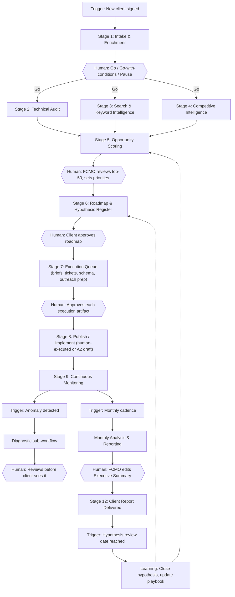

# PHASE 4–5: Automation architecture and the end-to-end workflow

## 4.1 Tool-selection philosophy

**RECOMMENDATION.** n8n is the orchestration and visualization layer for anything that is genuinely a multi-step, conditional, or scheduled process. It is not the home for everything. The rule: **pick the simplest tool that reliably does the job, and reserve custom automation for steps where no-code breaks down** (complex branching, agent tool use, cross-system orchestration).

| If the need is... | Default to... | Not... |
|---|---|---|
| A structured record clients/strategists edit directly (client profile, hypothesis register, SOP library) | Airtable or Notion | A custom database UI |
| A shared spreadsheet with formulas non-engineers will edit (scoring sheet, keyword workbook) | Google Sheets | Airtable (weaker formulas) or a database (no direct editing) |
| Time-series or large relational data (GSC/GA4 history, crawl snapshots, CrUX) | A real database (Postgres/BigQuery) | Google Sheets (breaks past ~50–100K rows) or Airtable (row limits, cost) |
| Scheduling, branching, API orchestration, human-approval steps | n8n | Zapier/Make for anything with >2 conditional branches or agent tool calls |
| Dashboards executives view | Looker Studio (or the client's existing BI tool) | A bespoke report generator, unless white-labeling matters commercially |
| Task tracking with dependencies and SLAs | The client's existing PM tool (ClickUp/Asana/Jira) via API, not a new one | Building a new task tracker |
| Ad hoc reasoning, classification, drafting | LLM API call (scoped agent) inside n8n | A always-on standalone "agent app" |
| Anything needing human judgment, relationship, or accountability | A human, notified via Slack/Teams/email | An approval "workflow" that just logs the action |

**RECOMMENDATION.** Do not build a proprietary "Client Brain" application in year one. Use Postgres (or BigQuery for the warehouse half) as the actual data store, with Airtable/Notion as the human-facing view over the parts humans edit directly, and n8n as the glue. This gets 90% of the value of a custom app for a fraction of the build cost, and every component can be replaced independently later.

## 4.2 Function → tool map

| Function | Recommended tool | Why | Alternatives considered and rejected |
|---|---|---|---|
| Client profile & intake record | Airtable (synced to Postgres) | Human-editable, relational enough, has an API | A custom form + DB (higher build cost for v1); Notion (weaker relational structure for scoring joins) |
| Warehouse (GSC, GA4, CrUX, crawl history, rank tracking) | BigQuery (or Postgres for smaller clients) | Handles volume, cheap, native GSC/GA4 bulk export support | Google Sheets (row limits, slow at scale) |
| Orchestration & scheduling | n8n | Visual, self-hostable, native HTTP/API/AI Agent/MCP support [S16] | Zapier/Make (higher per-task cost at this volume, weaker for agent tool use) |
| Website crawling | A dedicated crawler (Screaming Frog CLI / Sitebulb / custom headless-render crawler) called from n8n | Purpose-built; JS rendering support | Building a custom crawler (only if a specific unmet need arises, e.g. AI-crawler log analysis) |
| Keyword / SERP / backlink data | One data vendor via its API or MCP server (DataForSEO, Semrush, or Ahrefs — pick one primary, not three) [S17] | Avoid triple-subscription cost; standardize on one source of truth per metric type | Running all three "for coverage" (cost and reconciliation burden not justified at small/mid-client scale) |
| LLM reasoning (all agents) | A single LLM API, called from n8n's AI Agent node with scoped tools/prompts | Consistent behavior, one evaluation harness | A different model per agent "for optimization" (premature; revisit only if evaluation data justifies it) |
| Reporting / dashboards | Looker Studio connected to the warehouse | Free, client-shareable, Google-native alongside GSC/GA4 | A bespoke reporting app (unjustified build cost pre-scale) |
| Task/ticket creation | Client's existing PM tool via API (or ClickUp if the client has none) | Meets the team where they work; avoids a second system of record for execution | Introducing a new PM tool the client's team must adopt |
| Notifications & approvals | Slack/Teams (n8n "send and wait" pattern) [S16] | Fast human-in-the-loop without a custom UI | Email-only (slower, easier to miss); a custom approval UI (unjustified for v1) |
| Document deliverables (audits, briefs, reports) | Markdown/Google Docs generated by n8n, stored in Drive | Familiar, versioned, shareable | A custom document generator |
| CRM signal (source, stage, close) | Read from the client's existing CRM via API | First-party revenue truth; never re-platform a client's CRM | Asking the client to re-key data manually |

**What NOT to introduce unless a specific need appears:** a dedicated vector database (embeddings can live in Postgres/pgvector until scale demands more); a separate BI tool beyond Looker Studio; a second orchestration tool "for AI workflows" (n8n's AI Agent node covers this); a custom mobile app; a bespoke CMS integration beyond what's needed for A2-level draft creation.

---

## 5. The end-to-end workflow

**RECOMMENDATION — improved architecture.** The example chain in the brief is a reasonable skeleton but is a single linear pipe with one human checkpoint. The system below fixes three structural problems with a single-pipe design: (1) it separates **triggers that recur on different cadences** (onboarding is once; monitoring is daily; reporting is monthly) into their own workflows rather than one mega-chain; (2) it puts a human checkpoint **before** anything client-facing leaves the system at every stage, not only before the roadmap; (3) it makes the feedback loop an explicit trigger (a hypothesis closing, an anomaly firing) rather than a vague arrow back to "strategy update."

### Stage-by-stage specification

Each row follows **Trigger → Input → Action → Tool → AI/Agent → Decision → Output → Human checkpoint → Next stage**.

| # | Trigger | Input | Action | Tool | AI/Agent | Decision | Output | Human checkpoint | Next stage |
|---|---|---|---|---|---|---|---|---|---|
| 1 | New client signed (CRM/PM status change or manual form) | Signed contract, initial contact info | Create client record; pre-call enrichment crawl and SERP snapshot; schedule discovery call | n8n (webhook) + Airtable + crawler + SERP API | Research Agent drafts "what we already see" brief | — | Client record created; pre-call brief | **Human: FCMO conducts discovery interview** | Stage 2 |
| 2 | Stage 1 approved ("Go") | Interview transcript, access credentials | Populate client profile schema; flag proof-needed claims; set measurement baseline | n8n + Airtable/Postgres + transcript store | Structuring LLM call (schema-fill from transcript) | Go / Go-with-conditions / Pause | Client Brain record v1; measurement plan | **Human: FCMO confirms viability and hypotheses** | Stages 3–5 (parallel) |
| 3 | Stage 2 "Go" | Domain, sitemap, CMS type | Full crawl; CrUX/PSI pull; robots/sitemap parse; log sample if available | n8n + crawler + PageSpeed/CrUX APIs | Technical SEO Agent (triage, root-cause grouping) | Severity × certainty ÷ effort scoring | Ranked issue register | Sampled human review of top 20 issues before dev handoff | Stage 6 |
| 4 | Stage 2 "Go" | Seeds, GSC access, customer-language bank | Query expansion, intent classification, clustering, demand enrichment | n8n + GSC API + keyword/SERP vendor API | Keyword Intelligence Agent + SERP Analysis Agent | Opportunity scoring (Section 6) | Scored cluster table | **Human: FCMO reviews top 50 clusters** | Stage 6 |
| 5 | Stage 2 "Go" | Business + SERP competitor list | Crawl competitor sites; pull backlink/SERP data; classify content footprint | n8n + crawler + backlink/SERP API | Competitor Intelligence Agent | Gap and opportunity synthesis | Competitor evidence ledger | Sampled human review (spot-check 10%) | Stage 6 |
| 6 | Stages 3–5 complete | Issue register, keyword scores, competitor ledger | Merge into unified opportunity backlog; sequence by score and dependency | n8n + Postgres | Prioritization computation (deterministic, Section 6) | Rank and sequence | Draft roadmap + hypothesis register entries | **Human: FCMO sets final priorities and any overrides** | Stage 7 |
| 7 | Stage 6 approved by FCMO | Approved roadmap | Package into a client-facing roadmap document | n8n + doc template | Executive Summary Agent (drafts framing) | — | Client roadmap deliverable | **Human: FCMO edits; client approves in a call** | Stage 8 |
| 8 | Client approves roadmap | Prioritized backlog | For each item: generate brief / ticket / schema draft / outreach prep as applicable | n8n + Content Brief Agent / Structured Data Agent / Internal Linking Agent / Local SEO Agent | Item-specific agent per Section 3.8 | Route by item type | Execution artifacts (briefs, tickets, schema drafts) | **Human: named approver per artifact type (A1→A2)** | Stage 9 |
| 9 | Artifact approved | Approved artifact | Human or A2-drafted implementation (CMS draft, dev ticket, PR pitch) | CMS / PM tool / human hands | — (agents do not publish) | — | Live change or sent outreach | **Human executes or gives final publish approval** | Stage 10 |
| 10 | Continuous (scheduled, e.g. daily) | GSC/GA4/rank/CWV feeds | Pull latest data; run anomaly detection; annotate known events | n8n (cron) + warehouse | Analytics Agent | Threshold-based alerting | Alert or "all clear" log | Alerts routed to human (A3 auto-detect, human-reviewed before client sees it) | Stage 11 (on alert) / Stage 12 (monthly) |
| 11 | Anomaly alert fires | Anomaly context | Root-cause investigation (page group, query class, device, event correlation) | n8n + warehouse | Analytics Agent | Likely-cause ranking with confidence | Diagnostic note | **Human: reviews before any client communication** | Back to Stage 6 if it changes priorities |
| 12 | Monthly cadence | Full month of warehouse data, hypothesis register | Compile KPI tree; test open hypotheses; draft narrative | n8n + warehouse + BI tool | Reporting Agent + Executive Summary Agent | — | Draft monthly report + one-page exec summary | **Human: FCMO edits and approves before sending** | Stage 13 |
| 13 | Report sent | Report + client feedback | Log delivery; capture client questions/decisions | n8n + PM tool + Client Brain | — | — | Updated Client Brain; new/closed hypotheses | **Human: incorporates client feedback into next cycle** | Loops to Stage 6 (re-prioritization) and Stage 4/5 refresh (monthly cadence) |

**MODERN SEO PRACTICE.** Steps 3–5 run in parallel, not sequentially — there is no dependency between a technical crawl, keyword research, and competitor research, and running them in series only adds latency to onboarding.

**RECOMMENDATION.** The feedback loop is modeled as two explicit triggers (hypothesis review date; anomaly detection) rather than a single vague arrow, because "feedback → strategy update" as a single node hides exactly the kind of ambiguity that causes systems to silently stop learning.
