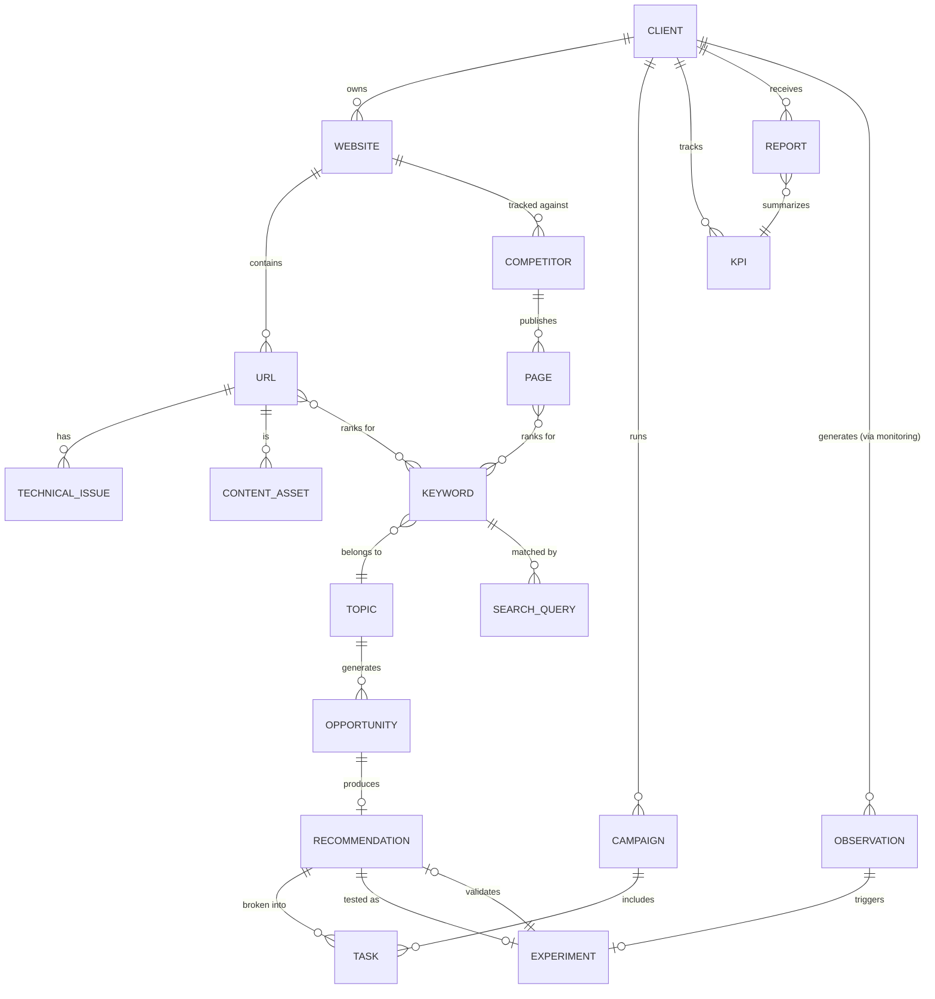

# PHASE 8: Data architecture

## 8.1 Entity-relationship overview

## 8.2 Entity specifications

For each entity: key fields, source of truth, owner, update frequency, relationships, and automation opportunities.

| Entity | Key fields | Source | Owner | Update frequency | Relationships | Automation opportunity |
|---|---|---|---|---|---|---|
| **Client** | id, name, domains[], ymyl_flag, revenue_model, sales_cycle_days, ltv, constraints, governance_policy | Intake interview | FCMO | On change (rare) | Owns Website, Campaign, KPI, Report | Schema pre-fill from interview transcript |
| **Website** | id, client_id, cms, hosting, crawl_config, robots_snapshot | Crawl + intake | Technical Agent | Weekly re-crawl | Belongs to Client; contains URL | Fully automated crawl scheduling |
| **URL** | id, website_id, path, status_code, canonical, indexable, template_type, last_crawled | Crawler + GSC | Technical Agent | Daily/weekly per crawl cadence | Belongs to Website; has Technical Issue; is a Content Asset; ranks for Keyword | Fully automated |
| **Keyword** | id, cluster_id, term, intent, volume_bucket, cpc, source | Keyword vendor API + GSC + customer-language bank | Keyword Intelligence Agent | Monthly refresh | Belongs to Topic; ranks on URL and competitor Page; matched by Search Query | Automated expansion; human review on intent ambiguity |
| **Search Query** | id, keyword_id, query_text, impressions, clicks, ctr, avg_position, date | GSC API (query-level) | Automation | Daily/weekly pull | Matched to Keyword | Fully automated |
| **Topic** | id, name, cluster_definition, business_relevance_score | Clustering algorithm + FCMO review | FCMO (approval), Automation (draft) | Monthly | Groups Keyword; generates Opportunity | AI-assisted clustering, human-approved |
| **Competitor** | id, client_id, domain, competitor_type (business/SERP/AI-answer), notes | Intake + SERP monitoring | Competitor Intelligence Agent | Monthly review | Tracked against Website; publishes Page | Automated discovery, human curation |
| **Page** (competitor) | id, competitor_id, url, content_type, word_count, last_updated, ranks_for[] | Crawl + SERP API | Competitor Intelligence Agent | Monthly | Belongs to Competitor; ranks for Keyword | Fully automated |
| **Content Asset** | id, url_id, title, status (draft/published/archived), author, brief_id, publish_date, target_cluster | CMS + Content Brief Agent | Content team + Content Opportunity Agent | Per content cycle | Is a URL; produced from Recommendation | AI-assisted briefing; human authorship |
| **Technical Issue** | id, url_id, issue_type, severity, certainty, effort_estimate, status, detected_date, resolved_date | Crawler + Technical Agent | Technical Agent (detection); Dev team (resolution) | Continuous | Belongs to URL; becomes Task | Fully automated detection |
| **Opportunity** | id, topic_id or url_id, dimension_scores (BV/WIN/DEM/CLK/GAIN/STRAT/EASE), TTI, DCF, opportunity_score, status | Opportunity model computation | Keyword/Competitor/Content Agents (draft); FCMO (approval) | Monthly recompute | Generated from Topic; produces Recommendation | Automated scoring; human review of top-ranked |
| **Recommendation** | id, opportunity_id, action_type, description, owner, priority_rank, approval_status | FCMO + relevant agent | FCMO | Per roadmap cycle | Produced from Opportunity; broken into Task; tested as Experiment | AI-assisted drafting; human approval mandatory |
| **Task** | id, recommendation_id or campaign_id, title, assignee, due_date, status, pm_tool_ref | PM tool (synced) | Assigned team member | Real-time (synced from PM tool) | Broken from Recommendation; part of Campaign | Fully automated ticket creation; human execution |
| **KPI** | id, client_id, metric_name, tier (outcome/leading/diagnostic), current_value, baseline_value, target_value, date | Warehouse aggregation | Analytics Agent | Daily/weekly/monthly per tier | Tracked by Client; summarized in Report | Fully automated computation |
| **Campaign** | id, client_id, name, start_date, end_date, objective, linked_hypotheses[] | FCMO planning | FCMO | Per initiative | Run by Client; includes Task | Human-defined, automation-tracked |
| **Report** | id, client_id, period, tier (operational/strategic/executive), kpi_snapshot, narrative, approval_status | Reporting Agent + FCMO | FCMO (approval) | Weekly/monthly/quarterly per tier | Received by Client; summarizes KPI | AI-assisted drafting; human approval mandatory |
| **Observation** | id, client_id, source (analytics/crawl/rank), observation_type, description, confidence, date | Analytics Agent (anomaly detection) | Analytics Agent | Continuous | Generated by Client monitoring; triggers Experiment | Fully automated detection; human-reviewed interpretation |
| **Experiment** | id, hypothesis_statement, metric, baseline, expected_effect, start_date, end_date, result, decision | Hypothesis register | FCMO | Per hypothesis lifecycle | Triggered by Observation; validates Recommendation | Human-authored, automation-monitored |

## 8.3 Where data lives

| Data class | System of record | Rationale |
|---|---|---|
| Client profile, constraints, governance policy | Airtable (synced to Postgres) | Human-editable; needs relational joins to Opportunity/Recommendation |
| Time-series (GSC queries, GA4 events, CrUX history, rank tracking) | BigQuery (or Postgres at smaller scale) | Volume; needs efficient date-range aggregation for KPI tiers |
| Crawl snapshots and technical issues | Postgres (structured) + object storage for raw HTML/screenshots | Structured querying for the issue register; raw artifacts for audit evidence |
| Keyword clusters, opportunity scores | Postgres (with a Google Sheets or Airtable view for human editing/override) | Computation lives in code; humans need a familiar surface to review and override |
| Competitor evidence ledger | Airtable or Notion | Narrative + evidence rows that strategists read and annotate directly |
| Content briefs, recommendations | Notion or Google Docs (generated by n8n) | Long-form documents humans edit heavily before use |
| Tasks | Client's existing PM tool (ClickUp/Asana/Jira) via API | Single source of truth for execution; avoid a second task system |
| Hypothesis register, hypotheses/hypothesis results | Airtable (or a Postgres table with an Airtable view) | Needs both structured querying (for the learning loop) and human narrative editing |
| Reports (operational/strategic/executive) | Looker Studio (dashboards) + Google Docs/PDF (narrative reports) | Dashboards for live numbers; documents for the reviewed, approved narrative |
| Agent prompts, evaluation sets, run logs | Version-controlled repository (git) + a lightweight logging table in Postgres | Prompts need version history and rollback; logs need queryability |
| n8n itself | Workflow definitions only — n8n is not a data store | n8n orchestrates; it should read from and write to the systems above, not hold state itself beyond in-flight execution data |

**RECOMMENDATION.** Treat n8n strictly as the *nervous system*, not the *memory*. Every workflow should be able to be deleted and rebuilt from its trigger and node logic without losing any client data, because all durable state lives in Airtable/Postgres/BigQuery/the PM tool. This is what makes the system maintainable rather than a single point of failure.
