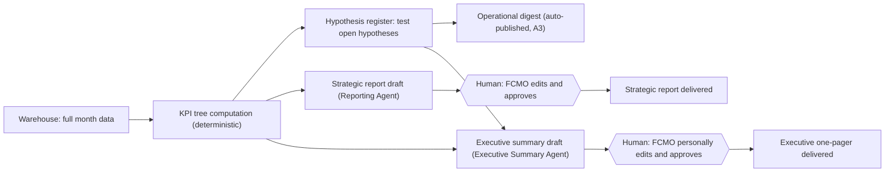

# PHASE 9: Reporting system

**Operating rule across all three tiers:** every number must be traceable to a warehouse query, never typed by a person or an LLM from memory. Vanity metrics (raw pageviews, raw impressions, "keyword rankings improved" without qualification, follower counts) are excluded from all three tiers below — they may exist in a raw data appendix, but never as a headline.

## 9.1 Operational tier — for SEO practitioners

**Audience:** the FCMO's own team and any client-side marketing staff doing hands-on work. **Cadence:** continuous/weekly. **Format:** a live dashboard (Looker Studio) plus a weekly digest (Slack/email, auto-generated).

| Content | Detail | Source |
|---|---|---|
| Open issues | Ranked technical issue register with severity, owner, age | Technical Agent / warehouse |
| Tasks | Status of in-flight tasks, blockers, overdue items | PM tool sync |
| Rankings | Priority-cluster rank tracking (top ~20 depth), with change vs. last period | Rank tracking data |
| Crawl findings | New issues since last crawl; resolved issues confirmed | Crawler diff |
| Content opportunities | Newly-flagged create/update/refresh/consolidate/prune items from the Content Decision Engine | Content Opportunity Agent |
| Technical changes log | What was deployed, when, by whom | Deployment log / PM tool |

**RECOMMENDATION.** This tier is allowed to be dense and numeric — it is a working tool, not a communication artifact — but every item must still link to its evidence so practitioners aren't asked to trust a number blind.

## 9.2 Strategic tier — for the (client-side) CMO

**Audience:** a client-side marketing leader who needs to manage the program without doing the hands-on work. **Cadence:** monthly. **Format:** a structured document (2–4 pages) plus a live dashboard link.

| Content | Detail | Source |
|---|---|---|
| Organic growth | Non-brand clicks/sessions by intent, vs. baseline and vs. plan | Warehouse (GSC + GA4) |
| Visibility | Share of target-cluster visibility; SERP feature ownership; AI-surface impressions (labeled, not headlined) | SERP Agent + AI Visibility Monitor |
| Conversions | Assisted and attributed conversions from organic, with confidence range | GA4 + CRM blend |
| Revenue influence | Estimated pipeline/revenue influenced, with the attribution caveat stated plainly | CRM + Analytics Agent |
| Strategic opportunities | Top 3–5 newly-surfaced opportunities from the scoring model, with rationale | Opportunity model |
| Risks | Anything from the risk register that could affect the program (dev capacity, algorithm volatility, data gaps) | Governance log |
| Competitive movement | Material changes in competitor visibility or content footprint | Competitor Intelligence Agent |
| Next priorities | What's queued for next month and why | Roadmap |

## 9.3 Executive tier — for a CEO/owner/high-net-worth client

**Audience:** someone who will spend 3–5 minutes on this and needs to leave knowing what to decide. **Cadence:** monthly or quarterly. **Format:** one page, no dashboard link required (though one is available on request).

The one-pager answers exactly six questions, in this order, and nothing else:

1. **What happened?** — one or two sentences, the headline number against plan.
2. **Why did it happen?** — the evidenced explanation, with a confidence grade; if genuinely unclear, say so rather than guessing.
3. **What does it mean for the business?** — translated into revenue/pipeline/market-position terms, not traffic terms.
4. **What should we do next?** — the top 1–3 recommended actions.
5. **What requires a decision?** — anything blocked on the client (budget, access, approval, resourcing).
6. **What is the expected business impact?** — a stated range (conservative/expected/stretch), with assumptions named, in the pattern of the archive's own "Modeled Search Investment" slide.

**RECOMMENDATION.** No chart with more than one line, no table with more than five rows, and no acronym used without being spelled out once. If a metric can't be explained in one sentence to someone without an SEO background, it doesn't belong on this page — move it to the strategic tier.

## 9.4 Report generation flow

**RECOMMENDATION.** Only the operational digest runs without a human gate (A3, per Section 3.0/7), because it stays internal to the practitioner team. Anything a client sees — strategic or executive — passes a named human approval every time, with no exception for "routine" months.
