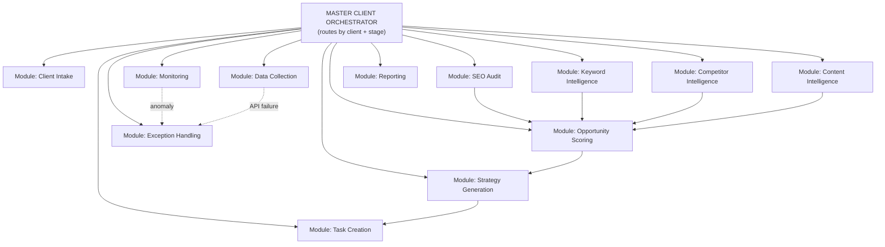

# PHASE 12: n8n blueprint

**Principle carried over from Section 4.1:** modular sub-workflows, not one monolith. n8n supports calling one workflow from another ("Execute Workflow" node); each module below is a separate n8n workflow with its own trigger, so any one module can be edited, tested, or replaced without touching the others.

## 12.1 Module map

**Pseudo-node names are used below where exact n8n node types depend on the specific integration chosen (e.g., which keyword vendor); real builds should replace these with the actual node type once a vendor is selected.**

## 12.2 Module specifications

### Module: Client Intake

| Element | Detail |
|---|---|
| Trigger node | Webhook (from CRM/PM tool status change) or Manual Trigger (form submission) |
| Data source | Intake form / CRM record |
| Transformation | Set node: normalize field names into the client-profile schema |
| AI node | AI Agent node: "Structuring Agent" — fills schema from interview transcript (see Prompt Library, Phase 14) |
| API call | Crawler API (pre-call enrichment); SERP API (brand snapshot) |
| IF/Switch logic | Switch on viability outcome: Go → continue; Go-with-conditions → flag + continue; Pause → notify + halt |
| Human approval | Slack "send and wait": FCMO confirms viability |
| Database/storage | Airtable (client profile) + Postgres (raw enrichment data) |
| Notification | Slack message to FCMO: "New client ready for discovery call" |
| Error handling | If crawl fails, log and proceed without pre-call brief rather than blocking intake |
| Output | Client profile record; triggers Data Collection module |

### Module: Data Collection

| Element | Detail |
|---|---|
| Trigger node | Execute Workflow (called from Client Intake) or Cron (recurring refresh) |
| Data source | GSC API, GA4 API, Bing Webmaster API, CRM API |
| Transformation | Code node: normalize date ranges and metric definitions across sources |
| AI node | None (deterministic pulls only) |
| API call | GSC Search Analytics + bulk export; GA4 Data API; Bing Webmaster API |
| IF/Switch logic | IF data freshness check fails → route to Exception Handling |
| Human approval | None (A0, read-only) |
| Database/storage | BigQuery/Postgres warehouse |
| Notification | None on success; alert on failure |
| Error handling | Retry with backoff; escalate to Exception Handling after 3 failures |
| Output | Populated warehouse; triggers SEO Audit, Keyword Intelligence, Competitor Intelligence in parallel |

### Module: SEO Audit

| Element | Detail |
|---|---|
| Trigger node | Execute Workflow (from Data Collection) or Cron (monthly) |
| Data source | Crawler output, CrUX API, PageSpeed Insights API, warehouse |
| Transformation | Code node: severity × certainty ÷ effort scoring |
| AI node | AI Agent node: "Technical SEO Agent" — root-cause grouping, remediation drafting |
| API call | Crawler service; CrUX History API; PageSpeed Insights API |
| IF/Switch logic | IF severity ≥ threshold → route to immediate Slack alert; else → standard queue |
| Human approval | Slack "send and wait": sampled review of top 20 issues |
| Database/storage | Postgres (issue register) |
| Notification | Slack digest to practitioner channel |
| Error handling | Partial-crawl detection: flag incomplete runs rather than treating them as "no issues found" |
| Output | Ranked issue register; feeds Opportunity Scoring and Task Creation |

### Module: Keyword Intelligence

| Element | Detail |
|---|---|
| Trigger node | Execute Workflow or Cron (monthly) |
| Data source | GSC queries, customer-language bank, keyword/SERP vendor API |
| Transformation | Code node: normalize and deduplicate expanded terms |
| AI node | AI Agent node: "Keyword Intelligence Agent" (intent classification, clustering rationale); AI Agent node: "SERP Analysis Agent" (module/feature mix) |
| API call | Keyword vendor API (DataForSEO/Semrush/Ahrefs — one primary); SERP API |
| IF/Switch logic | IF intent confidence < threshold → route to human review queue |
| Human approval | Airtable review view: FCMO reviews top 50 clusters |
| Database/storage | Postgres (cluster + scoring tables), Airtable view for human review |
| Notification | Slack: "Keyword refresh ready for review" |
| Error handling | Vendor API rate-limit handling: queue and retry within budget cap |
| Output | Scored cluster table; feeds Opportunity Scoring |

### Module: Competitor Intelligence

| Element | Detail |
|---|---|
| Trigger node | Execute Workflow or Cron (monthly) / Webhook (competitor-event trigger) |
| Data source | Competitor domain list, crawler, backlink API |
| Transformation | Code node: content-type classification tagging |
| AI node | AI Agent node: "Competitor Intelligence Agent" (gap synthesis, evidence-based narrative) |
| API call | Crawler service (competitor sites, respecting robots.txt); backlink API |
| IF/Switch logic | IF new competitor content volume spikes → flag for early re-scan |
| Human approval | Airtable/Notion: 10% sampled spot-check |
| Database/storage | Airtable or Notion (evidence ledger) |
| Notification | Slack digest on new gaps found |
| Error handling | If a competitor site blocks the crawler, log and fall back to SERP-only data |
| Output | Competitor evidence ledger; feeds Opportunity Scoring |

### Module: Content Intelligence

| Element | Detail |
|---|---|
| Trigger node | Execute Workflow (from Keyword + Competitor modules) or Cron (monthly) |
| Data source | Content inventory, warehouse performance data |
| Transformation | Code node: decay detection (trailing-baseline comparison with seasonality adjustment) |
| AI node | AI Agent node: "Content Opportunity Agent" (decision engine); AI Agent node: "Content Brief Agent" (brief drafting, on demand) |
| API call | CMS API (read-only inventory pull) |
| IF/Switch logic | Switch on decision type: Create/Update/Refresh/Consolidate/Prune, each routing to a different sub-path |
| Human approval | Required before any Prune or Consolidate action proceeds to Task Creation |
| Database/storage | Postgres (content asset + decision status) |
| Notification | Slack: weekly content-queue digest |
| Error handling | If CMS API is unavailable, fall back to last successful inventory snapshot with an explicit staleness flag |
| Output | Prioritized content action queue; feeds Task Creation |

### Module: Opportunity Scoring

| Element | Detail |
|---|---|
| Trigger node | Execute Workflow (from Audit, Keyword, Competitor modules) |
| Data source | Issue register, cluster table, evidence ledger |
| Transformation | Code node: the deterministic formula from Section 6.2 (RawScore → TimeAdjustedScore → OpportunityScore); gating rules applied first |
| AI node | AI Agent node: proposes BV/GAIN/STRAT sub-scores with rationale (constrained-scoring protocol, Section 6.4) |
| API call | None (internal computation) |
| IF/Switch logic | IF confidence = "low" or missing evidence_refs → reject row, route to human manual scoring |
| Human approval | Airtable: FCMO sets final priorities and overrides |
| Database/storage | Postgres (opportunity + recommendation tables) |
| Notification | Slack: "Opportunity backlog ready for prioritization review" |
| Error handling | Score-drift check against prior run; flag anomalous jumps |
| Output | Ranked opportunity backlog; feeds Strategy Generation |

### Module: Strategy Generation

| Element | Detail |
|---|---|
| Trigger node | Execute Workflow (from Opportunity Scoring), post FCMO approval |
| Data source | Approved opportunity backlog |
| Transformation | Document assembly (roadmap template) |
| AI node | AI Agent node: "Executive Summary Agent" (drafts framing narrative) |
| API call | Google Docs API (document creation) |
| IF/Switch logic | None |
| Human approval | FCMO edits; client approves on a call |
| Database/storage | Google Drive (roadmap document); Postgres (status) |
| Notification | Email/Slack to FCMO: "Roadmap ready for client review" |
| Error handling | None beyond standard doc-generation retry |
| Output | Approved client roadmap; feeds Task Creation |

### Module: Task Creation

| Element | Detail |
|---|---|
| Trigger node | Execute Workflow (from Strategy Generation or Content Intelligence) |
| Data source | Approved roadmap items |
| Transformation | Code node: route item type to the correct artifact generator (brief/ticket/schema/outreach prep) |
| AI node | AI Agent nodes: Content Brief Agent, Structured Data Agent, Internal Linking Agent, Local SEO Agent (per item type) |
| API call | PM tool API (ticket creation); CMS API (A2 draft creation, where applicable) |
| IF/Switch logic | Switch on artifact type |
| Human approval | Named approver per artifact type before any live action |
| Database/storage | PM tool (tasks); Postgres (recommendation-to-task linkage) |
| Notification | PM tool native notification to assignee |
| Error handling | If PM tool API fails, queue the ticket creation and alert rather than silently dropping it |
| Output | Live tasks/tickets; feeds Monitoring |

### Module: Monitoring

| Element | Detail |
|---|---|
| Trigger node | Cron (daily) |
| Data source | Warehouse (GSC, GA4, rank, CWV) |
| Transformation | Code node: statistical anomaly detection (seasonal decomposition) |
| AI node | AI Agent node: "Analytics Agent" (root-cause diagnosis, only on flagged anomalies) |
| API call | None beyond the Data Collection module's feeds |
| IF/Switch logic | IF anomaly detected → route to diagnostic sub-flow; ELSE → log "all clear" |
| Human approval | Diagnostic output reviewed before any client communication |
| Database/storage | Postgres (observation log) |
| Notification | Slack alert to FCMO on anomaly |
| Error handling | Data-quality check precedes diagnosis; tracking-break detection routes to Exception Handling, not Analytics Agent |
| Output | Observation log; feeds Reporting and, when material, back to Opportunity Scoring |

### Module: Reporting

| Element | Detail |
|---|---|
| Trigger node | Cron (weekly for operational; monthly/quarterly for strategic/executive) |
| Data source | Warehouse, hypothesis register, observation log |
| Transformation | Code node: KPI tree computation |
| AI node | AI Agent nodes: "Reporting Agent" (strategic draft), "Executive Summary Agent" (one-pager draft) |
| API call | Looker Studio (dashboard refresh, if API-driven); Google Docs API (document generation) |
| IF/Switch logic | Switch by tier: operational → auto-publish (A3); strategic/executive → human gate |
| Human approval | FCMO edits and approves strategic and executive tiers every cycle, no exception |
| Database/storage | Google Drive (reports); Postgres (report metadata + approval log) |
| Notification | Email/Slack to FCMO for approval; email to client on delivery |
| Error handling | If warehouse data is incomplete for the period, delay generation rather than publish partial numbers |
| Output | Delivered reports; closes the loop back to the Hypothesis Register |

### Module: Exception Handling

| Element | Detail |
|---|---|
| Trigger node | Error Trigger (n8n's built-in workflow-error trigger), called from any other module |
| Data source | Failed workflow's error payload |
| Transformation | Code node: classify error type (API failure, rate limit, auth expiry, data-quality failure) |
| AI node | None — this module is deliberately deterministic to avoid an agent misdiagnosing its own infrastructure failure |
| API call | None (may re-trigger the failed call after backoff) |
| IF/Switch logic | Switch on error class: transient → retry; auth → alert + halt; data-quality → route to human review, not silent continuation |
| Human approval | Alert always includes a human-readable summary and never auto-resolves an auth or data-quality failure |
| Database/storage | Postgres (error log) |
| Notification | Slack/PagerDuty-style alert to the technical owner |
| Error handling | This *is* the error-handling module; it must fail loudly rather than silently if it cannot classify an error |
| Output | Logged incident; resumed workflow (if retry succeeds) or escalated ticket |

**RECOMMENDATION.** Exception Handling is deliberately excluded from AI reasoning — an agent diagnosing why the system that runs agents has failed is a bad idea. Keep that path simple, deterministic, and loud.
