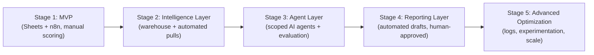

# PHASE 13: Implementation roadmap

**This supersedes the informal 6-phase build sequence in the Roadmap & Appendices tab**, which was a first pass written before Phases 4–15 were specified. The five-stage structure below is the authoritative roadmap; it reframes the same underlying work against explicit no-code-first sequencing and "what NOT to build yet" discipline.

## Stage 1 — Minimum Viable SEO OS

| Field | Detail |
|---|---|
| Objective | Prove the core loop (data in → human-reviewed insight → action out) for 1–2 pilot clients with the least engineering possible |
| Components | Client intake form; manual-triggered crawl; GSC/GA4 pulls into Google Sheets; a manually-scored version of the opportunity formula (Section 6.2) in Sheets; a weekly Slack digest assembled by a single n8n workflow |
| Tools | Google Sheets, Google Forms, n8n (2–3 simple workflows), Slack, the client's existing GSC/GA4 |
| Estimated complexity | Low |
| Dependencies | Client grants GSC/GA4 access; no CRM integration required yet |
| Human effort | High relative to later stages — most scoring and synthesis is still manual, assisted by ad hoc LLM prompts (conversational, not yet embedded in a workflow) |
| Expected leverage | Modest — mainly proves the data pipeline and the prioritization logic hold up against real client data |
| What NOT to build yet | No database, no agent layer, no CRM integration, no automated reporting beyond the digest, no competitor automation |

## Stage 2 — Intelligence Layer

| Field | Detail |
|---|---|
| Objective | Automate research and analysis so the FCMO's time shifts from data-gathering to judgment |
| Components | Postgres/BigQuery warehouse; the Technical Audit, Keyword Intelligence, and Competitor Intelligence n8n modules (Section 12.2) running on a schedule; Airtable as the human-facing review surface; the deterministic half of the opportunity formula (DEM, TTI, DCF) computed in code |
| Tools | n8n, Postgres/BigQuery, Airtable, a crawler service, one keyword/SERP/backlink vendor API |
| Estimated complexity | Medium |
| Dependencies | Stage 1 validated; a data-vendor contract signed; crawler infrastructure provisioned |
| Human effort | Medium — FCMO reviews structured outputs instead of assembling them |
| Expected leverage | High — this is where most of the time savings materializes, because retrieval and computation stop being manual |
| What NOT to build yet | No LLM-driven qualitative scoring (BV/GAIN/STRAT still human-rated); no content brief automation; no CMS integration; no client-facing automated reporting |

## Stage 3 — Agent Layer

| Field | Detail |
|---|---|
| Objective | Introduce the specialized AI agents (Section 3.8) for judgment-adjacent tasks that have a clear evidence-and-rationale structure |
| Components | AI Agent nodes for Keyword Intelligence (intent classification), SERP Analysis, Competitor Intelligence (gap synthesis), Content Opportunity, and Content Brief; the constrained-scoring protocol (Section 6.4) for BV/GAIN/STRAT; the evidence ledger and confidence-grading infrastructure; golden test sets for each agent before go-live |
| Tools | n8n AI Agent node, an LLM API, a prompt/version registry (git), an evaluation harness |
| Estimated complexity | High |
| Dependencies | Stage 2's data pipeline is stable and trusted; a per-client cost budget mechanism is in place |
| Human effort | Shifts from "do the work" to "review and correct the work," with sampling rates as defined in Section 3.8/6.4 |
| Expected leverage | High, but only if evaluation discipline holds — this is the stage most likely to erode trust if shipped without golden tests |
| What NOT to build yet | No agent gets write access to any production system (CMS, GBP, robots.txt); no automated outreach; no autonomous publishing at any level |

## Stage 4 — Reporting Layer

| Field | Detail |
|---|---|
| Objective | Automate the recurring reporting cadence (Section 9) without automating away the human edit/approval step |
| Components | KPI tree computation in the warehouse; Looker Studio dashboards; the Reporting Agent and Executive Summary Agent drafting workflows; the hypothesis register closing loop |
| Tools | Looker Studio, n8n, Google Docs API |
| Estimated complexity | Medium |
| Dependencies | Stages 2–3 producing reliable, evidenced data and recommendations to report on |
| Human effort | FCMO edits every strategic/executive deliverable every cycle; no exceptions carved out at this stage or any later one |
| Expected leverage | High for the FCMO's time on report *assembly*; leverage on report *quality* depends entirely on the human edit staying rigorous |
| What NOT to build yet | No client-facing chatbot or self-serve dashboard replacing the human-delivered narrative; no fully automated executive summary |

## Stage 5 — Advanced Optimization

| Field | Detail |
|---|---|
| Objective | Add sophisticated integrations and real experimentation once the core loop is trusted and repeatable across multiple clients |
| Components | Log-file analysis pipeline; JS-rendering diff automation at scale; multi-vendor data reconciliation (if justified by client portfolio size); formal experiment/holdout infrastructure for the hypothesis register; the AI Visibility Monitor (Section 3.8, Agent 15) formalized with a fixed sampling panel |
| Tools | Extends the existing stack; may add a dedicated experimentation/analytics tool if volume justifies it |
| Estimated complexity | High |
| Dependencies | A portfolio of clients large enough to justify the investment; Stages 1–4 operating with a clean agent scorecard (Section 3.9/15) |
| Human effort | Lower per-client marginal effort, but requires dedicated technical ownership of the platform itself |
| Expected leverage | Highest ceiling, but the smallest near-term payoff relative to build cost — this is where "automation for its own sake" risk is highest |
| What NOT to build yet | Nothing is permanently off-limits at this stage, but each addition should still pass the Section 4.1 test: is this the simplest tool for the job, and has a real, evidenced need appeared? |

## Sequencing diagram

**RECOMMENDATION.** Do not let a single client's urgency pull the build order forward — a client asking for "the AI agents" in month one is asking for Stage 3 leverage without Stage 2's data foundation underneath it, and skipping ahead produces exactly the plausible-but-wrong outputs described in the Gap Analysis (Phase 10.6).
