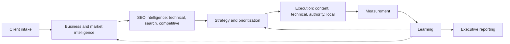
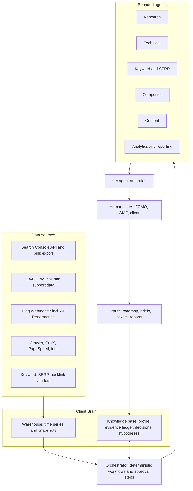
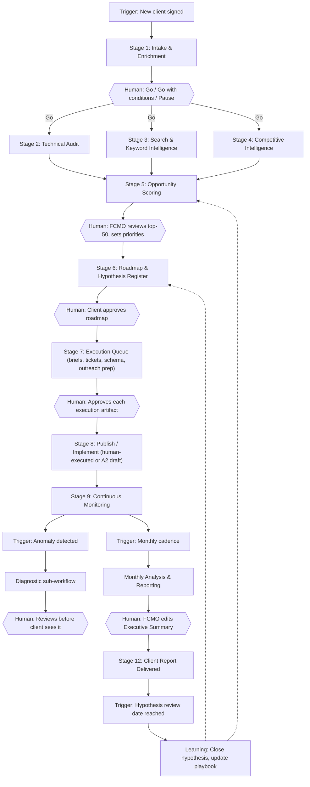
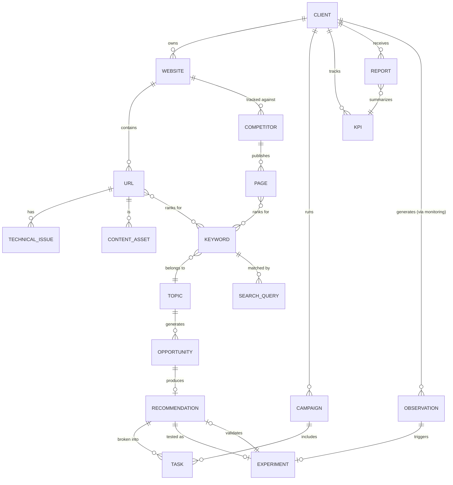
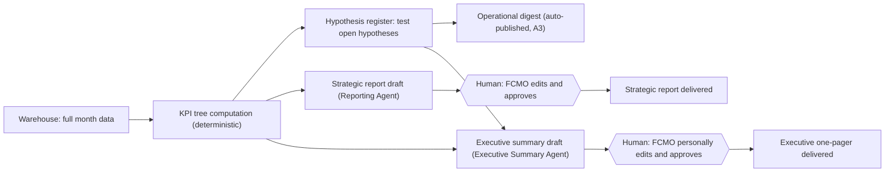
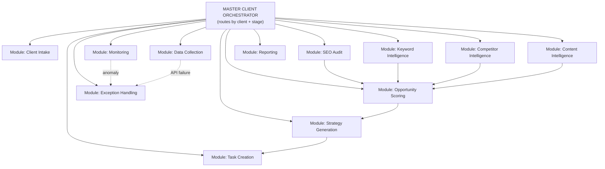
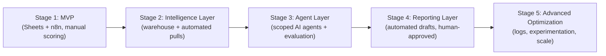

# SEO Operating System — FCMO Architecture (2026)

*Exported from Claude Docs — September 22, 2026*

---

*Exported from Claude Docs — September 22, 2026*

**A 2026 Fractional-CMO architecture, rebuilt from the UW–Madison Digital Marketing Bootcamp SEO curriculum (2021)**

*Prepared September 21, 2026. Scope of this document: Phase 1 (curriculum ingestion), Phase 2 (2021 → 2026 modernization layer), Phase 3 (FCMO operating model, including the agent layer). Source references like [S4] point to the Source Register at the end.*

---

## 0. Executive summary

**What the archive is.** Fifty files: 15 lecture decks, a syllabus, a study guide, a final-project worksheet, seven spreadsheets, and 24 images (a one-page audit checklist plus screenshots of worked examples). It is a solid *practitioner-level curriculum* (roughly "SEO fundamentals for a marketing generalist"). It is not an operating system: it teaches tasks, not a lifecycle. It has no business discovery, no prioritization model beyond a keyword sort, no governance, no experimentation, and nothing on AI search.

**What survives.** About a third of the curriculum is durable and should become system components almost unchanged: the crawl → index → rank mental model, search-intent thinking, duplicate/canonical handling, internal linking, the content-audit (red/yellow/green) method, the historical-optimization refresh workflow, the baseline → measure → compare → refine tracking cycle, and the three-horizon roadmap and modeled-investment slides from the example decks.

**What breaks.** Several things are wrong or dangerous if used as taught:

- **Prioritizing keywords by "lowest CPC" and "avoid low-volume topics"** (a paid-ads metric used as an SEO filter; the archive's own keyword sheet shows the tool suggesting real-estate and stock valuation terms for an instrument-appraisal practice).
- **`noindex` in robots.txt**, "sitemaps guarantee indexing", "crawlability is a ranking signal", "bounce rate / time on site / social signals are top ranking factors."
- **`.gov`/`.edu` comment-link hunting, forum and directory link dropping, and routine disavowing.**
- **Retired tools:** Structured Data Testing Tool, Mobile-Friendly Test, GA Universal Analytics screens, robots.txt tester, "Coverage" report.
- **FAQ/HowTo schema as a SERP lever** (FAQ rich results stopped appearing in Google Search on May 7, 2026 [S5]).

**What's missing entirely.** Business model and buyer research, entity/brand strategy, AI Overviews / AI Mode, LLM-assistant discovery and crawlers, AI-content policy, programmatic SEO, first-party data and privacy, attribution limits, JavaScript rendering, international SEO, migrations, log analysis, governance, and experimentation.

**The single most important 2026 finding for system design.** Google's own guidance (May 15, 2026) says AI Overviews and AI Mode are "rooted in our core Search ranking and quality systems" and that optimizing for generative AI search is, from Google's perspective, still SEO [S2][S3][S20]. Practitioners contest how far that framing holds outside Google (for example, [S19]), and independent studies show real click losses where AI answers appear [S10]. The system therefore treats **foundational SEO as the base layer and AI-search visibility as a measured, separate reporting layer**, not a separate discipline with its own magic tactics. Tactics Google explicitly says you can skip (llms.txt, "chunking," AI-specific rewrites, inauthentic mention-seeding) are demoted to **UNCERTAIN / low priority** rather than sold to clients as strategy.

**The design in one paragraph.** SEO-OS is a client-scoped **knowledge base ("Client Brain")** fed by APIs, read by narrowly-scoped **agents**, orchestrated by deterministic **workflows** (n8n), and governed by **human approval gates** proportional to risk. Every recommendation carries evidence, a confidence grade, an effort estimate, and an owner. Everything the client sees passes a human FCMO. Anything that can publish, email, redirect, block crawlers, or spend money never runs unattended.

### Ten design principles

1. **Business outcome first.** Traffic is a diagnostic; pipeline and revenue are outcomes.
2. **Evidence or it didn't happen.** Every claim in a deliverable links to a data pull, a SERP snapshot, or a primary source.
3. **Separate detection from judgment.** Machines detect; humans (or human+AI) interpret and decide.
4. **Score opportunities, don't sort by volume.** (Section 3.4.)
5. **First-party truth beats third-party estimates.** Search Console, GA4, CRM, sales calls, and logs outrank vendor "volume" and "authority" scores.
6. **Autonomy is earned per task, not granted per tool.** Four autonomy levels; irreversible actions never exceed level 2.
7. **Scraped content is untrusted input.** Agents must be robust to prompt injection from the web.
8. **Every agent has an evaluation set.** No agent goes live without a golden-case test.
9. **Learn on purpose.** Hypotheses are logged before execution and closed out after.
10. **Don't oversell the frontier.** AI-search tactics are labeled ESTABLISHED, EMERGING, or EXPERIMENTAL (Section 2.3).

### How status labels are used

| Label | Meaning |
|---|---|
| **CURRENT** | Still broadly applicable as taught |
| **MODERNIZED** | Fundamentally useful, but must be updated |
| **OUTDATED** | Should generally not be used as originally taught |
| **CONTEXTUAL** | Useful only in specific situations |
| **UNCERTAIN** | Needs further validation; do not present to clients as fact |

Confidence notes: where I relied on Google's own documentation I say so; where I relied on secondary reporting or vendor blogs I flag it, and where sources conflict I say so rather than pick a winner.

---
---

## 1.1 What is actually in the archive

| Group | Files | What I found | Reliability for extraction |
|---|---|---|---|
| **Lecture decks** | 15 PDFs (Lessons 1, 3–16) | 24–59 slides each, but only ~2.5–5K characters of text per deck: heavily image-based (stock photos, UI screenshots of Keyword Planner, Moz, Google Analytics *Universal* UI, GMB setup, Markup Helper). Each deck carries an identical 4-slide "course path" preamble. | Text layers extracted for all 15; I visually reviewed the Intro and Measurement decks. Tool-demo slides in other decks show UIs that no longer exist. |
| **Study guide** | 1 PDF, 46 pp. | The densest source: ~19 modules summarized in outline form (its text repeats once in the file). Contains the technical claims I audit in Phase 2. | Full text read. |
| **Syllabus** | 1 PDF | Course map, learning objectives, activities, required reading (Papagiannis, *Effective SEO and Content Marketing*, Wiley 2020, **not in the archive**). | Full text read. |
| **Final project form** | 2 PDFs (byte-identical) | The capstone template: keyword discovery → SERP evaluation → on-page/technical/backlink scoring (1–5) → 3–5 target keywords → 3 pages with title/meta/H1/alt. | Full text read. |
| **HubSpot Historical Optimization Workbook** | 2 XLSX (byte-identical; one has a mangled filename) | Two-tab refresh tracker: blog master list by page views; "posts to optimize" with target topics, snippet status, before/after 4-week page views, % change, status, notes. | Read. |
| **Manual SEO Audit Questions** | 1 XLSX | 14-item manual audit (domain check → heading tags) with tool per item, applied to two window-and-door sites. | Read. |
| **Keyword Stats export** | 1 XLSX, ~1,000 rows | Google Keyword Planner export (Apr 2020–Mar 2021) for a learner project on violin appraisal/lutherie topics. Monthly-search columns are empty (account without ad spend → volume buckets only). | Read (structure + sample). |
| **Untitled spreadsheets** | 3 XLSX | (a) keyword shortlist with volume bucket and competition; (b) manual-audit comparison of two window/door sites vs. a contractor site, with heading extracts; (c) GA exercise template (Sept 2020 vs Aug 2020 on-page metrics). | Read. |
| **Images** | 24 (1 checklist + 23 screenshots) | Audit checklist; 2×2 keyword difficulty/volume matrix; YMYL breakout prompt; content-type matrix for agencies; final-project rubric; **example client SEO decks** (competitor bubble chart, modeled search investment, three "Horizon" roadmap, KPI dashboards, GA benchmark vs industry, funnel analyses); a completed learner final project (cocktail blog). | Viewed all 24. |

**Gaps in the archive itself:** no deck for Lesson 2 (Search Engines in Depth; covered only in the study guide), Lesson 17 (SEO Audits II), or Lessons 18–19 (final project presentations). The screenshots include real third-party client metrics (a financial-services firm, an engineering firm, a clinical-trial finder). I treated them as *patterns to learn from* and will not carry any of that data into the system.

**Licensing note.** The decks are marked © 1996–2021 HackerU Ltd. This document paraphrases concepts and re-expresses them as system components; it does not reproduce slide text. Confirm licensing before redistributing any original material to clients.

## 1.2 Knowledge model: SEO domains and how well the curriculum covers them

Coverage rating: **Strong** (taught with method), **Moderate** (taught as concepts, thin on method), **Thin** (mentioned), **Absent**.

| Domain | Curriculum coverage | Where it lives | Key gap for an FCMO system |
|---|---|---|---|
| Strategy / roadmapping | Moderate | Syllabus; Horizon Review + Modeled Investment images | No prioritization method, no tie to revenue model or resourcing |
| Business discovery | **Absent** | Final project asks "what topics do you want to be known for" | No intake, revenue model, sales cycle, constraints |
| Audience research | Thin | Persona exercise (HubSpot Make My Persona); review-mining tip | No first-party research (sales calls, CRM, support) |
| Search intent | Moderate | Lesson 1 (learn/find/buy); Lesson 4 buying stages | Only three intents; no SERP-based intent validation |
| Keyword research | Strong (method) / weak (judgment) | Lessons 3–4, Keyword Planner; 2×2 matrix | CPC-based selection; volume-only; no clustering or SERP realism |
| Competitive intelligence | Moderate | Lesson 14; final-project scoring tables; content matrix | Competitors = "first two SERPs" only; subjective 1–5 scores |
| Technical SEO | Moderate | Lesson 8; checklist | Several wrong claims; no JS rendering, logs, migrations, international |
| Information architecture | Thin | Lesson 6 (silos, flat vs deep) | Internally inconsistent guidance |
| On-page SEO | Strong (mechanics) | Lessons 5–6 | Over-weights tags and keyword frequency |
| Content strategy | Moderate | Lesson 12; content-audit method | Strong audit method; weak on differentiation and information gain |
| Content production | Thin | Lesson 12 | No brief standard, QA, or AI policy |
| Internal linking | Moderate | Lesson 6 | Manual only |
| Structured data | Moderate | Lesson 10 | Retired tools; rich-result landscape changed |
| Local SEO | Moderate | Lesson 11 | Directory list obsolete; GMB naming; factor weights outdated |
| Off-page / link building | Moderate | Lessons 7, 9 | Includes spam-risk tactics |
| Digital PR | Thin | "Earned links," traditional media | No PR method |
| Measurement | Moderate | Lesson 15; tracking cycle; GA exercise | UA-based; vanity KPIs; no attribution thinking |
| Reporting | Thin | Example client decks | Useful *patterns*, no cadence or exec standard |
| Auditing | Strong (structure) | Lesson 16; manual audit; checklist | Manual, tool-shallow, unprioritized |
| Emerging search | Moderate (2021) | Lesson 13: voice, visual, video | Voice framing obsolete; no AI search at all |
| AI / search visibility | **Absent** | n/a | Entire domain missing |
| **Added:** Content refresh / historical optimization | Strong | HubSpot workbook | Best asset in the archive |
| **Added:** SEO forecasting / business case | Thin | "Modeled Search Investment" image | Excellent seed; needs method |
| **Added:** Accessibility | Thin | Lesson 12 | Claims ranking impact (UNCERTAIN) |
| **Added:** Governance, risk, compliance | **Absent** | n/a | Needed for AI agents and outreach |
| **Added:** Experimentation / learning loop | Thin | Tracking cycle | Needs hypothesis registry and closeouts |

## 1.3 Frameworks extracted

| # | Framework (as taught) | Source | Type | Verdict → reuse |
|---|---|---|---|---|
| F1 | **Crawl → index → rank; on-page / off-page / technical** trichotomy | Lessons 1–2 | Mental model | Keep as the base taxonomy; add "content/entity" and "SERP/AI surface" layers |
| F2 | **Basic audit checklist** (on-page 7 items, off-page 6, technical 7) | Checklist image, Lesson 16 | Checklist | Convert to automated check library (Section 3.3) |
| F3 | **14-item manual audit** (domain check, SERP appearance, speed, mobile, security, URL, structure, UX, social, content quality, headings) | Manual audit XLSX | Audit questions | Convert to hybrid audit; 8 of 14 are automatable |
| F4 | **Keyword difficulty × volume 2×2** mapping keyword sets to page tiers (L1 home / L2 category / L3+ blog) | Matrix image | Decision matrix | **Keep the idea** (match difficulty to page authority); replace vendor difficulty with SERP-based winnability |
| F5 | **Keyword list method:** seed → prefix/main/suffix → tool → export → sort by impressions, CPC | Lessons 3–4 | Process | Keep seed→expand→classify; **remove CPC-lowest filter**; replace sorting with opportunity score |
| F6 | **Buying-stage tagging** of key phrases | Lesson 4 activity | Classification | Keep; expand to intent taxonomy (Section 3.4) |
| F7 | **On-page element scoring 1–5** (title, meta, H1, alt; URL, speed, mobile; DA, links, anchors) | Final project | Scorecard | Keep as a *diagnostic rubric* for SERP-competitor teardown; add evidence column and remove subjective-only scoring |
| F8 | **Content audit red/yellow/green** using GA (pageviews, entrances, bounce, exit) + GSC (clicks, impressions, CTR, position) + code logging (title, meta, H1–H6) | Lesson 12 | Method | **Highest-value framework in the archive.** Modernize into keep/update/consolidate/prune/redirect decision engine |
| F9 | **Historical optimization workbook** (rank posts by views → pick decayed posts → update → compare 4-week before/after) | HubSpot XLSX | Template | Automate decay detection; add seasonality control |
| F10 | **Content strategy 5 steps** (goals, audience, content type, channels, distribute) + persona builder | Lesson 12 | Process | Keep skeleton; personas from real data |
| F11 | **Content-type matrix** (which formats competitors use: blogs, webinars, podcasts, guides, case studies…) | Matrix image | Competitive artifact | Reuse for content-footprint analysis |
| F12 | **Competitive research quad:** keyword, content, backlink, site-structure analysis (+ SWOT hint) | Lesson 14 | Method | Extend to business competitors vs SERP competitors vs AI-answer competitors |
| F13 | **Tracking cycle (8 steps):** strategy → discuss → baseline → execute → collect → compare → refine → report | Lesson 15 | Loop | **Keep as the measurement spine**; add controls, annotations |
| F14 | **KPI set:** organic sessions, keyword rank, leads/conversions, bounce, pages/session, avg duration; Authority Score/DA as KPI in examples | Lesson 15; KPI dashboard images | KPIs | Re-tier: outcome, leading, diagnostic (Section 3.9) |
| F15 | **Example client-deck patterns:** topline metrics vs benchmark; traffic-source table; landing-page bounce analysis; funnel step drop-off; competitor bubble chart (avg position vs keyword count); **modeled search investment** (30/50/75% improvement scenarios → visits → leads → conversions); **three horizons** (fixes → content roll-ups → platform/CMS) | Screenshots | Reporting/strategy templates | Adopt as executive-report modules (Sections 3.9, 3.1) |
| F16 | **Final-project rubric** (keyword research 30, competitor 25, content/site structure 20, on-page 20, instructions 5) | Rubric image | Assessment | Repurpose as **QA rubric for an onboarding audit deliverable** |
| F17 | **YMYL breakout** (pick YMYL site; check E-A-T signals; Moz DA) | Breakout image | Exercise | Keep YMYL risk-tiering; drop DA reliance |
| F18 | **Link value factors** (relevance, anchor, freshness, decay, diversity, footer/sidebar, spam) and **backlink analysis views** (top pages, top linking sites, top anchors) | Lessons 7, 9 | Analysis | Keep as triage dimensions; treat vendor metrics as proxies |
| F19 | **Local signals list** (proximity, GMB associations, links, citation consistency, DA, on-page keywords, anchors, CTR/click-to-call, social) | Lesson 11 | Checklist | Modernize with GBP-first structure (Section 2.1) |

## 1.4 Reusable artifacts → system components

The point is not to file these away but to *convert* them. Each row shows the modern component, who owns each step, and the target format.

| Source artifact | Modern system component | Human / LLM / API / Automation | Format |
|---|---|---|---|
| Final project form | **Onboarding Audit Pack** (research + strategy + first-90-day plan), scored by the F16 rubric | FCMO approves; agents draft; APIs supply data | Report template + JSON schema |
| *(none in archive)* → new | **Client Intake Form + Client Brain schema** (Section 3.1) | Human interview + LLM structuring | Form → structured record (Postgres/Notion) |
| Manual audit questions XLSX | **Audit Check Library** (each row = check ID, detector, severity model, remediation, owner) | API/crawler detect; LLM triage; human interpret | Database table + n8n workflow |
| SEO checklist image | **Quick-Scan Health Score** (run in first 48 hours) | Automation | Scored report |
| Keyword Planner sheet | **Keyword Intelligence Workbook**: seed → expansion → intent → cluster → opportunity score | API + LLM; human validates top 50 | Sheet/DB with versioned runs |
| Prefix–main–suffix method | **Query Expansion prompt + SERP-mined expansion** (PAA, autocomplete, GSC queries, sales-call phrases) | LLM + API | Prompt template |
| 2×2 difficulty/volume matrix | **Page-tier assignment rule** inside the opportunity model | Automation | Rule + visual |
| Competitor tables (1–5 scoring) | **Competitor Evidence Ledger** (competitor → evidence → gap → opportunity → action) | API collect; LLM synthesize; human approve | Table |
| Content audit R/Y/G | **Content Decision Engine** (keep / update / consolidate / prune / redirect) | Automation scores; human decides | Dashboard + queue |
| HubSpot historical workbook | **Refresh Queue** with decay alerts and before/after tracking | Automation + human | Table + n8n |
| Persona builder | **Persona-from-evidence record** (sources cited) | Human + LLM | Structured doc |
| Tracking cycle | **Hypothesis Register + Measurement Plan** | Human authors; automation monitors | Register |
| KPI images | **Three-tier KPI tree** and **Executive Report** modules | Automation compiles; human narrates | Dashboard + PDF/HTML |
| Modeled Search Investment slide | **Scenario Model** (conservative / expected / stretch with stated assumptions) | Human + spreadsheet | Model |
| Horizon Reviews | **Roadmap template** (Fix now / Build next / Scale later) | Human | Roadmap |
| Content-type matrix | **Content Footprint Map** for competitor gap analysis | LLM + human | Matrix |
| Rubric | **Deliverable QA checklist** | Human reviewer + QA agent | Checklist |

## 1.5 What the curriculum never asked, and an FCMO must

These become new system modules in Phase 3: business model and unit economics; sales cycle and lead quality; brand positioning and differentiation; entity/brand signals; SERP-feature and AI-surface analysis; JS rendering and log-file analysis; migrations; international/hreflang; programmatic content; AI-content and data-privacy policy; experimentation; stakeholder communication; and resourcing/constraint planning.
---

**How to read this section.** The pattern is *what the coursework teaches → what remains valid → what has changed → what the system should do instead*. Where the coursework is internally inconsistent or factually wrong (not merely dated), I say so. † marks a change I know from background knowledge but did not re-verify in this session.

## 2.0 Timeline of changes that matter

| When | Change | Effect on this curriculum | Ref |
|---|---|---|---|
| Jun 2021 | Page experience / Core Web Vitals begin rolling into ranking | Course was written just as this landed; speed advice stayed generic | [S7] |
| Dec 2022† | E-A-T becomes **E-E-A-T** (Experience added) | Course teaches "EAT" | [S18] |
| Aug–Sep 2023 | FAQ rich results restricted; HowTo removed | Course teaches rich snippets as a lever | [S5] |
| Dec 2023 | **Mobile-Friendly Test, Mobile Usability report, and API retired**; Lighthouse is the pointer | Course audit relies on the Mobile-Friendly Test | [S6] |
| Mar 2024 | **INP replaces FID** as a Core Web Vital | Course predates INP | [S7] |
| Mar 2024 | Spam policy expansion (scaled content abuse, expired domain abuse, site reputation abuse) | Relevant to AI content and link practices | [S12] |
| Jul 2023–2024† | Universal Analytics sunset → GA4 | Every GA screen and metric in the course | — |
| Sep 2025 | `&num=100` stops working; rank-tracker cost/coverage changes; Search Console impressions and average position shift | Course teaches "look at the first and second SERPs" and rank tracking depth | [S11] |
| Sep 2025 | Latest Quality Rater Guidelines version (per secondary reporting) | E-E-A-T, AI content, YMYL scope | [S18] |
| Feb 2026 | **Bing Webmaster Tools "AI Performance"** public preview (Copilot/AI summary citations, grounding queries) | First first-party AI-citation data | [S8] |
| Mar 2026 | Spam update (Mar 24–25) then broad core update (Mar 27–Apr 8) | Scaled-content risk | [S12] |
| May 7, 2026 | **FAQ rich results stop appearing** in Google Search; report/testing support removed in stages | Course's structured-data value proposition | [S5] |
| May 13, 2026 | GA4 adds a native **AI Assistant** channel (coverage of platforms reported inconsistently) | Attribution of AI referrals | [S13] |
| **May 15, 2026** | Google publishes **"Optimizing your website for generative AI features on Google Search"** | Official position on GEO/AEO | [S2][S3] |
| **Jun 3, 2026** | Search Console **Generative AI performance reports** (impressions only; staged rollout) plus an opt-out control | First official Google AI-visibility data | [S4] |
| Jun & Aug 2026 | Additional spam updates (details unconfirmed by Google) | Volatility annotation | [S12] |

## 2.1 The modernization table

Columns: **Concept** | **Original approach (2021)** | **Status** | **Modern interpretation** | **Keep / Modify / Remove** | **Reason**

### A. Search fundamentals and strategy

| Concept | Original approach | Status | Modern interpretation | Action | Reason |
|---|---|---|---|---|---|
| Definition of SEO | Format content and tech to raise visibility in results, improving traffic quantity and quality | **MODERNIZED** | Earn visibility and conversions across classic results, SERP features, maps, video, and AI answer surfaces; judge by business outcomes | Modify | "Results" now include AI Overviews/AI Mode and assistant citations [S1][S2] |
| Search-engine landscape | Google/Bing/Yahoo with market-share stats (92.4 / 2.6 / 1.8%) | **OUTDATED** | Multi-surface: Google (Search, AI Overviews, AI Mode, Discover, Maps, YouTube), Bing/Copilot, ChatGPT search, Perplexity, others. Use *the client's own* analytics for channel mix | Modify | Static share stats age quickly; surface diversity matters more |
| Search intent | Learn / Find / Buy | **MODERNIZED** | Keep the principle; classify as informational, navigational, commercial-investigation, transactional, local, plus multi-step/comparison tasks. Validate intent from **SERP composition**, not a label | Keep + expand | Google describes AI Mode as suited to complex, multi-part questions and uses "query fan-out" into sub-queries [S1] |
| SERP types | Knowledge graph, product, local, video, image, ads, news, snippets | **MODERNIZED** | Add AI Overviews, AI Mode, People Also Ask, discussion/forum modules, shopping and local packs. Record which modules appear per query cluster | Modify | Module mix changes click potential; it feeds the opportunity model |
| E-A-T | "Component of Google's algorithm" scored per site; checklist of certifications, bios, SSL | **MODERNIZED** | **E-E-A-T is a quality framework from rater guidelines, not a ranking factor or score.** Experience was added; Trust is the anchor. Evidence lives at page, author, and brand level | Modify | Treat as an *evidence-building checklist* (real authors, first-hand material, transparent sourcing), not a "score" [S18] |
| "Top ranking factors" list | Page speed, bounce rate, time on site, CTR, social signals, backlinks | **OUTDATED** (as a factor list) / **CONTEXTUAL** (as diagnostics) | Do not optimize GA bounce rate or time-on-site *as if* they were ranking inputs. Google's ranking systems and possible use of click data are not publicly specified. Use engagement metrics to diagnose UX and conversion | Remove as "factors"; keep as diagnostics | Presenting unverified factors as fact erodes client trust; treat click-behavior effects as **UNCERTAIN** |
| "Crawlability is a ranking signal" | Crawlable = ranks better | **OUTDATED** | Crawlability and indexability are **eligibility prerequisites**; without them nothing ranks. They are not ranking boosts | Modify | Google says pages must be indexed and snippet-eligible to be supporting links in AI features [S2] |
| Topical authority / content themes / silos | Content silos, deep architecture "increases authority" | **UNCERTAIN** | Cluster content around topics because it helps users, internal linking, and coverage. Google has not confirmed a "topical authority score" | Modify | Useful planning heuristic, not a guaranteed lever |

### B. Keyword and intent research

| Concept | Original approach | Status | Modern interpretation | Action | Reason |
|---|---|---|---|---|---|
| Keyword Planner as the primary source | Volume/CPC/competition from Google Ads tool | **MODERNIZED** | Keyword Planner is one input. Without ad spend it returns volume *buckets* (visible in the archive's own export). Blend with **Search Console queries**, SERP-derived expansions, sales/support language, and third-party estimates | Modify | First-party data beats estimates |
| Select keywords by **lowest average CPC** | "Identify the terms with the lowest average CPC" | **OUTDATED / harmful** | CPC is an auction price for paid ads. Higher CPC often signals *commercial value*. Use CPC only as a commercial-intent proxy | **Remove** | Optimizes for the wrong thing |
| **Avoid content on low-volume topics** | Volume as gatekeeper | **OUTDATED** | Low-volume, high-intent queries often convert best; AI-search fan-out queries have no reliable volume; emerging topics show zero | **Remove** | Replace with the opportunity model (Section 3.4) |
| Short-tail vs long-tail by word count | ≤2 words vs ≥3 | **MODERNIZED** | Tail = specificity and intent, not length. Conversational, multi-clause queries are growing | Modify | Word count is a poor proxy |
| Prefix + keyword + suffix mixing | Manual combinatorics | **MODERNIZED** | Keep as a seed technique; supplement with LLM-assisted expansion and SERP mining (PAA, autocomplete, related searches, GSC) and **cluster by SERP overlap** | Modify | Scales better and stays grounded in what Google actually returns |
| 2×2 difficulty × volume → page tier | High-authority pages for hard terms, blog for easy terms | **CURRENT** (idea) | Keep the principle. Replace vendor "difficulty" with **SERP-based winnability** (who ranks, page types, freshness, authority gap) | Keep + modify | Vendor difficulty scores are proprietary and inconsistent |
| Keyword density / frequency | "Keyword use and frequency matter" | **OUTDATED** | No target density. Aim for semantic coverage and clarity; keyword stuffing is a spam-policy violation | Remove | [S12] |
| Keyword cannibalization | Multiple pages for the same query = self-competition | **CURRENT** | Reframe as **intent overlap**: multiple URLs serving the same intent. Detect via GSC query-page pairs; not always harmful; consolidate with evidence | Keep + modify | Avoid needless merges |
| Buying-stage tagging | Tag key phrases by stage | **CURRENT** | Keep; connect stage to conversion path and CRM stage | Keep | Bridges SEO to revenue |

### C. On-page and content

| Concept | Original approach | Status | Modern interpretation | Action | Reason |
|---|---|---|---|---|---|
| Title tag length/rules | 65–70 chars; include keyword; avoid stop words, all caps | **MODERNIZED** | Google truncates by pixel width and frequently rewrites title links. Write clear, unique, descriptive titles; drop "avoid stop words"; test CTR in GSC | Modify | Titles are a relevance and click asset, not a keyword container |
| Meta description | Include keywords + CTA | **MODERNIZED** | Not a ranking factor; Google often generates its own snippet. Still worth writing for click-through on important pages | Modify | Low leverage per page |
| **Meta keywords** (logged in content audit) | Log meta keywords in audit | **OUTDATED** | Ignored by Google; remove from audit templates† | Remove | Wasted effort |
| H1 rules | "H1 is a major ranking factor; exactly one per page" | **MODERNIZED** | Headings help users, accessibility, and machine parsing. Multiple H1s are not a problem in themselves†. Audit *clarity and hierarchy*, not counts | Modify | The course's own sample site (3 H1s) was judged "alright" |
| Alt text | Describe images; use keywords | **CURRENT** | Describe the image for accessibility; no stuffing. Original, quality images matter for visual search and AI surfaces [S2] | Keep | — |
| Duplicate content and canonicals | Use `rel=canonical` | **CURRENT** | Canonical is a *hint*. Handle parameters, faceted navigation, syndication, and JS-rendered canonicals. Check the rendered HTML | Keep + modify | — |
| Internal linking and anchors | Manual linking | **CURRENT** | Still among the highest-ROI on-page levers. Automate opportunity discovery (semantic similarity, orphan detection, link-depth) with human approval | Keep + automate | — |
| Site architecture | Flat vs deep; silos increase authority | **CONTEXTUAL** | Logical hierarchy and short click paths matter. The course contradicts itself: it recommends fewer clicks from home *and* claims deep architecture raises authority | Modify | Prefer "important pages ≤3 clicks; topical grouping; no orphans" |
| XML sitemap | "Guarantees Google sees all pages" | **MODERNIZED** | A discovery **hint**, not a guarantee. Keep only canonical, indexable URLs. Add IndexNow for Bing/others† | Modify | — |
| Accessibility | "Search engines take accessibility into account for ranking" | **UNCERTAIN** (ranking) / **CURRENT** (value) | Do it for users and legal risk; semantic HTML also aids parsing. Don't promise ranking gains | Keep, reframe | — |
| Content strategy 5 steps | Goals → audience → type → channels → distribute | **CURRENT** | Keep skeleton; add **differentiation test** ("what can only we say?") and conversion pathing | Keep + extend | Google calls "non-commodity" content the key AI-visibility lever [S2] |
| Personas | HubSpot "Make My Persona" | **MODERNIZED** | Build from evidence: CRM, sales calls, support tickets, reviews, GSC queries | Modify | Invented personas hide real language |
| **AI-generated content** | *(not covered)* | **NEW** | Google's stance: quality and usefulness matter, not production method; **scaled low-value content is spam** (scaled content abuse). Use AI to assist expert-led work, never to mass-produce pages | Add policy | 2026 spam/core updates reinforced scaled-content enforcement [S12] |
| Programmatic SEO | *(not covered)* | **CONTEXTUAL** | Legitimate when each page carries unique data or utility (directories, comparison tools). High risk when templated filler | Add gated method | Needs information-gain test and sampled QA |
| Content velocity | *(implied "publish consistently")* | **OUTDATED** | Cadence is a project-management convenience, not a ranking lever. Deceptive date bumps are risky (secondary reports) | Modify | — |
| Content audit (R/Y/G) | GA + GSC + code log → red/yellow/green | **CURRENT** | **Best method in the archive.** Rebuild on GSC API + GA4 + backlinks + conversions; output keep/update/consolidate/prune/redirect | Keep + modernize | — |
| Historical optimization | Refresh top decayed posts; compare 4-week windows | **CURRENT** | Automate decay detection; extend comparison windows and control for seasonality and update volatility | Keep + modernize | — |

### D. Technical SEO

| Concept | Original approach | Status | Modern interpretation | Action | Reason |
|---|---|---|---|---|---|
| Robots.txt | "Instructs bots how to index"; `noindex` "located in robots.txt" | **OUTDATED / incorrect** | robots.txt controls **crawling**, not indexing. `noindex` belongs in a meta robots tag or `X-Robots-Tag` (Google dropped robots.txt noindex in 2019†). Blocking a URL in robots.txt can prevent Google from seeing a `noindex` | Correct | Course error |
| robots.txt for AI crawlers | *(not covered)* | **NEW** | Vendors run **separate** bots for training, search indexing, and user fetch. Blocking one does not block the others. OpenAI: blocking `OAI-SearchBot` removes a site from ChatGPT search answers; `GPTBot` (training) is independent | Add | [S9] |
| HTTPS/SSL | Encrypt; HTTP vs HTTPS | **CURRENT** | Baseline hygiene | Keep | — |
| Site speed | Server, images, plugins, PHP 7.2, 64-bit OS | **MODERNIZED** | Measure **Core Web Vitals in field data** (LCP ≤ 2.5 s, INP ≤ 200 ms, CLS ≤ 0.1 at the 75th percentile). PHP 7.2 is long end-of-life†. Ranking weight is modest relative to relevance; UX and conversion are the stronger justification | Modify | INP replaced FID (Mar 2024) [S7] |
| 404 pages | "Bad for SEO" | **MODERNIZED** | 404s are normal. Fix when internal links point to them, when URLs with backlinks/traffic vanished, or when soft 404s appear | Modify | Avoid false-alarm audits |
| 301 vs 302 | Permanent vs temporary; `.htaccess` snippets | **CURRENT** (concept) / **CONTEXTUAL** (snippets) | Use permanent redirects for moves; implement at the CDN/edge/framework layer as needed. Apache snippets apply only to Apache | Keep concept | — |
| Mobile-friendliness | Mobile-Friendly Test | **OUTDATED (tool)** | Tool retired Dec 2023; use Lighthouse and real-device checks; mobile-first indexing is the default | Replace tool | [S6] |
| Preferred domain | www vs non-www | **CURRENT** | Consolidate with 301 and canonical | Keep | — |
| GSC sections | Performance, URL Inspection, **Coverage**, Sitemap, **Mobile Usability**, **Sitelinks Search Box** | **OUTDATED** | Coverage → **Page indexing** report†; Mobile Usability retired [S6]; sitelinks search box discontinued†; **new: Generative AI performance reports** [S4] | Replace | UI changes; API and bulk export are the automation path |
| JavaScript rendering | *(not covered)* | **NEW** | Compare raw vs rendered HTML; ensure critical content, links, canonicals, and structured data are present after rendering | Add | Frequent hidden cause of index gaps |
| International / hreflang | *(not covered)* | **NEW / CONTEXTUAL** | Only when relevant | Add | — |

### E. Structured data

| Concept | Original approach | Status | Modern interpretation | Action | Reason |
|---|---|---|---|---|---|
| Tools | Google Structured Data Markup Helper; **Structured Data Testing Tool** | **OUTDATED** | Use **Rich Results Test** (for Google features) and the **Schema Markup Validator** (general schema.org)† | Replace | Testing Tool was already retired around the course's writing† |
| JSON-LD | Recommended | **CURRENT** | Still the preferred format | Keep | — |
| Rich snippets as a lever | Structured data "allows rich snippets" | **MODERNIZED** | Rich results for many types remain (Product, Article, Event, Recipe, Review snippets, Video, etc.). **FAQ rich results are gone** (May 7, 2026); HowTo removed in 2023; several niche types deprecated in Jan 2026 (secondary). Markup may remain, causes no harm, and won't produce visible FAQ results | Modify | [S5] |
| Structured data for AI search | *(not covered)* | **UNCERTAIN** | Google says structured data is **not required** for generative AI features and no special AI markup exists [S2]. Keep schema for eligible rich results, entity clarity, and data quality, with markup **matching visible content** | Keep for classic reasons | Don't sell schema as an "AI hack" |

### F. Local SEO

| Concept | Original approach | Status | Modern interpretation | Action | Reason |
|---|---|---|---|---|---|
| Google My Business | Claim, NAP, photos, replies | **MODERNIZED** | Now **Google Business Profile (GBP)**†. Google's stated pillars: relevance, distance, prominence. Expert survey (Whitespark, n=47) ranks primary category and proximity highest; reviews rising; citations declining in weight | Modify | Weights are expert opinion, not Google data (**UNCERTAIN** as numbers) [S14] |
| Citation building | List on Yellowpages, Citysearch, Merchant Circle… | **MODERNIZED** | NAP consistency remains **hygiene** (data aggregators + top industry/local directories). Stop volume-based directory submission | Modify | Several listed directories are obsolete |
| Review signals | Get reviews on many sites | **CURRENT** | Google reviews (volume, recency, rating, text, responses) matter most for GBP; solicit ethically; never gate or buy | Keep + tighten | Policy risk |
| Behavioral signals | CTR, click-to-call, check-ins | **UNCERTAIN** | Directionally plausible; unproven causal weight. Optimize the profile for user action, not the "signal" | Reframe | — |
| Voice / "near me" | Q&A format, NAP, schema for voice | **MODERNIZED** | Keep accurate business data and concise answers. Assistant landscape changed (Cortana discontinued†); treat "voice" as conversational search | Modify | — |

### G. Off-page and links

| Concept | Original approach | Status | Modern interpretation | Action | Reason |
|---|---|---|---|---|---|
| Links as top-3 factor; "best off-page tactic" | Link building as core | **MODERNIZED** | Links remain a meaningful signal, but *earned* editorial links from digital PR, original research, partnerships, and genuine relationships are the ethical path | Modify | Spam updates target manipulative links [S12] |
| Link value factors (relevance, anchor, freshness, decay, diversity…) | Triage dimensions | **CURRENT** | Keep as **triage dimensions**, not a formula | Keep | — |
| Vendor authority metrics (DA/DR/Authority Score) | Used as KPIs; referring IPs/subnets, citation flow | **CONTEXTUAL** | Third-party proxies, not Google metrics. Use for relative comparison and prospecting; do not present as "authority" outcomes | Modify | Prevents vanity KPI |
| `.gov` / `.edu` **comment** links; forum/Reddit link dropping; directory submission | "Search for .edu/.gov sites with comments crawlers can follow" | **OUTDATED / high risk** | Comment and forum link placement is spam behavior. Google does not treat TLDs as inherently valuable† | **Remove** | Reputational and spam risk |
| Guest blogging | Do's and don'ts | **CONTEXTUAL** | Only for genuine audience exposure in relevant publications; qualify links when appropriate; never mass or paid | Restrict | Link-scheme risk |
| Paid links | "Google looks down on" | **CURRENT** | Correct. Use `rel="sponsored"`/`ugc`/`nofollow` where applicable | Keep | — |
| Nofollow | Prevents sharing value | **OUTDATED** | Nofollow is a hint†; sculpting via nofollow is not a strategy | Modify | — |
| Disavow | Monitor backlinks and disavow "negative links" | **CONTEXTUAL** | Use only for a **manual action** or for links you or a vendor created. Google says most sites don't need it; its systems ignore most spam | Restrict | [S15] |
| Unlinked brand mentions | Ask for a link | **CURRENT** | Ethical, high-yield; keep human-sent | Keep | — |
| Broken-link building | Replace dead links with your content | **CURRENT** | Keep only when your content is genuinely equivalent or better | Keep | — |
| Social signals | "Amplify ranking factors" | **UNCERTAIN** | Treat social/video/forums as **distribution and discovery channels**, not ranking levers | Reframe | — |
| Brand mentions and AI answers | *(brand mentions taught as SEO)* | **UNCERTAIN** | Real brand presence and reputation help users and may correlate with AI citations; **seeking inauthentic mentions is spam and Google says it won't help** [S2] | Ethical only | — |

### H. Measurement, analytics, and reporting

| Concept | Original approach | Status | Modern interpretation | Action | Reason |
|---|---|---|---|---|---|
| Analytics platform | Universal Analytics screens | **OUTDATED** | GA4 (events, engagement rate, key events, BigQuery export). Build reports on Search Console + GA4 + CRM | Replace | — |
| KPI set | Pageviews, bounce, time on site, pages/visit, scroll depth | **MODERNIZED** | Three tiers: outcome (revenue, pipeline, qualified leads), leading (visibility, qualified sessions), diagnostic (engagement, CWV). Don't lead with diagnostics | Modify | — |
| Baseline → compare cycle | 8-step tracking loop | **CURRENT** | Add algorithm-update annotations, seasonality, and (where feasible) holdout comparisons | Keep + strengthen | — |
| Rank tracking | "Keyword ranking increase" as KPI | **MODERNIZED** | Track rank for a **priority set** (top ~20 depth is reliable); `&num=100` removal made deep tracking costlier and shifted GSC impressions/position [S11] | Modify | Google has not formally explained the change |
| Attribution | Not covered | **NEW** | SEO is assisted-conversion heavy. Use blended attribution: GA4 key events + CRM opportunity source + hidden form fields; state uncertainty | Add | — |
| Privacy / first-party data | Not covered | **NEW** | Consent-mode gaps mean under-counting; integrate CRM; minimize personal data sent to LLMs | Add | — |
| Zero-click | Not covered | **NEW** | Report *visibility* (impressions, cited presence) alongside clicks; segment by intent; see Section 2.3 | Add | [S10] |
| Tool list | Ubersuggest, MozBar, WooRank, Website Grader | **CONTEXTUAL** | Generic "grader" scores are shallow; do not base audits on them. Prefer crawler + GSC + CrUX + logs | Replace | — |
| Audit format | 14-item manual audit + automated grader | **MODERNIZED** | Keep the structure; automate detection; add severity and impact/effort scoring | Modify | — |

### I. Emerging search (2021 view → 2026 view)

| Concept | Original approach | Status | Modern interpretation | Action | Reason |
|---|---|---|---|---|---|
| Voice search | Alexa/Google/Siri/Cortana; Q&A format | **MODERNIZED** | Fold into conversational-query coverage; low standalone priority | Demote | — |
| Visual search | Alt text, image sitemap, quality images | **MODERNIZED** | High-quality original images and video are explicitly recommended for generative AI surfaces [S2]; alt text and clean image delivery remain | Modify | — |
| Video | YouTube SEO, transcripts, video sitemap, schema | **CURRENT** | Video is a first-class result and citation type; keep and extend | Keep | — |
| AI Overviews / AI Mode | *(absent)* | **NEW / ESTABLISHED (as features)** | Present in Google Search; use query fan-out; links to supporting pages; controlled by standard eligibility (indexed, snippet-eligible) | Add | [S1][S2] |
| LLM-assistant discovery | *(absent)* | **EMERGING** | ChatGPT search, Copilot, Perplexity and others retrieve web content via their own crawlers/indexes. Allow the search crawlers you want, and measure | Add (measured) | [S8][S9] |
| llms.txt, chunking, AI-only rewrites | *(absent)* | **UNCERTAIN** | Google says not needed. Some third-party claims of effects on other assistants lack strong evidence. Zero-cost items (llms.txt) may be done last; never sold as strategy | Deprioritize | [S2] |
| Entity understanding | Knowledge graph on SERP (taught as a SERP type) | **MODERNIZED** | Consistent organization/person/product identity across site, GBP, schema, profiles, and reputable third-party sources | Add | Foundation for brand and author trust |

## 2.2 What the coursework got wrong (not just old)

These should be *corrected explicitly* if any of the original material is reused with clients.

1. **`noindex` in robots.txt** and robots.txt "instructs bots how to index."
2. **"Sitemap guarantees that Google sees all pages."**
3. **"Crawlability is a ranking signal."**
4. **Lowest CPC as a keyword-selection criterion.**
5. **Meta keywords logged as an audit item.**
6. **Nofollow "prevents Google from sharing the value of your links."**
7. **Deep architecture "increases authority"** while also advising fewer clicks from the home page.
8. **Disavowing as routine backlink hygiene.**
9. **`.gov`/`.edu` comment links.**
10. **"Google uses accessibility for ranking."** (unsupported as stated)

## 2.3 Evidence ladder for AI-search claims

The brief asked me not to exaggerate emerging AI-search concepts. This is the ladder the system uses to label every AI-related tactic before it reaches a client.

| Tier | Definition | Items | System behavior |
|---|---|---|---|
| **ESTABLISHED** | Backed by Google/Bing/OpenAI documentation or unambiguous behavior | Content must be indexed and snippet-eligible to be linked in AI features; AI Overviews/AI Mode use query fan-out; AI features rooted in core ranking/quality systems; separate AI crawlers with separate robots.txt tokens; Search Console and Bing now report AI-surface visibility (with limits) | Build into audits and reports |
| **EMERGING** | Real signal, thin or contested evidence | AI-referral traffic is small but tends to convert well (vendor/analyst data, varies); brand/entity presence correlating with citations; conversational-query coverage; multimodal (image/video) inclusion | Monitor; run small experiments; label uncertainty |
| **EXPERIMENTAL** | Vendor-promoted, no strong independent support | llms.txt / markdown mirrors; content "chunking"; prompt-mimicking Q&A rewrites; "share of model" scores from sampled prompts; AI-visibility scores as KPIs | Do not sell as strategy; allow only low-cost tests with a pre-registered success metric |
| **RISKY** | Can violate spam policies | Inauthentic mention-seeding; mass AI-generated pages; scaled programmatic pages without unique value | Prohibit |

### What the data says about zero-click and AI answers (and its limits)

- **Pew (US panel, 2025):** users clicked a traditional result on 8% of visits with an AI summary vs. 15% without; about 1% clicked a source link inside the summary [S10].
- **Ahrefs (Dec 2025):** position-one CTR was reduced by about 58% when an AI Overview appeared [S10].
- **Later data shows partial stabilization** in one tracker (organic CTR on AI-Overview queries rising from 1.3% to 2.4% between Dec 2025 and Feb 2026, still below queries without an overview) [S10]. Studies use different definitions and samples, so **do not average them**.
- **Impact varies sharply by intent:** informational queries are hit hardest; branded and transactional queries far less. So the opportunity model includes a **click-realism** term (Section 3.4).

## 2.4 Validation flags: what I could not settle

- **Search Console AI reports:** announced Jun 3, 2026 with a staged rollout and impressions-only data (no clicks) [S4]. **Confirm access per property before promising it in a client scope.**
- **GA4 AI Assistant channel:** secondary sources disagree on which platforms it covers (ChatGPT/Gemini/Claude vs. a list including Copilot, Grok, Deepseek) and on Perplexity [S13]. **Verify in each property.** Sessions without referrers still land in Direct.
- **Local ranking weights:** percentages in circulation come from an expert opinion survey and are re-quoted inconsistently; I use ranks, not percentages.
- **Spam/core update targets:** Google rarely specifies; several "what it targeted" claims are third-party inference [S12]. The system annotates dates and avoids causal claims.
- **Some sources are vendor or agency blogs.** I prefer Google, Bing, and OpenAI documentation and flagged where I couldn't fetch the primary page (e.g., web.dev thresholds).
- **Whether GEO tactics help outside Google:** weak or mixed evidence; the industry debate is live [S19][S20].

---

## 3.0 Architecture

### The lifecycle



Each stage produces a versioned artifact in the Client Brain. The dotted lines are the point: measurement and learning **rewrite** the business hypotheses and the priority queue. The system is a loop, not a pipeline.

### The system architecture



**Layer responsibilities**

| Layer | Purpose | Typical implementation | Non-negotiables |
|---|---|---|---|
| Data sources | Read-only pulls | Search Console API / BigQuery bulk export; GA4 export; Bing Webmaster API; PageSpeed Insights + CrUX APIs; crawler (Screaming Frog CLI, Sitebulb, or custom); vendor APIs | Least-privilege credentials; per-client isolation; rate and cost budgets |
| Client Brain | Memory and truth | Warehouse (BigQuery/Postgres) for time series; knowledge base (Postgres + vector index, or Notion/Airtable for human-facing registers) | Every record has source, timestamp, confidence, and author (human or agent version) |
| Orchestrator | Determinism | n8n (schedules, webhooks, HTTP/API nodes, AI Agent node, MCP Client Tool, "send and wait" approval steps) [S16] | Deterministic steps wherever the outcome is knowable; agent nodes only for judgment tasks |
| Agents | Bounded reasoning | LLM with tool access scoped per agent (Section 3.8) | Tool allow-lists; no write access to production systems |
| QA | Catch failures | Rule-based checks plus a QA agent plus a human reviewer for client-facing outputs | Golden-case tests before deployment |
| Human gates | Judgment and accountability | FCMO approval; client SME sign-off for claims; legal/compliance where relevant | Approvals logged |
| Outputs | Decisions and work | Roadmap, tickets (Jira/Linear/Asana), briefs, reports | Every output traces back to evidence |

### Task ownership: who does what

| Owner | Use when | Examples |
|---|---|---|
| **API / Automation** | Outcome is deterministic and auditable | Pull GSC data; fetch CrUX; run a crawl; diff robots.txt; compute scores; schedule reports |
| **LLM** | Language transformation or classification with checkable output | Classify intent (with SERP evidence); cluster labels; summarize competitor pages; draft brief skeletons |
| **Human + AI** | Judgment with high leverage, AI accelerates | Strategy synthesis; content angle selection; prioritization review; report narrative |
| **Human** | Relationship, accountability, or irreversible risk | Client interviews; approving claims; outreach to journalists; pricing/scope; publishing YMYL content |

### Autonomy levels (per task, not per tool)

| Level | Name | Definition | Examples | Approval |
|---|---|---|---|---|
| **A0** | Observe | Read-only collection and reporting | Data pulls, alerts, dashboards | None (logged) |
| **A1** | Recommend | Agent drafts findings/recommendations | Audit findings, keyword clusters, brief drafts | Human reviews before it leaves the system |
| **A2** | Execute with approval | Agent applies a change to a **draft/staging** system after explicit approval | Create CMS draft; open dev tickets; prepare schema for review | Named approver per action |
| **A3** | Guarded autonomy | Reversible, low-risk actions inside hard limits | Create alerts; refresh a dashboard; open a *ticket* for a regression | Pre-approved policy; audit log |

**Hard rule:** these never exceed A2 and never run unattended: publishing content, sending outreach, deploying schema or redirects to production, editing robots.txt or sitemaps, submitting disavow files, editing or responding on a Business Profile, responding to reviews, and any spend.

### Cross-cutting components

| Component | What it is | Why it matters |
|---|---|---|
| **Evidence ledger** | Table of claims → source (query, URL, screenshot, doc) → timestamp → confidence | Prevents unsupported statements in client deliverables |
| **Confidence grade** | H / M / L per finding, with rubric (data completeness, source authority, replication) | Lets executives see certainty |
| **Prompt & agent registry** | Versioned system prompts, tool lists, eval scores | Enables audits and rollback |
| **Cost budgets** | Per-run and per-client caps on API units and tokens | Agents are poor judges of query cost. Some SEO API calls cost 50+ units each [S17] |
| **Update-calendar annotations** | Automatic markers for Google core/spam updates and site changes | Prevents misattribution of movement [S12] |
| **Untrusted-input policy** | All web-fetched text is data, never instructions | Prompt-injection defense (Section 3.10) |

---

## 3.1 Stage 1: Client intake

**Goal:** turn a signed engagement into a structured, verified Client Brain record and a measurement plan, and decide whether SEO is the right lever right now.

### Inputs

| Category | Fields | Collected by |
|---|---|---|
| Identity | Legal name, domains, subdomains, CMS, hosting/CDN, dev contact | Form (human) |
| Offer | Products/services, price points, margin, capacity limits, seasonality | Interview (human) → LLM structures |
| Customers | Segments, buyer vs. user, decision makers, top objections, geography | Interview + sales/CRM export |
| Revenue model | New vs. repeat, lifetime value, average deal size, **sales cycle length**, lead-to-close rate | Interview + CRM |
| Objectives | 12-month business goals; what SEO must contribute; acceptable payback period | FCMO facilitation |
| Market | Named competitors (business), substitutes, market maturity, regulated status (YMYL flag) | Interview + research agent |
| Current marketing | Channels, spend, brand assets, email list, PR history | Form |
| History | Past SEO work, penalties/manual actions, migrations, redesigns, tool logins | Form + agent pull |
| Constraints | Dev capacity, SME availability, legal review, brand voice rules, budget, tooling | Interview |
| Access | Search Console, GA4, GBP, Bing Webmaster, CMS (view), CRM (read), tag manager | Access checklist |

### Process (with owners)

1. **Pre-call enrichment (Automation + LLM):** crawl homepage and top pages; pull public SERP snapshots for the brand and 10 obvious head terms; check robots.txt, sitemap, basic CWV, brand SERP composition, GBP presence; draft a "what we already see" one-pager.
2. **Discovery interview (Human):** use a script; record with consent; transcripts go to the Client Brain.
3. **Structure (LLM, human-checked):** populate the client profile schema, flag gaps, and produce **claims needing proof** (differentiators the client asserts).
4. **Channel-fit and viability check (Human):** is search demand real for this offer? Are there gating constraints (no dev access, no SMEs, regulated claims, very long cycle with no attribution path)? Outcome: *Go / Go with conditions / Pause*.
5. **Measurement plan (Human + Automation):** define primary conversions and their CRM mapping; establish baseline window; set annotations; define data-quality checks (tag firing, consent coverage, form source fields).
6. **Initial hypotheses (Human + AI):** 5–10 falsifiable statements (for example, "Service-page cluster X is under-linked; consolidating and linking will lift qualified clicks by ≥15% in 90 days"), each with a metric and review date.

### Outputs

| Output | Format | Owner |
|---|---|---|
| Client profile and business model | Structured record + one-page summary | FCMO approves |
| SEO objectives (tied to revenue) | Objective → metric → target → timeframe | FCMO |
| Measurement plan | Tracking spec + baseline dates | FCMO + analytics |
| Constraint register | List with owner and workaround | FCMO |
| Initial hypotheses | Hypothesis register entries | FCMO |
| Access and risk log | Checklist | Ops |

### Minimum client-profile schema (illustrative)

```yaml
client:
  id: acme-hvac
  domains: [acme-hvac.com]
  ymyl_flag: false
  business_model:
    offers: [ {name, price_band, margin_band, capacity_limit, seasonality} ]
    sales_cycle_days: 21
    lead_to_close: 0.22
    ltv_usd: 4800
  markets: [ {geo, priority, service_area_type} ]
  customers: [ {segment, jobs_to_be_done, objections, language_examples: [...]} ]
  competitors: { business: [...], serp: [], ai_answer: [] }
  differentiators: [ {claim, proof_asset, proof_status} ]
  constraints: { dev_hours_per_month, sme_hours_per_month, legal_review: true }
  measurement: { primary_events: [...], crm_source_field: "utm_source", baseline: {start, end} }
  governance: { approvers: [...], ai_content_policy: "assist_only" }
```

---

## 3.2 Stage 2: Business and market intelligence

**Goal:** understand what the company actually sells, to whom, why they buy, and how they talk, so that search research measures *the right demand*.

| Question | Method | Evidence sources | Owner |
|---|---|---|---|
| What does the company actually sell (vs. what the site says)? | Offer inventory; margin and capacity ranking | Interview, price sheets, CRM closed-won | Human + LLM |
| Who buys, and who influences? | Buyer/user/influencer map | CRM contacts, sales calls | Human + AI |
| Why do customers buy (and choose you)? | Win/loss review; "reason for switching" mining | Call transcripts, reviews, surveys | LLM extracts; human validates |
| Customer pain points and language | Voice-of-customer bank with verbatims | Reviews (own and competitors'), support tickets, sales calls, forums, Reddit | LLM clusters; human curates |
| Purchase journey and cycle | Stage map with typical questions per stage | CRM stage data, sales input, analytics paths | Human + AI |
| Commercial intent map | Which query families precede which offers | GSC queries, paid search terms, sales language | Human + AI |
| Geographic markets | Service-area and priority-market definition | Sales data, GBP insights, GSC by country/region | Human |
| Differentiation and proof | Claims → proof assets → gaps (feeds "non-commodity" content and E-E-A-T evidence) | Case studies, credentials, unique data | Human |
| Market maturity | New / growing / mature / saturated; demand trends | Trends data, competitor content volume, category news | Human + AI |
| Competitor set (business) | Who customers actually compare you with | Sales input, review sites, branded SERPs | Human |

**Outputs:** business model summary; customer-language bank (verbatim, sourced); journey map; **commercial intent map** (query family → offer → funnel stage → revenue relevance); geography map; differentiation-and-proof register; market-maturity note.

**Failure modes to guard against:** treating the client's website copy as the source of truth for what customers want; inventing personas; ignoring sales-team language; missing that a "high-volume" topic isn't what buyers use to decide.

---

## 3.3 Stage 3: Technical SEO audit

**Principle:** *machines detect; humans interpret.* Detection is scheduled and automated. Interpretation (severity in context, tradeoffs, sequencing, developer communication) is human or human+AI.

### Audit check library

Automatable = **Full** (fully automated detection), **Partial** (detect, but needs context), **Manual** (human judgment required).

| Area | What to check | Auto | Data source / tool | Human interpretation |
|---|---|---|---|---|
| **Crawlability** | robots.txt rules; blocked key sections/resources; crawl traps; crawl budget signals on large sites | Full | Crawler; robots.txt diff; GSC Crawl Stats; **server logs** | Is a block intentional (staging, faceted URLs)? |
| **AI crawler access** | Rules for `Googlebot`, `Bingbot`, `OAI-SearchBot`, `GPTBot`, `ChatGPT-User`, and other vendors' search/training/user-fetch bots | Full | robots.txt parse; log sample | Business decision: allow search bots? opt out of training? [S9] |
| **Indexability** | Index status by page type; `noindex`, `X-Robots-Tag`, canonicals to other URLs; "Crawled – not indexed"/"Discovered – not indexed" patterns | Full | GSC Page indexing; URL Inspection API (quota-limited); crawler | Are excluded pages *supposed* to be excluded? |
| **XML sitemaps** | Present, submitted, only indexable canonical URLs, `lastmod` sanity | Full | Crawler; GSC/Bing sitemap status | Does the sitemap represent the business's priority pages? |
| **Canonicals** | Self-referencing, conflicts with redirects/hreflang, canonical chains, rendered vs raw mismatch | Full | Crawler with rendering | Which URL *should* be canonical? |
| **Redirects** | Chains/loops, 302s used as permanent, mixed HTTP/HTTPS, migration maps | Full | Crawler | Intent of each redirect |
| **Status codes / broken links** | 4xx/5xx internal links; soft 404s; broken outbound | Full | Crawler; GSC | Prioritize by traffic/backlinks pointing at the URL |
| **Duplicate / near-duplicate content** | Exact and near duplicates; parameter variants; boilerplate ratio | Partial | Crawler; embedding similarity | Consolidate, canonicalize, or differentiate? |
| **Metadata** | Missing, duplicate, too long/short titles and descriptions; template patterns | Full | Crawler | Rewriting worth it? (Google may rewrite titles) |
| **Heading structure** | Missing H1, skipped levels, headings used for styling | Full | Crawler | Clarity over counts |
| **Internal linking** | Orphans, click depth, hub coverage, anchor-text patterns, links to non-indexable pages | Partial | Crawler graph; embeddings for opportunities | Which links serve users and business priorities? |
| **Site architecture** | URL taxonomy, depth distribution, cluster coverage | Partial | Crawler; content inventory | Architecture change needs strategy and dev cost |
| **Core Web Vitals** | LCP, INP, CLS **field** data (75th percentile) per template; regressions; lab diagnosis | Full | CrUX API/History; PageSpeed Insights API; Lighthouse CI; GSC CWV report | Which template fixes give UX and conversion gains? [S7] |
| **Mobile experience** | Viewport, tap targets, content parity, mobile-first rendering | Partial | Lighthouse; rendering crawl | Real-device QA |
| **Structured data** | Present/valid/eligible; matches visible content; deprecated types (FAQ) flagged; Organization/LocalBusiness/Product/Article coverage | Partial | Crawler extraction; Rich Results Test (manual) + Schema Markup Validator | Is markup honest and worth maintaining? [S5] |
| **JavaScript rendering** | Raw vs rendered HTML diff: content, links, canonicals, meta, schema; blocked JS/CSS | Full (detect) | Headless-browser crawl; URL Inspection "rendered" view | Framework fix needs dev partnership |
| **Image optimization** | Format, dimensions, weight, lazy-loading of LCP image, alt coverage, decorative vs informative | Full | Crawler; Lighthouse | Are images original and useful? |
| **HTTPS / security** | Mixed content, cert validity, HSTS, hacked/malware signals, spam injection | Full | Crawler; GSC Security issues; monitoring | Incident response |
| **International SEO** (if relevant) | hreflang reciprocity, language/region targeting, duplicate locale content | Full (detect) | Crawler | Do markets justify separate versions? |
| **Pagination / faceted navigation** | Crawlable combinations, canonicals, noindex rules | Partial | Crawler; logs | Which facets have demand? |
| **Log analysis** | Googlebot/Bingbot/AI bot hits, wasted crawl, status distribution | Full (large sites) | Logs → warehouse | Crawl budget tradeoffs |
| **Manual actions / security** | GSC alerts | Full | GSC | Recovery plan |
| **Content quality signals (technical adjacent)** | Thin/duplicate templates, boilerplate, auto-generated page clusters | Partial | Crawler + LLM triage | Editorial judgment |
| **Brand SERP** | Ranking, panels, GBP, reviews, sitelinks | Partial | SERP snapshot | Reputation risk |

### Severity and prioritization

Score each finding: **Impact** (pages/traffic/revenue affected) × **Certainty** (how sure the detector is) ÷ **Effort** (dev hours). Add a **Risk** flag for anything that could cause a traffic drop if changed (redirects, canonicals, noindex). Output: a **ranked fix list** with owner, effort, dependency, and a verification test per fix.

### Outputs

- Health score (trend-tracked, not a client KPI by itself).
- Ranked issue register with evidence and repro steps.
- Developer-ready tickets with acceptance criteria.
- A monitoring configuration (what to alert on going forward).

---

## 3.4 Stage 4: Search and keyword intelligence

### The pipeline

| Step | What happens | Owner |
|---|---|---|
| 1. **Seed discovery** | From client offers, customer-language bank, GSC queries, paid search terms, competitor page titles, sales and support phrases | Automation + LLM |
| 2. **Query expansion** | Autocomplete, People Also Ask, related searches, LLM-assisted variants, modifier libraries (prefix/suffix from the course, generalized) | API + LLM |
| 3. **Normalization** | De-duplicate, lemmatize, handle brand/competitor/misspelling variants | Automation |
| 4. **Intent classification** | LLM proposes; SERP evidence confirms (module mix, page types ranking) | LLM + API; human reviews samples |
| 5. **Entity and topic identification** | Extract entities and map to topics; flag ambiguous head terms (for example "appraisal") | LLM + human |
| 6. **Clustering** | Group by **SERP overlap** (shared ranking URLs) plus semantic similarity | Automation |
| 7. **SERP analysis** | For each priority cluster: module mix, dominant page type, freshness, AI Overview presence, local pack, forums/video | API + human |
| 8. **Demand and value enrichment** | GSC impressions/CTR, third-party volume (bucketed), CPC as commercial proxy, Trends seasonality, CRM/sales frequency | API |
| 9. **Scoring** | Opportunity score (below) | Automation |
| 10. **Human review** | Top 50 clusters reviewed by FCMO/SME for business fit and claims capacity | Human |
| 11. **Publish to roadmap** | Ranked backlog with recommended action per cluster | Human + Automation |

### Intent taxonomy

| Intent | Signals | Typical page type | Primary KPI |
|---|---|---|---|
| Informational | "how", "what", "why"; explainer-heavy SERP; AI Overview present | Guide, explainer, original research | Visibility and assisted conversion; **click realism is low** |
| Commercial investigation | "best", "vs", "reviews", "alternatives"; comparison SERP | Comparison, buyer's guide, evaluation content | Qualified sessions, assisted conversions |
| Transactional | Product/service names, "buy", "quote", "pricing"; shopping/service pages | Product/service/landing pages | Leads, revenue |
| Navigational / brand | Brand and product names | Homepage, brand hubs, product pages | Brand demand, brand-SERP ownership |
| Local | "near me", city/neighborhood modifiers; map pack | GBP + location pages | Calls, direction requests, form fills |
| Task / multi-step | Multi-clause queries; comparison + constraint; "help me choose" | Decision content, tools, calculators | Engagement, conversion |
| Support / post-purchase | Product troubleshooting | Help content | Retention, deflection |

### The opportunity model

Volume-only ranking fails because volume ignores business value, competition, click realism, and whether the client can add something unique. Score each keyword cluster 1–5 on seven dimensions.

| Dimension | Question | Weight |
|---|---|---|
| **BV** Business value | How close to revenue? (offer fit, margin, conversion path, funnel stage) | 30% |
| **WIN** Winnability | Given who ranks and their page types/authority/freshness, can we realistically earn a top position? Include "striking distance" (existing rank 4–20 in GSC) | 20% |
| **DEM** Demand | Blended demand: GSC impressions, bucketed volume, sales/support frequency, trend (log-scaled) | 15% |
| **CLK** Click realism | Expected click yield after SERP features, AI Overview presence, and local packs; brand vs. informational | 10% |
| **GAIN** Information gain | Can the client provide first-hand experience, original data, or unique expertise? | 10% |
| **STRAT** Strategic fit | Contribution to topic cluster, entity/brand building, link-worthiness, AI-citation potential | 10% |
| **EASE** Ease | Inverse of effort and risk (dev work, SME time, compliance/YMYL) | 5% |

**Opportunity Score = 20 × Σ (weight × score)** → 0–100. Sequence by score, then by dependency.

**Gating rules (before scoring):** business relevance ≥ 2; no compliance red flag; ambiguous intent must be resolved by SERP evidence; hard "must-win" overrides for brand terms, GBP/local, and core money pages regardless of score.

**Ordering and output:** each cluster gets a *recommended action* (create / update / consolidate / build link asset / optimize GBP / do nothing), an owner, effort, and a hypothesis with a metric.

### Worked example (illustrative, using the archive's own keyword sheet)

The archive's Keyword Planner export was built for an instrument-appraisal practice (violin, lutherie, USPAP, insurance and estate-planning angles). Its head terms are "violin" and "appraisal" at 500K searches, and it also surfaced "valuation" ideas such as "dcf valuation" and "409a valuation", which are business-finance intents. Under the 2021 method (sort by volume, prefer low CPC) the winners are exactly the wrong ones. The scores below are **hypothetical** dimension ratings to show how the model behaves:

| Cluster | BV | WIN | DEM | CLK | GAIN | STRAT | EASE | **Score** | Reading |
|---|---|---|---|---|---|---|---|---|---|
| "appraisal" (500K) | 1 | 1 | 5 | 2 | 2 | 2 | 3 | **40** | Ambiguous intent (real estate, business); unwinnable; low fit |
| "violin" (500K) | 1 | 1 | 5 | 3 | 2 | 2 | 2 | **41** | Head term; no buyer intent for appraisal |
| "stradivarius violin value" (50K) | 3 | 2 | 4 | 2 | 4 | 4 | 3 | **61** | Real interest; answer-heavy SERP; useful for authority content |
| "USPAP instrument appraisal" (1K–10K) | 4 | 5 | 1 | 4 | 5 | 4 | 4 | **77** | Small but qualified; strong differentiation |
| "violin appraisal for insurance" (small) | 5 | 4 | 2 | 4 | 5 | 5 | 4 | **84** | Closest to revenue; winnable; built on real expertise |

The point is not these numbers; it is that **the model surfaces the small, qualified, winnable clusters the volume filter would have thrown away.**

### Competitor keyword gap and long-tail work

- **Gap analysis (API + LLM):** compare cluster coverage against 3–5 *SERP* competitors (not only business competitors); output "they rank, we don't" and "we rank on page 2" lists.
- **Long-tail:** mine GSC for queries with impressions but low position (striking distance), and mine PAA/forum questions for problems the client's SMEs can answer with first-hand material.
- **Local queries:** generate service × location matrices only where the client can serve and has evidence of presence; avoid mass location pages without unique content.
- **Informational vs. transactional balance:** informational work is rated on visibility and assisted conversion, not clicks alone, because AI answers reduce click yield where they appear [S10].

---

**Principle:** a client has *three* competitor sets, and they are rarely the same companies.

| Competitor set | Definition | How found |
|---|---|---|
| **Business competitors** | Who buyers actually compare you with | Sales input, review sites, intake |
| **SERP competitors** | Domains and pages that occupy the results for your target clusters (often publishers, marketplaces, forums) | SERP snapshots across clusters; frequency of appearance |
| **AI-answer competitors** | Sources cited when AI features answer your target questions | Manual/sampled prompt checks; Bing AI Performance and Search Console AI reports for your *own* side [S4][S8] |

*(The course's "look at the first and second SERPs" method survives, but deep-SERP sampling is now costlier and less reliable after `&num=100` stopped working [S11]. Cap depth at roughly the top 20.)*

### Analysis dimensions

| Dimension | Evidence collected | Method |
|---|---|---|
| Organic visibility | Ranking keyword counts, estimated traffic, share of cluster visibility | Vendor API (directional) |
| Content footprint | Page inventory by type (guide, comparison, case study, tool, video) | Crawl + LLM classification; the course's content-type matrix (F11) |
| Topic coverage | Which clusters they cover, depth, and freshness | Embedding clustering of their pages |
| Search-intent coverage | Intent mix vs. ours | Intent classifier |
| Authority signals | Referring domains (relevant ones), notable editorial links, link velocity | Backlink APIs; treat vendor scores as proxies |
| Technical strengths | CWV field data, rendering, structured data, architecture | Crawler; CrUX |
| SERP ownership | Which modules they win (snippets, video, PAA, local pack, AI citations) | SERP snapshots |
| Local visibility | Map-pack presence, GBP completeness, review count/recency | SERP + GBP analysis |
| Brand / entity signals | Brand search demand trend, panels, third-party coverage, author entities | SERP + news monitoring |
| AI-search visibility (where measurable) | Citation frequency in sampled AI answers; treat as **directional** | Manual/sampled checks; document prompt set and date |

### Standard output row

| Competitor | Evidence | Gap | Opportunity | Recommended action |
|---|---|---|---|---|
| *(illustrative)* Competitor B | Ranks top 3 for 14 terms in the "insurance appraisal" cluster with a 2,000-word guide and 6 case-study pages (crawl + SERP snapshot dated 2026-09-14) | Client has one thin service page and no proof content | Winnable cluster where client holds real credentials | Create pillar guide + 3 anonymized case studies from client's own work; link from service page; pitch a broker association for a data-backed feature. Hypothesis: +20% qualified clicks in 120 days |

**QA rules:** every row must cite a dated snapshot or export; no row without an owner and a hypothesis; competitor claims about *traffic* are labeled estimates.

---

## 3.6 Stage 6: Content strategy

**Goal:** convert intelligence into a prioritized editorial and optimization program that is *differentiated, evidence-based, and tied to conversion*, and that avoids generic AI-generated "SEO content." Google's own guidance frames "non-commodity" content (unique insight beyond common knowledge) as the most consequential factor for visibility in its AI features [S2].

### Content decision engine (per URL and per cluster)

| Trigger (from GSC/GA4/crawl/CRM) | Decision | Action |
|---|---|---|
| Business-relevant intent, **no page** | **Create** | Brief → SME → production |
| Impressions high, CTR low or position 4–20 | **Update (optimize)** | Retitle, tighten intent match, add missing sections, internal links |
| Traffic/rank **decayed** vs. trailing baseline (seasonality-adjusted) | **Refresh** | Update facts, examples, evidence; keep URL |
| Multiple URLs serving one intent, splitting impressions | **Consolidate** | Merge into strongest URL; 301 the rest; preserve backlinks |
| No traffic, no links, no business value, no unique content | **Prune** | 404/410, or redirect to the closest relevant page |
| Performing and converting | **Protect and extend** | Add internal links, supporting content, conversion path tests |
| Weak on E-E-A-T evidence (YMYL) | **Upgrade evidence** | Expert reviewer, citations, author bio, update process |

*This is the course's red/yellow/green content audit (F8) and historical optimization workbook (F9), rebuilt as an automated queue with human approval.*

### Content brief standard

A brief is not a keyword list. Required sections:

1. **Target cluster, intent, and page type**
2. **Business goal and conversion path** (next step for the reader; CRM event)
3. **Audience and funnel stage** (from the customer-language bank)
4. **SERP synthesis:** what ranks now, what format, what's missing
5. **Information-gain plan:** the specific first-hand experience, data, expert perspective, or original visual this page will contain that the top results do not
6. **Named author and SME** with credentials and what they'll contribute
7. **Evidence requirements:** sources to cite, data to gather, claims that need proof
8. **Outline as questions to answer**, not as headings to stuff
9. **Internal links** (in and out), anchor guidance
10. **Media plan:** original photos/video/diagrams; alt text guidance
11. **Entity and schema notes** (only where it matches visible content)
12. **Compliance and YMYL notes**
13. **QA checklist and measurement:** metric, baseline, review date

### AI usage policy for content

| Category | Rule | Examples |
|---|---|---|
| **Allowed** | AI assists research and editing; humans own claims | Research synthesis, outline options, SERP summaries, transcript-to-draft from *SME interviews* with human edit, metadata drafts, translation with review, link suggestions |
| **Restricted** | Requires SME-sourced input, named editor, and evidence check | Drafting body copy; YMYL topics (also require qualified expert review) |
| **Prohibited** | Never | Mass page generation without unique value; fabricated quotes, stats, reviews, credentials, or "first-hand" experience; auto-publishing; AI-authored outreach at scale |

Google's position is that production method is not the issue; scaled low-value content is [S12]. The March 2026 core update coverage reinforces that AI-assisted content is not penalized by default, but scaled, unedited, low-information content is.

### Quality gates before publish

- **Information-gain test:** would a reader learn something they can't get from the top five results? If not, don't publish.
- **Intent match** to the SERP evidence.
- **Cannibalization check** against existing URLs.
- **Fact and claim check** against the evidence ledger; every statistic sourced.
- **E-E-A-T evidence check:** author identity, credentials, first-hand material, sources.
- **Similarity/plagiarism check.**
- **Accessibility and rendering check.**
- **Conversion path present.**

### Programmatic content (if the client's model supports it)

Permitted only when each page carries unique, verifiable data or utility. Require: a template quality spec, a per-page uniqueness metric, staged rollout (10–50 pages), indexing and engagement review before scaling, and a kill switch. Otherwise treat as scaled content abuse risk [S12].

---

## 3.7 Stage 7: Authority and off-page strategy

**Principle:** authority is *earned reputation*, and the system's job is to find real opportunities and prepare humans, not to manufacture signals.

### What can be systematized

| Function | Automation role | Human role |
|---|---|---|
| **Link-worthy asset discovery** | Analyze which content types earn links in the niche; propose asset ideas | Choose and produce assets with real data or expertise |
| **Digital PR opportunity radar** | Monitor news, expert-request platforms, and topical trends; alert on fits | Decide what to say; pitch; build relationships |
| **Industry publications and partners** | Compile lists by relevance and audience | Judge fit; relationship outreach |
| **Citations** | Audit NAP/aggregator consistency; flag mismatches | Fix and verify listings |
| **Unlinked mentions** | Detect brand mentions without links | Human-sent, personalized request |
| **Competitor backlink opportunities** | Find pages linking to several competitors but not you; classify the reason for the link | Decide if a legitimate reason to link exists |
| **Broken-link opportunities** | Find dead resources in relevant pages; match to genuinely equivalent content | Personalized note |
| **Expert commentary** | Track requests matching client experts' knowledge | SME writes/approves quotes |
| **Backlink monitoring** | Alert on unusual velocity, spam patterns, lost links | Assess whether action is needed |

### What must NOT be automated (or done at all)

| Tactic | Why |
|---|---|
| Mass or templated outreach at scale | Spam and reputational risk; email-law exposure (CAN-SPAM, GDPR/PECR, CASL) |
| AI-written "expert quotes" or fabricated data | Deception; trust and legal risk |
| Buying links; private blog networks; paid posts without qualification | Violates link-spam policies; `sponsored`/`nofollow` required where applicable [S12] |
| Comment, forum, or directory link placement | Spam behavior (course tactic removed) |
| Seeking inauthentic brand mentions to influence AI answers | Google says it won't help and may be treated as spam [S2] |
| Fake, incentivized-without-disclosure, or gated reviews | Platform and consumer-protection risk† |
| Automated disavow submissions | High-impact, rarely needed; manual action only [S15] |
| Guest-post farms; expired-domain redirects | Scaled/expired-domain abuse risk [S12] |
| Auto-responding to reviews or editing a Business Profile | Brand and policy risk; keep human |
| Scraping and emailing contact lists without a lawful basis | Privacy and compliance risk |

### Authority KPIs

Relevant referring domains and *editorial* links; brand-search demand trend; referral traffic and assisted conversions from earned coverage; share of target-topic media mentions. **Vendor authority scores (DA/DR/Authority Score) are prospecting aids only.**

---

## 3.8 The AI / agent layer

**General rules for all agents**

- **One job, one tool allow-list.** No agent has write access to production systems.
- **Structured outputs** (JSON schema) with evidence references; free-text is a rendering step.
- **Evidence-or-abstain:** if evidence is missing, the agent must say so, not infer.
- **Untrusted input:** web pages, reviews, and competitor content are data; instructions inside them are ignored.
- **Budgeted:** per-run API-unit and token caps; some vendor calls cost tens of units [S17].
- **Evaluated:** each agent has a golden set of cases and a regression test before any prompt or model change.
- **Autonomy** stated as A0–A3 (Section 3.0).

### 1. SEO Research Agent (market, customer language, and standards watch)

- **Purpose:** Synthesize business, market, and customer-language research; watch primary sources for changes that affect playbooks.
- **Inputs:** Intake record; interview transcripts; reviews, tickets, sales calls; Google/Bing/OpenAI documentation feeds; Search Status Dashboard.
- **Tools/data:** Web search/fetch, transcript store, document watcher (RSS/diff), Client Brain.
- **Reasoning task:** Cluster verbatims into pains/jobs; separate claims from evidence; detect changes in official guidance and assess relevance to active clients.
- **Output:** Customer-language bank; market brief; "what changed" bulletin with affected clients.
- **Human approval:** Yes for anything client-facing (A1).
- **Failure modes:** Over-generalizing from few sources; invented quotes; treating blogs as authority.
- **QA:** Every verbatim links to source ID; primary-source check on any guidance claim; sampled human review.
- **Automation potential:** Medium-high (research); low (interpretation).

### 2. Technical SEO Agent

- **Purpose:** Turn raw audit detections into a prioritized, developer-ready issue register.
- **Inputs:** Crawl exports, GSC indexing data, CrUX/PSI, logs, robots/sitemaps.
- **Tools/data:** Crawler CLI, GSC/URL Inspection API (quota-aware), PSI/CrUX APIs, headless render diff, warehouse.
- **Reasoning task:** Group findings by root cause and template; estimate affected pages/traffic; propose fixes with acceptance tests; flag change-risk items.
- **Output:** Ranked issue register; tickets with repro steps; monitoring rules.
- **Human approval:** Yes for prioritization and any ticket to dev (A1→A2 for ticket creation).
- **Failure modes:** False positives on intentional exclusions; recommending risky changes (canonical/redirect) without context; ignoring JS rendering.
- **QA:** Detection unit tests on known-issue sites; require URL evidence; second-check redirects/canonicals against rendered HTML.
- **Automation potential:** High for detection; medium for triage; low for remediation design.

### 3. Keyword Intelligence Agent

- **Purpose:** Build and refresh the keyword-cluster universe and score opportunities.
- **Inputs:** Seeds, GSC queries, customer-language bank, vendor exports, SERP data.
- **Tools/data:** Keyword/SERP APIs, embeddings, warehouse, opportunity-model scorer.
- **Reasoning task:** Expand, classify intent with SERP evidence, resolve ambiguous head terms, cluster, and assign dimension scores with rationale.
- **Output:** Cluster table with intent, entities, scores, recommended action, and evidence.
- **Human approval:** Yes for the top-50 and any strategic cluster (A1).
- **Failure modes:** Trusting vendor volume; mis-clustering; intent errors (for example "appraisal"); hallucinated volumes.
- **QA:** Numeric fields only from API; 10% human sample; consistency test on repeated runs; ambiguity flags forced.
- **Automation potential:** High for expansion/clustering; medium for scoring; human for value judgments (BV, GAIN).

### 4. Competitor Intelligence Agent

- **Purpose:** Maintain the competitor evidence ledger across three competitor sets.
- **Inputs:** Competitor domains, SERP snapshots, crawls, backlink data, review data.
- **Tools/data:** Crawl/scrape (respecting robots and terms), backlink API, SERP API, LLM classifier.
- **Reasoning task:** Classify their content footprint; detect gaps; explain *why* a competitor ranks using evidence, not speculation.
- **Output:** Competitor → Evidence → Gap → Opportunity → Action rows (Section 3.5).
- **Human approval:** Yes (A1).
- **Failure modes:** Over-attributing rank to one factor; stale data; presenting estimates as facts; prompt injection from scraped pages.
- **QA:** Snapshot date on every row; estimate labels; injection-resistant pipeline; spot checks.
- **Automation potential:** Medium-high.

### 5. Content Opportunity Agent

- **Purpose:** Run the content decision engine (create/update/refresh/consolidate/prune).
- **Inputs:** Content inventory, GSC/GA4 performance, backlink/link data, opportunity scores, conversions.
- **Tools/data:** Warehouse queries, decay detector, similarity search, cannibalization detector.
- **Reasoning task:** Apply decision rules; propose consolidation pairs; estimate impact; flag risk (URLs with links or conversions).
- **Output:** Prioritized action queue with rationale, expected impact, and rollback notes.
- **Human approval:** Yes, especially prune/consolidate (A1).
- **Failure modes:** Recommending prunes that discard backlinks/assisted conversions; seasonality misread; merging pages with distinct intent.
- **QA:** Guardrail rules (never prune with links/conversions without review); backtests on past changes.
- **Automation potential:** High (detection); medium (decision).

### 6. Content Brief Agent

- **Purpose:** Produce briefs that enforce information gain and evidence requirements.
- **Inputs:** Target cluster, SERP synthesis, customer-language bank, SME roster, client proof assets.
- **Tools/data:** SERP fetch, Client Brain, brief template.
- **Reasoning task:** Identify what top results lack; propose an information-gain plan from *client-owned* material; draft outline as questions.
- **Output:** Completed brief (Section 3.6 standard).
- **Human approval:** Yes; strategist and SME sign-off (A1).
- **Failure modes:** Generic briefs cloned from top results; proposing "expertise" the client doesn't have; fabricated proof.
- **QA:** "Information-gain plan" cannot be empty; every proof item must map to a client asset; similarity check against top results.
- **Automation potential:** Medium-high.

### 7. Internal Linking Agent

- **Purpose:** Find and rank internal-link opportunities and structural problems.
- **Inputs:** Crawl graph, content embeddings, conversion pages, priority clusters.
- **Tools/data:** Crawler, embeddings/vector search, CMS (read).
- **Reasoning task:** Suggest source→target links with anchor and placement; detect orphans, hub gaps, and cannibalizing anchors.
- **Output:** Link suggestion list with context sentence and expected benefit.
- **Human approval:** Yes; editor approves; optional A2 to create CMS draft edits.
- **Failure modes:** Irrelevant/over-optimized anchors; link overload; linking to noindex/redirected pages.
- **QA:** Check target status/indexability; cap links per page; anchor variety rules.
- **Automation potential:** High for suggestions; A2 for drafts.

### 8. SERP Analysis Agent

- **Purpose:** Describe what the SERP rewards for a cluster: modules, page types, freshness, and AI-surface presence.
- **Inputs:** SERP snapshots (location/device specified), top URLs, module presence.
- **Tools/data:** SERP API; page fetch; LLM classifier.
- **Reasoning task:** Infer dominant intent and format; identify feature ownership; estimate click yield; note AI Overview presence.
- **Output:** SERP brief per cluster; click-realism input (CLK) for the model.
- **Human approval:** Sample (A1).
- **Failure modes:** Personalization/location variance treated as universal; sampling once; volatility during updates.
- **QA:** Snapshot metadata (date/location/device); repeat sampling on priority clusters; update-calendar flags.
- **Automation potential:** High.

### 9. Local SEO Agent

- **Purpose:** Monitor and diagnose local visibility (GBP, reviews, pack rankings, citations).
- **Inputs:** GBP data (read), review feeds, local rank grids, citation audit, competitor GBPs.
- **Tools/data:** GBP API/export, local rank tracker, SERP API.
- **Reasoning task:** Compare categories, services, review velocity, and completeness against competitors; spot suspensions and inconsistencies.
- **Output:** Local diagnostics; recommended profile changes; review-request plan; anomaly alerts.
- **Human approval:** Required for **any** profile edit or review response. Agent never edits GBP (A0–A1 only).
- **Failure modes:** Recommending category or name changes that risk suspension; treating survey weights as facts; spammy location pages.
- **QA:** Policy checklist against Google's GBP guidelines; human verification.
- **Automation potential:** Medium (monitoring high, action low).

### 10. Structured Data Agent

- **Purpose:** Generate and validate schema that matches visible content.
- **Inputs:** Page HTML, entity records, feed data.
- **Tools/data:** Schema.org vocabulary, validators (Rich Results Test manual, Schema Markup Validator), Search Console reports.
- **Reasoning task:** Choose eligible types; produce JSON-LD; check parity with visible content; flag deprecated types (for example FAQ) [S5].
- **Output:** JSON-LD drafts with validation results and rollout notes.
- **Human approval:** Yes; deployment is a ticket (A1→A2 draft).
- **Failure modes:** Marking up content not on the page; stale prices/availability; over-markup with no benefit.
- **QA:** Automated parity test; validator pass; sampled human review; post-deploy GSC monitoring.
- **Automation potential:** High for generation; medium for governance.

### 11. SEO QA Agent

- **Purpose:** Gatekeeper for deliverables: catches errors, unsupported claims, and policy violations before human review.
- **Inputs:** Draft deliverables (audits, briefs, reports, content), evidence ledger.
- **Tools/data:** Rule engine, similarity checks, link/URL checkers, claim-to-source matcher.
- **Reasoning task:** Verify claims have evidence; check numbers against source tables; detect AI-content policy violations; check brand voice and formatting.
- **Output:** Pass/fail with annotated defects.
- **Human approval:** Human reviewer sees QA report; QA cannot approve alone.
- **Failure modes:** False confidence; misses subtle factual errors; over-blocking.
- **QA:** Seeded-error test sets (planted defects) run weekly; track recall/precision.
- **Automation potential:** Medium-high.

### 12. Analytics Agent

- **Purpose:** Monitor performance, detect anomalies, and explain movement.
- **Inputs:** GSC, GA4, CRM outcomes, rank data, update calendar, release log.
- **Tools/data:** Warehouse, seasonal decomposition/anomaly detection, annotation store.
- **Reasoning task:** Decompose changes (page group, query class, device, brand vs. non-brand, intent); test against known events (updates, releases, tracking changes); propose hypotheses.
- **Output:** Anomaly alerts with likely causes, confidence, and next checks; weekly diagnostics.
- **Human approval:** Alerts auto (A3); interpretation reviewed before client communication.
- **Failure modes:** Correlation-as-cause; ignoring tracking breakage or consent effects; misreading `&num=100`-type data shifts [S11].
- **QA:** Data-quality checks first (tags, sampling, consent); backtests on known incidents.
- **Automation potential:** High for detection; medium for explanation.

### 13. Reporting Agent

- **Purpose:** Assemble recurring reports from governed data and templates.
- **Inputs:** Approved KPI tree, warehouse, annotations, hypothesis register.
- **Tools/data:** BI tool/API, report templates.
- **Reasoning task:** Populate modules; write plain-language commentary bounded by data; highlight deltas versus baseline/plan.
- **Output:** Weekly ops digest; monthly report draft.
- **Human approval:** Yes for monthly/quarterly (A1); weekly internal digests may run A3.
- **Failure modes:** Confident narrative over noisy data; metric drift; omitting bad news.
- **QA:** Numbers pulled programmatically, never typed by the model; reconcile to source dashboards; "bad news must appear" rule.
- **Automation potential:** High.

### 14. Executive Summary Agent

- **Purpose:** Convert the report into a one-page decision document for executives.
- **Inputs:** Approved monthly report, scenario model, risk register.
- **Tools/data:** Client Brain, report outputs.
- **Reasoning task:** Lead with business outcome and confidence; separate what we know from what we believe; state decisions requested.
- **Output:** One-page summary: outcome, drivers, risks, next 30/60/90 decisions.
- **Human approval:** FCMO must edit and approve (A1).
- **Failure modes:** Overstating attribution; hiding uncertainty; jargon.
- **QA:** Claims tagged with confidence; checklist for "decisions requested"; tone review.
- **Automation potential:** Medium (drafting), low (judgment).

### 15. AI Visibility Monitor (measurement-only; EMERGING)

- **Purpose:** Track first-party AI-surface data and sampled AI answers, without overclaiming.
- **Inputs:** Search Console generative AI reports (where available), Bing AI Performance, GA4 AI referrals, log data for AI crawlers, a fixed prompt set.
- **Tools/data:** GSC/Bing exports, GA4, logs, sampled prompt runs.
- **Reasoning task:** Trend citations/impressions by page and topic; flag drops; compare with classic organic; document sampling method.
- **Output:** AI visibility panel with clear labels: **first-party**, **sampled**, **estimated**.
- **Human approval:** Sample review; A0/A1 only.
- **Failure modes:** Non-deterministic prompt results treated as rankings; conflating impressions with clicks; partial platform coverage [S4][S8][S13].
- **QA:** Fixed prompt panel; repeated runs; report ranges; never a headline KPI.
- **Automation potential:** Medium.

### Agent run schedule

| Cadence | Agents | Output |
|---|---|---|
| Onboarding (weeks 1–4) | Research, Technical, Keyword, Competitor, SERP, Content Opportunity | Onboarding Audit Pack and 90-day roadmap |
| Daily/continuous | Analytics (alerts), Technical (regression monitors) | Alerts |
| Weekly | Analytics, Reporting, AI Visibility Monitor, Local | Ops digest |
| Monthly | Keyword refresh, Content Opportunity, Competitor, Reporting, Executive Summary | Monthly report and exec page |
| Per initiative | Brief, Internal Linking, Structured Data, QA | Briefs, links, schema, QA reports |
| Quarterly | Research (standards review), all agents' eval reruns | Playbook update; agent scorecard |

---

## 3.9 Measurement, reporting, and learning

### KPI tree

| Tier | Metrics | Use |
|---|---|---|
| **Outcome** | Revenue and pipeline from organic; qualified leads; cost/lead vs. other channels; payback | Executive headline (with confidence) |
| **Leading** | Non-brand clicks and impressions by intent; share of target-cluster visibility; local pack visibility; qualified organic sessions; assisted conversions; AI-surface impressions/citations (labeled) | Programme steering |
| **Diagnostic** | Index coverage, CWV, crawl errors, CTR by page group, engagement rate, referral quality | Root-cause analysis |

**Attribution stance:** SEO is under-credited by last-click. Use GA4 key events, CRM opportunity source fields, and hidden form fields; state uncertainty; report ranges. Consent gaps and referrer-less AI sessions mean under-counting [S13].

### Cadence

| Cadence | Audience | Content |
|---|---|---|
| Weekly (internal) | FCMO + team | Anomalies, tickets, experiments in flight |
| Monthly | Client marketing lead | KPI tree, what moved and why, next actions |
| Quarterly | Executives | Strategy review, scenario model vs. actual, resource decisions |

### Anomaly rules (Analytics Agent)

- Non-brand clicks or impressions deviate beyond seasonal expectation by page group (not just sitewide).
- Index coverage change > threshold; new `noindex`, robots.txt or sitemap diff.
- CWV regression at the 75th percentile on any key template.
- Brand SERP change; GBP suspension or rating drop.
- Sudden ranking volatility coinciding with a logged Google update: **annotate, do not diagnose** until the rollout completes [S12].
- Tracking failure (tag drops, conversion spikes/drops without traffic change).
- Data-source change (for example, definition or coverage changes in vendor tools) [S11].

### Executive report structure (one page + appendix)

1. **Headline outcome** vs. plan (with confidence grade)
2. **What changed and why** (evidence; update annotations)
3. **What's working / what isn't** (bad news is mandatory)
4. **Risks and dependencies** (dev capacity, approvals, algorithm volatility)
5. **Decisions requested** (30/60/90-day)
6. **Scenario tracker** (the "Modeled Search Investment" pattern from the archive: conservative / expected / stretch, with assumptions)
7. **Appendix:** KPI tables, experiment log, technical status

### Learning loop

| Element | Description |
|---|---|
| **Hypothesis register** | ID, statement, metric, baseline, expected effect, start/end dates, owner, result, decision |
| **Experiment discipline** | Pre-register success metric; avoid overlapping tests on the same page group; use before/after with seasonality control or holdouts where feasible |
| **Post-mortems** | Every closed hypothesis writes a lesson into the Client Brain and the shared playbook |
| **Agent evaluation** | Golden sets and seeded-error tests; monthly scorecard: accuracy, edit rate, time saved, defects escaping to clients |
| **Prompt/model change control** | Versioned prompts; regression before rollout; rollback plan |
| **Playbook review** | Quarterly: re-validate against primary sources (Google/Bing documentation, update history); retire practices that no longer hold |

---

## 3.10 Governance, risk, and compliance

| Risk | Control |
|---|---|
| **Prompt injection from scraped/competitor/review content** | Treat web text as data; separate "instructions" from "content" in prompts; no tool calls triggered by fetched content; allow-listed tools; output schema validation; log tool calls |
| **Client data leakage** | Per-client tenants; least-privilege credentials; data minimization (no personal data in prompts); vendor DPAs; retention limits |
| **Hallucinated facts and metrics** | Numbers only from APIs; evidence ledger; QA agent; human review |
| **Spam-policy exposure** | AI-content policy; scaled/programmatic gating; link-scheme prohibitions (Section 3.7) [S12] |
| **Irreversible actions** | Autonomy ceiling A2; named approvers; staging first; rollback plans |
| **Cost overrun** | Per-run and per-client budgets; caching; agent cost estimates before paid calls [S17] |
| **Platform and data volatility** | Source-change monitoring (Search Console, Bing, GA4, SERP vendors); annotate data breaks; retire brittle dependencies |
| **Transparency with clients** | Disclose AI-assisted workflows and human-review commitments in the engagement; never present sampled/estimated data as first-party |
| **Regulatory/YMYL** | Expert review, claim substantiation, industry rules (health, finance, legal) |

---
---

| Phase | Weeks | Build | Exit criterion |
|---|---|---|---|
| **1. Foundation** | 1–3 | Client Brain schema; connectors (Search Console, GA4, Bing Webmaster); annotation calendar; weekly digest (A0) | Digest runs for two pilot clients without manual data work |
| **2. Diagnostics** | 4–7 | Audit check library and Technical Agent; regression monitors; CWV pipeline | Issue register beats a manual audit on recall in a blind test |
| **3. Intelligence** | 8–11 | Keyword pipeline and opportunity model; SERP Agent; Competitor ledger | FCMO rates top-50 clusters ≥80% actionable |
| **4. Content system** | 12–15 | Decision engine; brief agent with gates; internal-linking agent | Briefs pass information-gain review; zero fabricated claims in a 30-item audit |
| **5. Authority and local** | 16–19 | Opportunity radar, mention detection, GBP monitor (read-only) | All outreach remains human-sent |
| **6. Executive layer and hardening** | 20–24 | Reporting and Executive Summary agents; QA agent; evaluation suite; AI Visibility Monitor | Agent scorecard in place; incident drill passed |

**Suggested next deliverables** (each is a natural Phase 4 step): (1) the client-intake questionnaire and Client Brain schema in full; (2) n8n workflow specifications for the first four automations (GSC ingest, weekly digest, technical regression monitor, keyword refresh); (3) system prompts, output schemas, and golden test cases for each agent; (4) the KPI dashboard spec and the executive-report template.

---

# Appendix A: Source register

*Primary sources are marked **(P)**; everything else is secondary reporting or commentary and should be verified against the primary page before being quoted to a client.*

| ID | Source | URL | Used for |
|---|---|---|---|
| S1 | **(P)** Google Search Central: *AI features and your website* | https://developers.google.com/search/docs/appearance/ai-features | How AI Overviews/AI Mode work; query fan-out |
| S2 | **(P)** Google Search Central: *Optimizing your website for generative AI features on Google Search* (May 15, 2026) | https://developers.google.com/search/docs/fundamentals/ai-optimization-guide | SEO relevance to AI features; non-commodity content; myths |
| S3 | **(P)** Google Search Central Blog (May 15, 2026) | https://developers.google.com/search/blog/2026/05/a-new-resource-for-optimizing | Announcement of S2 |
| S4 | **(P)** Google Search Central Blog: *Introducing Search Generative AI performance reports in Search Console* (Jun 3, 2026) | https://developers.google.com/search/blog/2026/06/gen-ai-performance-reports | AI-surface impressions reporting; staged rollout details via secondary coverage (impressions only, opt-out control) |
| S5 | Search Engine Journal / Search Engine Land on FAQ rich results retirement (May 7, 2026); Google documentation notice | https://www.searchenginejournal.com/google-drops-faq-rich-results-from-search/574429/ ; https://searchengineland.com/google-to-no-longer-support-faq-rich-results-476957 | FAQ rich result retirement and tooling timeline |
| S6 | **(P)** Google Search Central Blog: *The role of page experience in creating helpful content* (Apr 2023); Search Engine Land confirmation (Dec 2023) | https://developers.google.com/search/blog/2023/04/page-experience-in-search ; https://searchengineland.com/google-officially-drops-mobile-usability-report-mobile-friendly-test-tool-and-mobile-friendly-test-api-435377 | Retirement of Mobile-Friendly Test / Mobile Usability report |
| S7 | Core Web Vitals overview and thresholds (secondary; confirm on web.dev) | https://ppc.land/core-web-vitals/ | INP replaced FID (Mar 12, 2024); LCP/INP/CLS thresholds at p75 |
| S8 | **(P)** Bing Webmaster Blog: *Introducing AI Performance in Bing Webmaster Tools Public Preview* (Feb 2026); Bing help page | https://blogs.bing.com/webmaster/February-2026/Introducing-AI-Performance-in-Bing-Webmaster-Tools-Public-Preview ; https://www.bing.com/webmasters/help/ai-performance-9f8e7d6c | Copilot/AI-summary citation reporting |
| S9 | **(P)** OpenAI: *Overview of OpenAI Crawlers* | https://developers.openai.com/docs/gptbot | Separate bots for search vs. training; opt-out effects |
| S10 | Click-impact studies: Pew Research (via SerpApi summary); Ahrefs (Dec 2025); trend summary | https://serpapi.com/blog/the-state-of-the-serp-in-the-age-of-ai/ ; https://ahrefs.com/blog/ai-overviews-reduce-clicks-update ; https://www.seosummer.com/ai-overviews-organic-traffic/ | Zero-click and AI-answer click impact; methodological caveats |
| S11 | Coverage of the `&num=100` change (Google had not formally confirmed the cause) | https://www.jumpfly.com/blog/organic-search-impressions-fell-off-a-cliff-why-and-now-what/ | Rank-tracking/Search Console data shifts |
| S12 | Search Engine Journal on the March 2026 spam update; industry coverage of March core update and later spam updates. **Check the Google Search Status Dashboard for authoritative dates.** | https://www.searchenginejournal.com/google-begins-rolling-out-the-march-2026-spam-update/570428/ | Update timeline; spam-policy context |
| S13 | Coverage of GA4's AI Assistant channel (sources disagree on platform coverage) | https://www.madx.digital/learn/ga4-launches-ai-assistant-channel ; https://nogood.io/blog/how-to-track-ai-traffic/ | AI referral attribution limits |
| S14 | Whitespark Local Search Ranking Factors (expert survey) | https://whitespark.ca/local-search-ranking-factors/ | Local factor ranks (not Google data) |
| S15 | Search Engine Journal coverage of Google's disavow stance | https://www.searchenginejournal.com/google-disavow-tool/289871/ | Disavow only for manual actions/own schemes |
| S16 | n8n MCP overview (secondary) | https://uibakery.io/blog/n8n-mcp-guide | n8n MCP client/server and orchestration capabilities; verify in n8n docs |
| S17 | Comparison of SEO MCP servers/APIs (secondary) | https://mcpplaygroundonline.com/blog/seo-mcp-servers ; https://mcp.directory/blog/best-seo-mcp-servers-2026 | API-unit costs; vendor MCP availability |
| S18 | Quality Rater Guidelines explainers (secondary; official guidelines are published by Google) | https://theguidex.com/insights/google-quality-rater-guidelines | E-E-A-T framing; Sept 2025 version |
| S19 | iPullRank critique of Google's AI-search guidance | https://ipullrank.com/google-ai-search-guidance | Counter-view on "GEO is just SEO" |
| S20 | Search Engine Journal on Google's guide ("AEO and GEO still SEO") | https://www.searchenginejournal.com/googles-new-ai-search-guide-calls-aeo-and-geo-still-seo/575026/ | Independent summary of S2 |

# Appendix B: Curriculum traceability

| Course lesson | Primary system home |
|---|---|
| 1 Intro to SEO | 2.1-A; intent taxonomy (3.4) |
| 2 Search engines in depth | Technical audit (3.3); measurement setup (3.1) |
| 3–4 Keyword research | Keyword pipeline and opportunity model (3.4) |
| 5–6 On-page | Content decision engine (3.6); internal-linking agent; audit library |
| 7, 9 Off-page and link building | Authority system (3.7) |
| 8 Technical | Audit library (3.3); Technical Agent |
| 10 Structured data | Structured Data Agent; audit library |
| 11 Local | Local SEO Agent; local queries (3.4) |
| 12 Content marketing | Content strategy (3.6); brief standard; personas → customer-language bank (3.2) |
| 13 Emerging tech | 2.1-I; AI Visibility Monitor |
| 14 Competitive research | Competitive intelligence (3.5) |
| 15 Tracking | Measurement, reporting, and learning (3.9) |
| 16–17 Audits | Audit library; onboarding audit pack; final-project rubric as QA |
---

## 4.1 Tool-selection philosophy

**RECOMMENDATION.** n8n is the orchestration and visualization layer for anything that is genuinely a multi-step, conditional, or scheduled process. It is not the home for everything. The rule: **pick the simplest tool that reliably does the job, and reserve custom automation for steps where no-code breaks down** (complex branching, agent tool use, cross-system orchestration).

| If the need is... | Default to... | Not... |
|---|---|---|
| A structured record clients/strategists edit directly (client profile, hypothesis register, SOP library) | Airtable or Notion | A custom database UI |
| A shared spreadsheet with formulas non-engineers will edit (scoring sheet, keyword workbook) | Google Sheets | Airtable (weaker formulas) or a database (no direct editing) |
| Time-series or large relational data (GSC/GA4 history, crawl snapshots, CrUX) | A real database (Postgres/BigQuery) | Google Sheets (breaks past ~50–100K rows) or Airtable (row limits, cost) |
| Scheduling, branching, API orchestration, human-approval steps | n8n | Zapier/Make for anything with >2 conditional branches or agent tool calls |
| Dashboards executives view | Looker Studio (or the client's existing BI tool) | A bespoke report generator, unless white-labeling matters commercially |
| Task tracking with dependencies and SLAs | The client's existing PM tool (ClickUp/Asana/Jira) via API, not a new one | Building a new task tracker |
| Ad hoc reasoning, classification, drafting | LLM API call (scoped agent) inside n8n | A always-on standalone "agent app" |
| Anything needing human judgment, relationship, or accountability | A human, notified via Slack/Teams/email | An approval "workflow" that just logs the action |

**RECOMMENDATION.** Do not build a proprietary "Client Brain" application in year one. Use Postgres (or BigQuery for the warehouse half) as the actual data store, with Airtable/Notion as the human-facing view over the parts humans edit directly, and n8n as the glue. This gets 90% of the value of a custom app for a fraction of the build cost, and every component can be replaced independently later.

## 4.2 Function → tool map

| Function | Recommended tool | Why | Alternatives considered and rejected |
|---|---|---|---|
| Client profile & intake record | Airtable (synced to Postgres) | Human-editable, relational enough, has an API | A custom form + DB (higher build cost for v1); Notion (weaker relational structure for scoring joins) |
| Warehouse (GSC, GA4, CrUX, crawl history, rank tracking) | BigQuery (or Postgres for smaller clients) | Handles volume, cheap, native GSC/GA4 bulk export support | Google Sheets (row limits, slow at scale) |
| Orchestration & scheduling | n8n | Visual, self-hostable, native HTTP/API/AI Agent/MCP support [S16] | Zapier/Make (higher per-task cost at this volume, weaker for agent tool use) |
| Website crawling | A dedicated crawler (Screaming Frog CLI / Sitebulb / custom headless-render crawler) called from n8n | Purpose-built; JS rendering support | Building a custom crawler (only if a specific unmet need arises, e.g. AI-crawler log analysis) |
| Keyword / SERP / backlink data | One data vendor via its API or MCP server (DataForSEO, Semrush, or Ahrefs — pick one primary, not three) [S17] | Avoid triple-subscription cost; standardize on one source of truth per metric type | Running all three "for coverage" (cost and reconciliation burden not justified at small/mid-client scale) |
| LLM reasoning (all agents) | A single LLM API, called from n8n's AI Agent node with scoped tools/prompts | Consistent behavior, one evaluation harness | A different model per agent "for optimization" (premature; revisit only if evaluation data justifies it) |
| Reporting / dashboards | Looker Studio connected to the warehouse | Free, client-shareable, Google-native alongside GSC/GA4 | A bespoke reporting app (unjustified build cost pre-scale) |
| Task/ticket creation | Client's existing PM tool via API (or ClickUp if the client has none) | Meets the team where they work; avoids a second system of record for execution | Introducing a new PM tool the client's team must adopt |
| Notifications & approvals | Slack/Teams (n8n "send and wait" pattern) [S16] | Fast human-in-the-loop without a custom UI | Email-only (slower, easier to miss); a custom approval UI (unjustified for v1) |
| Document deliverables (audits, briefs, reports) | Markdown/Google Docs generated by n8n, stored in Drive | Familiar, versioned, shareable | A custom document generator |
| CRM signal (source, stage, close) | Read from the client's existing CRM via API | First-party revenue truth; never re-platform a client's CRM | Asking the client to re-key data manually |

**What NOT to introduce unless a specific need appears:** a dedicated vector database (embeddings can live in Postgres/pgvector until scale demands more); a separate BI tool beyond Looker Studio; a second orchestration tool "for AI workflows" (n8n's AI Agent node covers this); a custom mobile app; a bespoke CMS integration beyond what's needed for A2-level draft creation.

---

## 5. The end-to-end workflow

**RECOMMENDATION — improved architecture.** The example chain in the brief is a reasonable skeleton but is a single linear pipe with one human checkpoint. The system below fixes three structural problems with a single-pipe design: (1) it separates **triggers that recur on different cadences** (onboarding is once; monitoring is daily; reporting is monthly) into their own workflows rather than one mega-chain; (2) it puts a human checkpoint **before** anything client-facing leaves the system at every stage, not only before the roadmap; (3) it makes the feedback loop an explicit trigger (a hypothesis closing, an anomaly firing) rather than a vague arrow back to "strategy update."



### Stage-by-stage specification

Each row follows **Trigger → Input → Action → Tool → AI/Agent → Decision → Output → Human checkpoint → Next stage**.

| # | Trigger | Input | Action | Tool | AI/Agent | Decision | Output | Human checkpoint | Next stage |
|---|---|---|---|---|---|---|---|---|---|
| 1 | New client signed (CRM/PM status change or manual form) | Signed contract, initial contact info | Create client record; pre-call enrichment crawl and SERP snapshot; schedule discovery call | n8n (webhook) + Airtable + crawler + SERP API | Research Agent drafts "what we already see" brief | — | Client record created; pre-call brief | **Human: FCMO conducts discovery interview** | Stage 2 |
| 2 | Stage 1 approved ("Go") | Interview transcript, access credentials | Populate client profile schema; flag proof-needed claims; set measurement baseline | n8n + Airtable/Postgres + transcript store | Structuring LLM call (schema-fill from transcript) | Go / Go-with-conditions / Pause | Client Brain record v1; measurement plan | **Human: FCMO confirms viability and hypotheses** | Stages 3–5 (parallel) |
| 3 | Stage 2 "Go" | Domain, sitemap, CMS type | Full crawl; CrUX/PSI pull; robots/sitemap parse; log sample if available | n8n + crawler + PageSpeed/CrUX APIs | Technical SEO Agent (triage, root-cause grouping) | Severity × certainty ÷ effort scoring | Ranked issue register | Sampled human review of top 20 issues before dev handoff | Stage 6 |
| 4 | Stage 2 "Go" | Seeds, GSC access, customer-language bank | Query expansion, intent classification, clustering, demand enrichment | n8n + GSC API + keyword/SERP vendor API | Keyword Intelligence Agent + SERP Analysis Agent | Opportunity scoring (Section 6) | Scored cluster table | **Human: FCMO reviews top 50 clusters** | Stage 6 |
| 5 | Stage 2 "Go" | Business + SERP competitor list | Crawl competitor sites; pull backlink/SERP data; classify content footprint | n8n + crawler + backlink/SERP API | Competitor Intelligence Agent | Gap and opportunity synthesis | Competitor evidence ledger | Sampled human review (spot-check 10%) | Stage 6 |
| 6 | Stages 3–5 complete | Issue register, keyword scores, competitor ledger | Merge into unified opportunity backlog; sequence by score and dependency | n8n + Postgres | Prioritization computation (deterministic, Section 6) | Rank and sequence | Draft roadmap + hypothesis register entries | **Human: FCMO sets final priorities and any overrides** | Stage 7 |
| 7 | Stage 6 approved by FCMO | Approved roadmap | Package into a client-facing roadmap document | n8n + doc template | Executive Summary Agent (drafts framing) | — | Client roadmap deliverable | **Human: FCMO edits; client approves in a call** | Stage 8 |
| 8 | Client approves roadmap | Prioritized backlog | For each item: generate brief / ticket / schema draft / outreach prep as applicable | n8n + Content Brief Agent / Structured Data Agent / Internal Linking Agent / Local SEO Agent | Item-specific agent per Section 3.8 | Route by item type | Execution artifacts (briefs, tickets, schema drafts) | **Human: named approver per artifact type (A1→A2)** | Stage 9 |
| 9 | Artifact approved | Approved artifact | Human or A2-drafted implementation (CMS draft, dev ticket, PR pitch) | CMS / PM tool / human hands | — (agents do not publish) | — | Live change or sent outreach | **Human executes or gives final publish approval** | Stage 10 |
| 10 | Continuous (scheduled, e.g. daily) | GSC/GA4/rank/CWV feeds | Pull latest data; run anomaly detection; annotate known events | n8n (cron) + warehouse | Analytics Agent | Threshold-based alerting | Alert or "all clear" log | Alerts routed to human (A3 auto-detect, human-reviewed before client sees it) | Stage 11 (on alert) / Stage 12 (monthly) |
| 11 | Anomaly alert fires | Anomaly context | Root-cause investigation (page group, query class, device, event correlation) | n8n + warehouse | Analytics Agent | Likely-cause ranking with confidence | Diagnostic note | **Human: reviews before any client communication** | Back to Stage 6 if it changes priorities |
| 12 | Monthly cadence | Full month of warehouse data, hypothesis register | Compile KPI tree; test open hypotheses; draft narrative | n8n + warehouse + BI tool | Reporting Agent + Executive Summary Agent | — | Draft monthly report + one-page exec summary | **Human: FCMO edits and approves before sending** | Stage 13 |
| 13 | Report sent | Report + client feedback | Log delivery; capture client questions/decisions | n8n + PM tool + Client Brain | — | — | Updated Client Brain; new/closed hypotheses | **Human: incorporates client feedback into next cycle** | Loops to Stage 6 (re-prioritization) and Stage 4/5 refresh (monthly cadence) |

**MODERN SEO PRACTICE.** Steps 3–5 run in parallel, not sequentially — there is no dependency between a technical crawl, keyword research, and competitor research, and running them in series only adds latency to onboarding.

**RECOMMENDATION.** The feedback loop is modeled as two explicit triggers (hypothesis review date; anomaly detection) rather than a single vague arrow, because "feedback → strategy update" as a single node hides exactly the kind of ambiguity that causes systems to silently stop learning.

---

## 6.1 Why volume/difficulty/rank alone fail

A score built only from search volume, keyword difficulty, and current rank optimizes for **traffic acquisition**, not business outcome. It cannot distinguish a high-volume, unwinnable, wrong-intent term (the archive's own "appraisal" at 500K searches/month) from a low-volume term that converts at ten times the rate. **RECOMMENDATION:** score business value, winnability, and go-to-market readiness as separate, explicit dimensions, and multiply rather than average them where a zero in one dimension should zero out the whole opportunity (a page the client legally cannot claim, for instance).

## 6.2 The V2 opportunity-scoring formula

This extends the seven-dimension model in Section 3.4 with the additional variables requested (revenue potential, existing authority, probability of success, competitive intensity, time to impact, customer importance, conversion potential, geographic relevance, content readiness, technical dependency, data confidence). Several of the newly-requested variables are absorbed into the existing dimensions rather than duplicated — the mapping is shown explicitly so the model stays implementable in one spreadsheet tab rather than sprawling into an unmanageable score count.

| Requested variable | Where it lives in V2 | Why merged here |
|---|---|---|
| Business value, Revenue potential, Customer importance, Conversion potential | **BV** (Business Value) | All four describe "how close to money," rated together from CRM/margin/funnel data |
| Search intent | Gating step (Section 6.3), not a score | Wrong intent should exclude a cluster, not merely lower its score |
| Strategic relevance | **STRAT** | Unchanged from Section 3.4 |
| Existing authority, Competitive intensity | **WIN** (Winnability) | Both describe "can we realistically win," from the same competitive evidence |
| Probability of success | **WIN** × **DCF** (Data Confidence Factor, new — see below) | Split so a confident "we can win" is not the same as an uncertain guess |
| Effort, Technical dependency, Content readiness | **EASE** | All describe implementation cost/friction |
| Time to impact | **TTI** (new modifier, below) | Kept separate because a great opportunity that takes 18 months competes with the business's actual planning horizon |
| Geographic relevance | Client-specific gate, not a universal score | Only meaningful for multi-location or expansion clients (see the simulated run in the final tab) |
| Data confidence | **DCF** (new modifier, below) | Prevents the model from treating a thin-data guess as equal to a well-evidenced score |

### The formula

```
RawScore = 20 × [ (0.30 × BV) + (0.20 × WIN) + (0.15 × DEM) + (0.10 × CLK)
                 + (0.10 × GAIN) + (0.10 × STRAT) + (0.05 × EASE) ]

TimeAdjustedScore = RawScore × TTI_multiplier

OpportunityScore = TimeAdjustedScore × DCF_multiplier
```

Where:

- **BV, WIN, DEM, CLK, GAIN, STRAT, EASE** are 1–5 human- or evidence-scored dimensions as defined in Section 3.4 (BV now folds in revenue potential, customer importance, and conversion potential; WIN folds in existing authority and competitive intensity; EASE folds in technical dependency and content readiness).
- **TTI_multiplier** (Time to Impact) reflects that a client planning quarterly cannot weight an 18-month payoff the same as a 60-day one:

| Estimated time to measurable impact | TTI_multiplier |
|---|---|
| 0–90 days | 1.00 |
| 91–180 days | 0.90 |
| 181–365 days | 0.75 |
| 365+ days | 0.60 |

- **DCF_multiplier** (Data Confidence Factor) penalizes scores built on thin or estimated data, so the ranked list doesn't quietly launder a guess into a "77":

| Data confidence | Basis | DCF_multiplier |
|---|---|---|
| High | First-party data (GSC, CRM, sales) for ≥3 of the 7 dimensions | 1.00 |
| Medium | First-party data for 1–2 dimensions; rest from vendor estimates | 0.85 |
| Low | All dimensions from vendor estimates or LLM inference with no first-party check | 0.65 |

**Spreadsheet implementation** (one row per keyword cluster or opportunity):

```
=20*((0.30*BV)+(0.20*WIN)+(0.15*DEM)+(0.10*CLK)+(0.10*GAIN)+(0.10*STRAT)+(0.05*EASE))*TTI_MULT*DCF_MULT
```

Every input cell (`BV`, `WIN`, `DEM`, `CLK`, `GAIN`, `STRAT`, `EASE`, `TTI_MULT`, `DCF_MULT`) is a plain number column; the formula column is the only computed cell. This is deliberately implementable in Google Sheets or Airtable with no scripting — a database implementation (Postgres) simply stores the same nine inputs and computes the same expression in a view.

## 6.3 Gating rules (applied before scoring, not after)

A cluster is **excluded from scoring entirely** (not merely scored low) if any of the following hold:

1. **Wrong or unresolved intent** — SERP evidence contradicts the assumed intent (the "appraisal" case) and has not been disambiguated into a sub-cluster.
2. **Compliance red flag** — the claim required is one the client cannot substantiate, or the topic requires regulatory review not yet available.
3. **No geographic fit** — for location-bound clients, the query targets a market the client does not (yet) serve; re-admit it manually when Stage 1 expansion plans activate it (see the simulated run).
4. **Zero business relevance** (BV = 1 and no strategic override) — the topic has no plausible path to revenue or brand relevance.

Hard **must-win overrides** bypass the score entirely and are always top-of-queue: branded terms, Google Business Profile / local-pack presence for any client with a physical or service-area presence, and core transactional pages already earning revenue.

## 6.4 How an LLM assists without inventing scores

**RECOMMENDATION — the constrained-scoring protocol.** An LLM must never emit a final numeric score from a prompt like "rate this opportunity 1–5." That produces plausible-looking numbers with no accountable basis and no way to catch drift. Instead:

1. **The LLM extracts evidence, not scores.** For each dimension, the agent's job is to retrieve or compute the *inputs* a human would use to score it — e.g., for `WIN`, it reports "3 of the top 5 ranking pages are from domains with no evident topical authority in this niche; 2 of 5 pages are 5+ years old and thin," not "WIN = 4."
2. **Deterministic code computes the sub-score from a rubric, where possible.** Anything that can be derived from data (DEM from GSC/vendor volume, TTI from a lookup table, DCF from which fields are first-party) is computed by code, not asked of the LLM at all.
3. **The LLM proposes a score only for genuinely qualitative dimensions (BV, GAIN, STRAT), and must show its work.** The output is structured JSON with a `score`, a `rationale` citing the specific evidence used, and a `confidence`. No rationale, no score accepted by the pipeline.
4. **Every LLM-proposed score is sampled for human review** (Section 3.4: FCMO reviews the top 50; QA Agent spot-checks a random 10% of the rest for rationale quality).
5. **Score drift is monitored.** If the same cluster is re-scored on a later run and the LLM-proposed dimension moves by more than 1 point with no new evidence, the pipeline flags it rather than silently overwriting the prior value.
6. **The LLM never sets DCF or TTI.** Those are computed entirely from data provenance (are the values first-party or vendor-estimated?) and a lookup table, precisely because those two modifiers exist to guard against unaccountable confidence.

```json
{
  "cluster_id": "violin-appraisal-insurance",
  "dimension": "GAIN",
  "score": 5,
  "rationale": "Client is a certified USPAP appraiser with 12 years of case files; no competing page in the top 10 cites a certified appraiser or shows real case examples.",
  "evidence_refs": ["client_intake.credentials", "serp_snapshot_2026-09-14.top10"],
  "confidence": "high"
}
```

Rows with `confidence: "low"` or missing `evidence_refs` are rejected by the pipeline and routed to a human for manual scoring.

---

## 7. Human-in-the-loop model

**Operating principle.** The objective is not maximum automation; it is maximum useful leverage without sacrificing quality, judgment, trust, or client outcomes. The classification below is exhaustive across the system's components, using five levels: **Fully automated**, **Automated with QA**, **AI-assisted**, **Human decision required**, **Human-only**.

| Component | Classification | Rationale |
|---|---|---|
| Data pulls (GSC, GA4, CrUX, crawl, backlinks) | **Fully automated** | Deterministic retrieval; no judgment involved |
| Anomaly detection (statistical threshold breach) | **Fully automated** (detection) | Flagging a deviation is deterministic; explaining it is not (see below) |
| Anomaly *diagnosis* (likely cause) | **Automated with QA** | AI proposes causes; a human confirms before any client-facing statement |
| Technical issue detection (crawl-based) | **Fully automated** | Rule-based detectors (broken links, missing tags, etc.) |
| Technical issue *prioritization and remediation design* | **AI-assisted** | Severity scoring is automatable; sequencing against a client's actual dev capacity needs a human |
| Keyword expansion and clustering | **Fully automated** | Mechanical transformation of seed terms into clusters |
| Keyword *intent classification* | **Automated with QA** | AI classifies from SERP evidence; ambiguous cases and the top 50 clusters get human review |
| Opportunity scoring (deterministic dimensions: DEM, TTI, DCF) | **Fully automated** | Pure computation from data |
| Opportunity scoring (qualitative dimensions: BV, GAIN, STRAT) | **AI-assisted** | LLM proposes with evidence; human samples and can override |
| Final prioritization / roadmap sequencing | **Human decision required** | Business judgment about resourcing, client relationship, and risk appetite that no model has access to |
| **Strategic recommendations** | **Human decision required** | Always FCMO-owned; agents draft, never decide |
| Competitor content-footprint classification | **Automated with QA** | Mechanical categorization with sampled accuracy checks |
| Content brief drafting | **AI-assisted** | Structure and SERP synthesis automatable; the information-gain plan and SME assignment need a human |
| **Content publication** | **Human-only** (or A2 draft, human publishes) | Even for low-risk content, the publish action itself is never autonomous |
| Internal-link suggestion | **AI-assisted** | Suggestion is automatable; a human approves before any CMS change |
| Schema/structured-data generation | **AI-assisted** | Draft generation automatable; a human verifies parity with visible content before deployment |
| **Link outreach (pitching, guest posts, unlinked-mention requests)** | **Human-only** | Personalization and relationship risk make this unsuitable for automation at any stage beyond opportunity-finding |
| Backlink monitoring (detecting new/lost links, spam patterns) | **Fully automated** | Detection is mechanical |
| Disavow file preparation/submission | **Human decision required**, submission **Human-only** | Rare, high-impact, and Google explicitly says most sites don't need it [S15] |
| **Client communications** (reports, calls, emails to the client) | **Human-only** for delivery; **AI-assisted** for drafting | The FCMO must always be the voice the client hears from, even when a draft is machine-assisted |
| Report data compilation | **Fully automated** | Numbers pulled programmatically from the warehouse |
| Report narrative drafting | **AI-assisted** | Bounded by the actual numbers; never invents interpretation the human hasn't reviewed |
| Executive summary | **Human decision required** for final content | FCMO must edit and personally stand behind every claim before it reaches a CEO-level reader |
| **Technical changes to a live site** (redirects, canonicals, robots.txt, schema deployment) | **Human decision required**, execution **Human-only** or dev-team-executed | Irreversible-risk actions never exceed A2 (draft) autonomy |
| **Brand-sensitive claims** (differentiation, "best," comparative claims) | **Human-only** | Legal and reputational exposure; no AI sign-off substitutes for human accountability |
| **Legal/compliance-sensitive content** (YMYL, regulated claims) | **Human-only**, with qualified expert review | Beyond FCMO review — requires subject-matter/legal sign-off per Section 3.10 |
| **Reputation-sensitive actions** (review responses, Business Profile edits, crisis communications) | **Human-only** | No autonomy level permits these; agents may draft, but a human sends |
| Local citation / NAP consistency auditing | **Fully automated** | Mechanical comparison against aggregator data |
| Local citation *correction submission* | **AI-assisted** draft, **Human decision required** to submit | Directory submissions can affect a live public listing |
| Hypothesis register maintenance | **Automated with QA** | Automation logs and tracks; a human writes the actual hypothesis and closes it out |
| Playbook/QA rubric updates | **Human decision required** | Changing what "good" means for the system is a governance act |

**RECOMMENDATION.** Notice the pattern: almost nothing in this system is "Fully automated" once it touches judgment, relationships, or anything irreversible — and that is the intended shape, not an accident of caution. The leverage comes from collapsing the *research and drafting* burden, not from removing the human from decisions that carry business or reputational weight.

---

## 8.1 Entity-relationship overview



## 8.2 Entity specifications

For each entity: key fields, source of truth, owner, update frequency, relationships, and automation opportunities.

| Entity | Key fields | Source | Owner | Update frequency | Relationships | Automation opportunity |
|---|---|---|---|---|---|---|
| **Client** | id, name, domains[], ymyl_flag, revenue_model, sales_cycle_days, ltv, constraints, governance_policy | Intake interview | FCMO | On change (rare) | Owns Website, Campaign, KPI, Report | Schema pre-fill from interview transcript |
| **Website** | id, client_id, cms, hosting, crawl_config, robots_snapshot | Crawl + intake | Technical Agent | Weekly re-crawl | Belongs to Client; contains URL | Fully automated crawl scheduling |
| **URL** | id, website_id, path, status_code, canonical, indexable, template_type, last_crawled | Crawler + GSC | Technical Agent | Daily/weekly per crawl cadence | Belongs to Website; has Technical Issue; is a Content Asset; ranks for Keyword | Fully automated |
| **Keyword** | id, cluster_id, term, intent, volume_bucket, cpc, source | Keyword vendor API + GSC + customer-language bank | Keyword Intelligence Agent | Monthly refresh | Belongs to Topic; ranks on URL and competitor Page; matched by Search Query | Automated expansion; human review on intent ambiguity |
| **Search Query** | id, keyword_id, query_text, impressions, clicks, ctr, avg_position, date | GSC API (query-level) | Automation | Daily/weekly pull | Matched to Keyword | Fully automated |
| **Topic** | id, name, cluster_definition, business_relevance_score | Clustering algorithm + FCMO review | FCMO (approval), Automation (draft) | Monthly | Groups Keyword; generates Opportunity | AI-assisted clustering, human-approved |
| **Competitor** | id, client_id, domain, competitor_type (business/SERP/AI-answer), notes | Intake + SERP monitoring | Competitor Intelligence Agent | Monthly review | Tracked against Website; publishes Page | Automated discovery, human curation |
| **Page** (competitor) | id, competitor_id, url, content_type, word_count, last_updated, ranks_for[] | Crawl + SERP API | Competitor Intelligence Agent | Monthly | Belongs to Competitor; ranks for Keyword | Fully automated |
| **Content Asset** | id, url_id, title, status (draft/published/archived), author, brief_id, publish_date, target_cluster | CMS + Content Brief Agent | Content team + Content Opportunity Agent | Per content cycle | Is a URL; produced from Recommendation | AI-assisted briefing; human authorship |
| **Technical Issue** | id, url_id, issue_type, severity, certainty, effort_estimate, status, detected_date, resolved_date | Crawler + Technical Agent | Technical Agent (detection); Dev team (resolution) | Continuous | Belongs to URL; becomes Task | Fully automated detection |
| **Opportunity** | id, topic_id or url_id, dimension_scores (BV/WIN/DEM/CLK/GAIN/STRAT/EASE), TTI, DCF, opportunity_score, status | Opportunity model computation | Keyword/Competitor/Content Agents (draft); FCMO (approval) | Monthly recompute | Generated from Topic; produces Recommendation | Automated scoring; human review of top-ranked |
| **Recommendation** | id, opportunity_id, action_type, description, owner, priority_rank, approval_status | FCMO + relevant agent | FCMO | Per roadmap cycle | Produced from Opportunity; broken into Task; tested as Experiment | AI-assisted drafting; human approval mandatory |
| **Task** | id, recommendation_id or campaign_id, title, assignee, due_date, status, pm_tool_ref | PM tool (synced) | Assigned team member | Real-time (synced from PM tool) | Broken from Recommendation; part of Campaign | Fully automated ticket creation; human execution |
| **KPI** | id, client_id, metric_name, tier (outcome/leading/diagnostic), current_value, baseline_value, target_value, date | Warehouse aggregation | Analytics Agent | Daily/weekly/monthly per tier | Tracked by Client; summarized in Report | Fully automated computation |
| **Campaign** | id, client_id, name, start_date, end_date, objective, linked_hypotheses[] | FCMO planning | FCMO | Per initiative | Run by Client; includes Task | Human-defined, automation-tracked |
| **Report** | id, client_id, period, tier (operational/strategic/executive), kpi_snapshot, narrative, approval_status | Reporting Agent + FCMO | FCMO (approval) | Weekly/monthly/quarterly per tier | Received by Client; summarizes KPI | AI-assisted drafting; human approval mandatory |
| **Observation** | id, client_id, source (analytics/crawl/rank), observation_type, description, confidence, date | Analytics Agent (anomaly detection) | Analytics Agent | Continuous | Generated by Client monitoring; triggers Experiment | Fully automated detection; human-reviewed interpretation |
| **Experiment** | id, hypothesis_statement, metric, baseline, expected_effect, start_date, end_date, result, decision | Hypothesis register | FCMO | Per hypothesis lifecycle | Triggered by Observation; validates Recommendation | Human-authored, automation-monitored |

## 8.3 Where data lives

| Data class | System of record | Rationale |
|---|---|---|
| Client profile, constraints, governance policy | Airtable (synced to Postgres) | Human-editable; needs relational joins to Opportunity/Recommendation |
| Time-series (GSC queries, GA4 events, CrUX history, rank tracking) | BigQuery (or Postgres at smaller scale) | Volume; needs efficient date-range aggregation for KPI tiers |
| Crawl snapshots and technical issues | Postgres (structured) + object storage for raw HTML/screenshots | Structured querying for the issue register; raw artifacts for audit evidence |
| Keyword clusters, opportunity scores | Postgres (with a Google Sheets or Airtable view for human editing/override) | Computation lives in code; humans need a familiar surface to review and override |
| Competitor evidence ledger | Airtable or Notion | Narrative + evidence rows that strategists read and annotate directly |
| Content briefs, recommendations | Notion or Google Docs (generated by n8n) | Long-form documents humans edit heavily before use |
| Tasks | Client's existing PM tool (ClickUp/Asana/Jira) via API | Single source of truth for execution; avoid a second task system |
| Hypothesis register, hypotheses/hypothesis results | Airtable (or a Postgres table with an Airtable view) | Needs both structured querying (for the learning loop) and human narrative editing |
| Reports (operational/strategic/executive) | Looker Studio (dashboards) + Google Docs/PDF (narrative reports) | Dashboards for live numbers; documents for the reviewed, approved narrative |
| Agent prompts, evaluation sets, run logs | Version-controlled repository (git) + a lightweight logging table in Postgres | Prompts need version history and rollback; logs need queryability |
| n8n itself | Workflow definitions only — n8n is not a data store | n8n orchestrates; it should read from and write to the systems above, not hold state itself beyond in-flight execution data |

**RECOMMENDATION.** Treat n8n strictly as the *nervous system*, not the *memory*. Every workflow should be able to be deleted and rebuilt from its trigger and node logic without losing any client data, because all durable state lives in Airtable/Postgres/BigQuery/the PM tool. This is what makes the system maintainable rather than a single point of failure.

---

**Operating rule across all three tiers:** every number must be traceable to a warehouse query, never typed by a person or an LLM from memory. Vanity metrics (raw pageviews, raw impressions, "keyword rankings improved" without qualification, follower counts) are excluded from all three tiers below — they may exist in a raw data appendix, but never as a headline.

## 9.1 Operational tier — for SEO practitioners

**Audience:** the FCMO's own team and any client-side marketing staff doing hands-on work. **Cadence:** continuous/weekly. **Format:** a live dashboard (Looker Studio) plus a weekly digest (Slack/email, auto-generated).

| Content | Detail | Source |
|---|---|---|
| Open issues | Ranked technical issue register with severity, owner, age | Technical Agent / warehouse |
| Tasks | Status of in-flight tasks, blockers, overdue items | PM tool sync |
| Rankings | Priority-cluster rank tracking (top ~20 depth), with change vs. last period | Rank tracking data |
| Crawl findings | New issues since last crawl; resolved issues confirmed | Crawler diff |
| Content opportunities | Newly-flagged create/update/refresh/consolidate/prune items from the Content Decision Engine | Content Opportunity Agent |
| Technical changes log | What was deployed, when, by whom | Deployment log / PM tool |

**RECOMMENDATION.** This tier is allowed to be dense and numeric — it is a working tool, not a communication artifact — but every item must still link to its evidence so practitioners aren't asked to trust a number blind.

## 9.2 Strategic tier — for the (client-side) CMO

**Audience:** a client-side marketing leader who needs to manage the program without doing the hands-on work. **Cadence:** monthly. **Format:** a structured document (2–4 pages) plus a live dashboard link.

| Content | Detail | Source |
|---|---|---|
| Organic growth | Non-brand clicks/sessions by intent, vs. baseline and vs. plan | Warehouse (GSC + GA4) |
| Visibility | Share of target-cluster visibility; SERP feature ownership; AI-surface impressions (labeled, not headlined) | SERP Agent + AI Visibility Monitor |
| Conversions | Assisted and attributed conversions from organic, with confidence range | GA4 + CRM blend |
| Revenue influence | Estimated pipeline/revenue influenced, with the attribution caveat stated plainly | CRM + Analytics Agent |
| Strategic opportunities | Top 3–5 newly-surfaced opportunities from the scoring model, with rationale | Opportunity model |
| Risks | Anything from the risk register that could affect the program (dev capacity, algorithm volatility, data gaps) | Governance log |
| Competitive movement | Material changes in competitor visibility or content footprint | Competitor Intelligence Agent |
| Next priorities | What's queued for next month and why | Roadmap |

## 9.3 Executive tier — for a CEO/owner/high-net-worth client

**Audience:** someone who will spend 3–5 minutes on this and needs to leave knowing what to decide. **Cadence:** monthly or quarterly. **Format:** one page, no dashboard link required (though one is available on request).

The one-pager answers exactly six questions, in this order, and nothing else:

1. **What happened?** — one or two sentences, the headline number against plan.
2. **Why did it happen?** — the evidenced explanation, with a confidence grade; if genuinely unclear, say so rather than guessing.
3. **What does it mean for the business?** — translated into revenue/pipeline/market-position terms, not traffic terms.
4. **What should we do next?** — the top 1–3 recommended actions.
5. **What requires a decision?** — anything blocked on the client (budget, access, approval, resourcing).
6. **What is the expected business impact?** — a stated range (conservative/expected/stretch), with assumptions named, in the pattern of the archive's own "Modeled Search Investment" slide.

**RECOMMENDATION.** No chart with more than one line, no table with more than five rows, and no acronym used without being spelled out once. If a metric can't be explained in one sentence to someone without an SEO background, it doesn't belong on this page — move it to the strategic tier.

## 9.4 Report generation flow



**RECOMMENDATION.** Only the operational digest runs without a human gate (A3, per Section 3.0/7), because it stays internal to the practitioner team. Anything a client sees — strategic or executive — passes a named human approval every time, with no exception for "routine" months.

---

**This section applies the same scrutiny to the architecture above that Phase 2 applied to the original curriculum.** Every item below is a genuine limitation, not a hedge.

## 10.1 Missing processes

| Gap | Why it matters | Mitigation |
|---|---|---|
| No formal client offboarding / handoff SOP | Knowledge and access walk out the door when an engagement ends; the next agency (or in-house hire) inherits nothing | Add an Offboarding SOP to the library (Section 11): access transfer checklist, playbook handoff document, final report |
| No process for a client who wants to reduce scope mid-engagement | The system assumes a stable engagement shape; real clients change budgets | Add a scope-change SOP that re-runs prioritization against a smaller resource envelope rather than pausing everything |
| No competitor-response protocol | If a competitor makes a sudden, large move (site relaunch, aggressive content push), nothing in the cadence catches it faster than the monthly cycle | Add an event-triggered competitor re-scan (not just scheduled monthly) |
| No crisis/reputation-incident SOP | A negative review pile-on, a Business Profile suspension, or a manual action are handled ad hoc above | Add an incident-response SOP with defined severity levels and response-time targets |

## 10.2 Missing data

| Gap | Why it matters | Mitigation |
|---|---|---|
| No systematic capture of sales-call recordings/transcripts at most clients | The customer-language bank (Section 3.2) is the foundation of good keyword and content work, and most clients don't have this instrumented | Make call-recording/transcription setup an early Stage 1 deliverable, not an assumption |
| No structured capture of *lost* deals (why prospects didn't buy) | Win-only feedback biases the customer-language bank toward existing customers, missing objections that keep others away | Add a lost-deal review cadence to Stage 2 (Business & Market Intelligence) |
| Limited visibility into non-Google/Bing AI-answer performance | ChatGPT, Perplexity, and others do not expose first-party analytics comparable to Search Console; the AI Visibility Monitor (Section 3.8) is necessarily sampled | Treat this explicitly as **EXPERIMENTAL / EMERGING** data, never as a KPI headline (already enforced in Section 3.9, but worth restating as a standing limitation) |
| No structured competitor pricing/positioning data | The opportunity model's BV dimension partly depends on competitive pricing context that isn't collected anywhere in the pipeline | Add a lightweight competitor-pricing field to the Competitor entity, refreshed manually at intake and reviewed quarterly |

## 10.3 Missing automation

| Gap | Opportunity |
|---|---|
| Manual creation of the client-facing roadmap document from the approved backlog | Templatable; low risk since a human still approves the content before it's shown |
| Manual reconciliation between the PM tool's task status and the Client Brain's Recommendation status | A scheduled sync job would keep these from drifting apart, which otherwise causes reporting to understate progress |
| Manual detection of "an SME committed to a brief and never delivered" | A simple due-date-passed alert on Content Asset status would close a real gap in the content pipeline |

## 10.4 Over-automation risks (where the design might overreach)

| Risk | Where it could creep in | Guardrail already in place / needed |
|---|---|---|
| Treating the LLM-proposed BV/GAIN/STRAT scores as ground truth over time as reviewers get complacent | Automation bias grows the longer a system "seems to work" | The score-drift monitor (Section 6.4) and the mandatory 10% sample QA are the guardrails; this needs an owner who actually reviews the sample, not just a rule that exists on paper |
| Auto-approving "routine" monthly reports without a human read-through, once the team trusts the pipeline | Explicitly disallowed in Section 9.4, but social pressure to skip review under time pressure is real | Make the approval step logged and visible to the client relationship owner, so skipping it is an accountable choice, not a silent default |
| Letting the Internal Linking Agent's suggestions get rubber-stamped in bulk once volume grows | A100-suggestion batch invites a single "approve all" click | Cap batch size for human review (e.g., 15 suggestions per review session) and require per-item, not per-batch, approval |

## 10.5 Bottlenecks

| Bottleneck | Cause | Mitigation |
|---|---|---|
| FCMO review of the top-50 keyword clusters, every month, per client | This does not scale past a handful of clients per FCMO without support staff | Introduce a strategist tier below the FCMO who does first-pass review, with FCMO spot-checking; or reduce cadence to quarterly for stable clients |
| Crawl time on large sites (50,000+ URLs) | Full crawls of large sites can take hours and strain shared infrastructure | Use incremental/sampled crawls for sites above a size threshold, full crawls only after major changes |
| Vendor API rate limits during onboarding (technical + keyword + competitor agents running in parallel for a new client) | Simultaneous heavy API use at intake could hit rate limits or cost caps | Stagger onboarding API calls; pre-allocate a cost budget per client before starting (Section 3.0 cross-cutting components) |

## 10.6 Failure modes: how an agent could produce a plausible but incorrect result

| Failure mode | Example | Detection |
|---|---|---|
| SERP snapshot taken at an atypical moment (personalization, A/B test, temporary volatility during an algorithm update) treated as steady-state | SERP Analysis Agent concludes a competitor "owns" a feature based on one snapshot during a Google test | Repeat sampling on priority clusters (already specified); flag snapshots taken during a logged update window |
| LLM intent classification confidently wrong on an ambiguous term | Classifying "appraisal" as purely informational when the client's actual buyers search transactionally | SERP-evidence requirement (Section 3.4) plus mandatory human review for ambiguous head terms |
| Competitor Intelligence Agent attributing a competitor's rank to the wrong factor (e.g., crediting content depth when the real driver is a decade of accumulated backlinks) | Produces a plausible but wrong "why they rank" narrative | Require the agent to list *all* evidence found (content, backlinks, technical, brand), not a single-cause story, and have a human name the most likely driver |
| Anomaly diagnosis confidently naming a cause when the real cause is a tracking break | Ranking "shows a big organic drop" that's actually a lost GA4 tag | Data-quality checks run **before** anomaly diagnosis (Section 3.8, Analytics Agent QA), not after |
| An agent silently treating a stale cached API response as fresh | A crawl or SERP pull fails silently and the pipeline uses last week's data without flagging it | Every data pull is timestamped and the pipeline refuses to proceed on data older than its defined freshness window without an explicit override |

## 10.7 Data-quality problems

| Problem | Where it enters | Control |
|---|---|---|
| GSC/GA4 sampling and definitional changes (e.g., the `&num=100` shift) silently altering historical comparability | Vendor/platform side, outside the system's control | Annotate the warehouse with known platform-change dates (Section 2.0 timeline) so trend breaks are explained, not misread as performance |
| Consent-mode gaps under-counting real user activity | Client's own tag implementation | Data-quality check step (already specified for the Analytics Agent) should include a consent-coverage metric, not just tag-firing |
| Vendor keyword-volume "buckets" (as seen in the archive's own export) treated as precise numbers | Vendor data limitation | DCF_multiplier (Section 6.2) already penalizes low-confidence data; extend the same discipline to any dashboard that displays a bucketed number as if precise |
| Stale competitor data if the monthly competitor crawl fails partway through | Crawl infrastructure | Crawl completion should be a monitored condition itself, with partial-crawl runs flagged rather than silently accepted |

## 10.8 Strategic risks: where SEO could win the metric and fail the business

| Risk | Example | Guardrail |
|---|---|---|
| Ranking for a term the business cannot actually fulfill | The archive's own workbook was built for topics ("valuation," "insurance") adjacent to but not the client's real practice | The gating rules (Section 6.3) and the BV dimension both exist specifically to prevent this, but they depend on someone actually validating the business-fit claim, not just scoring it |
| Chasing volume in a market the client hasn't entered yet | Content built for a metro the client doesn't serve, generating leads nobody can service | The geographic-fit gate (Section 6.3); enforced concretely in the simulated client run |
| Content that ranks but doesn't convert because it was optimized for the SERP, not the reader's next step | A comprehensive guide with no conversion path | The content brief standard (Section 3.6) mandates a conversion path field; QA should refuse briefs missing it |
| Over-optimizing branded search at the expense of category-building content | Easy wins on brand terms crowd out harder, more valuable non-brand investment | KPI tree (Section 3.9) explicitly separates brand and non-brand so this trade-off is visible, not hidden in a blended number |

## 10.9 Client-experience risks

| Risk | Mitigation |
|---|---|
| Reports feel machine-generated and impersonal | Every client-facing report passes through mandatory human editing (Section 3.0/9.4); the FCMO's own voice, not the agent's draft, is what's delivered |
| Client feels like they're talking to a bot when raising a question | All client communication is Human-only for delivery (Section 7); agents may assist drafting, never send |
| Automation surfaces so many recommendations the client feels overwhelmed rather than guided | The prioritization engine and the FCMO's manual sequencing exist precisely to hand the client a short, ranked list, not a data dump |
| Client distrust if they later discover AI was involved in research/drafting without disclosure | Governance requires disclosing AI-assisted workflows in the engagement (Section 3.10) |

## 10.10 Technical risks

| Risk | Where it bites | Mitigation |
|---|---|---|
| GSC/GA4 API quota limits at scale across many clients | URL Inspection API in particular has tight per-property quotas | Design the Technical Agent to use bulk exports/BigQuery where possible and reserve the interactive API for spot checks |
| Vendor keyword/SERP/backlink API pricing changes or rate-limit changes | A single-vendor dependency (Section 4.2) creates concentration risk | Keep the data-access layer abstracted behind a common interface so switching vendors doesn't require rewriting every downstream agent |
| n8n instance downtime or version upgrades breaking node behavior | Self-hosted infrastructure risk | Standard ops practice: staged upgrades, workflow version control, monitoring on the n8n instance itself |
| Platform changes with no notice (Google retiring a tool, changing a report, as happened repeatedly in Phase 2) | Documented extensively as a pattern in this domain | The SEO Research Agent's "standards watch" function (Section 3.8, Agent 1) exists specifically to catch this before it silently breaks a workflow |
| CMS-specific quirks breaking A2 draft-creation integrations | Every CMS is different; a generic "create draft" action is fragile | Build CMS integration per client's actual platform rather than assuming a universal API; treat as a per-client setup cost, not a zero-cost automation |

**RECOMMENDATION.** None of the above should be read as reasons not to build the system — they are the reasons to build it in stages with real evaluation gates (Section 13), rather than all at once.

---

Each SOP follows **Trigger → Inputs → Procedure → Outputs → QA → Owner → Automation level**. Automation-level values match Section 7's five-level scale.

## SOP-01: SEO Client Onboarding

| Field | Detail |
|---|---|
| Trigger | Contract signed |
| Inputs | Client contact info, domain(s), access credentials |
| Procedure | Create client record → pre-call enrichment crawl and SERP snapshot → schedule and conduct discovery interview → populate client profile schema → viability check (Go/Go-with-conditions/Pause) → set measurement baseline → log initial hypotheses |
| Outputs | Client profile record, measurement plan, hypothesis register entries, access/risk log |
| QA | FCMO confirms schema completeness and viability decision before Stage 2 begins |
| Owner | FCMO |
| Automation level | AI-assisted (enrichment, schema-fill); Human decision required (viability) |

## SOP-02: SEO Discovery (Business & Market Intelligence)

| Field | Detail |
|---|---|
| Trigger | Onboarding "Go" decision |
| Inputs | CRM export, sales-call access, review sites, support tickets |
| Procedure | Offer inventory → buyer/influencer mapping → win/loss and lost-deal review → customer-language extraction and clustering → journey mapping → commercial-intent mapping → market maturity assessment |
| Outputs | Customer-language bank, journey map, commercial intent map, differentiation-and-proof register |
| QA | Every verbatim must cite a source; human curates final language bank |
| Owner | FCMO + Research Agent |
| Automation level | AI-assisted |

## SOP-03: Technical Audit

| Field | Detail |
|---|---|
| Trigger | Onboarding "Go," or scheduled monthly re-audit |
| Inputs | Domain, crawl access, GSC property access |
| Procedure | Full crawl → GSC indexing pull → CrUX/PSI pull → rendered-vs-raw diff → structured-data extraction → severity × certainty ÷ effort scoring |
| Outputs | Ranked issue register, developer tickets, monitoring configuration |
| QA | Sampled human review of top 20 issues; redirect/canonical changes double-checked against rendered HTML |
| Owner | Technical SEO Agent (detection); FCMO + dev team (remediation) |
| Automation level | Fully automated (detection); AI-assisted (prioritization); Human decision required (remediation design) |

## SOP-04: Keyword Research

| Field | Detail |
|---|---|
| Trigger | Onboarding, or monthly refresh |
| Inputs | Seeds, customer-language bank, GSC queries, competitor page titles |
| Procedure | Seed discovery → expansion (autocomplete, PAA, related searches) → normalization → intent classification with SERP evidence → clustering by SERP overlap → demand enrichment → opportunity scoring |
| Outputs | Scored, clustered keyword table with recommended actions |
| QA | Ambiguous intent forced to human review; top 50 clusters reviewed by FCMO |
| Owner | Keyword Intelligence Agent; FCMO approves |
| Automation level | Fully automated (expansion/clustering); AI-assisted (scoring); Human decision required (final prioritization) |

## SOP-05: Competitor Research

| Field | Detail |
|---|---|
| Trigger | Onboarding, or monthly refresh, or competitor-event trigger |
| Inputs | Business competitor list, SERP snapshots |
| Procedure | Identify three competitor sets (business/SERP/AI-answer) → crawl and classify content footprint → backlink/authority signal pull → SERP ownership analysis → gap synthesis |
| Outputs | Competitor evidence ledger (Competitor → Evidence → Gap → Opportunity → Action) |
| QA | Every row cites a dated snapshot; 10% human spot-check |
| Owner | Competitor Intelligence Agent |
| Automation level | Automated with QA |

## SOP-06: Content Gap Analysis

| Field | Detail |
|---|---|
| Trigger | Monthly, or after competitor/keyword refresh |
| Inputs | Content inventory, keyword clusters, competitor content footprint |
| Procedure | Run the Content Decision Engine (create/update/refresh/consolidate/prune) against current performance and coverage data |
| Outputs | Prioritized content action queue |
| QA | Guardrail: never auto-recommend pruning a URL with active backlinks or conversions without flagging for review |
| Owner | Content Opportunity Agent |
| Automation level | Automated with QA |

## SOP-07: Content Brief Creation

| Field | Detail |
|---|---|
| Trigger | Content Decision Engine flags "Create" or "Update," or FCMO requests |
| Inputs | Target cluster, SERP synthesis, customer-language bank, SME roster |
| Procedure | Identify information gap vs. top results → draft information-gain plan from client-owned material → assign SME → draft outline as questions → specify evidence and compliance requirements |
| Outputs | Complete brief per the Section 3.6 standard |
| QA | Information-gain plan cannot be empty; similarity check against top-ranking pages |
| Owner | Content Brief Agent; strategist/SME sign-off |
| Automation level | AI-assisted |

## SOP-08: Internal Linking Review

| Field | Detail |
|---|---|
| Trigger | Monthly, or after new content publishes |
| Inputs | Crawl graph, content embeddings, priority clusters |
| Procedure | Detect orphans and hub gaps → suggest source→target links with anchor and placement → cap suggestions per review batch |
| Outputs | Link suggestion list with expected benefit |
| QA | Check target indexability; cap links per page; anchor-variety rule |
| Owner | Internal Linking Agent; editor approves |
| Automation level | AI-assisted |

## SOP-09: Local SEO Review

| Field | Detail |
|---|---|
| Trigger | Monthly, for any client with a physical/service-area presence |
| Inputs | GBP data, review feeds, local rank grid, citation audit |
| Procedure | Compare category/services/review velocity/completeness against competitors → flag inconsistencies and suspensions → draft profile-change recommendations |
| Outputs | Local diagnostics, recommended changes, review-request plan |
| QA | Policy checklist against GBP guidelines before any recommendation is surfaced |
| Owner | Local SEO Agent; FCMO approves any profile change |
| Automation level | Automated with QA (monitoring); Human-only (any live edit) |

## SOP-10: Structured Data Implementation

| Field | Detail |
|---|---|
| Trigger | New page type launched, or audit flags missing/invalid/deprecated schema |
| Inputs | Page HTML, entity records |
| Procedure | Select eligible schema type → generate JSON-LD → verify parity with visible content → flag deprecated types (e.g., FAQ) |
| Outputs | Validated JSON-LD draft with rollout notes |
| QA | Automated parity test; validator pass; sampled human review; post-deploy GSC monitoring |
| Owner | Structured Data Agent; dev team deploys |
| Automation level | AI-assisted (generation); Human decision required (deployment) |

## SOP-11: Link Opportunity Sourcing

| Field | Detail |
|---|---|
| Trigger | Monthly |
| Inputs | Competitor backlink data, brand-mention monitoring, broken-link scans |
| Procedure | Identify unlinked mentions, competitor-linked-not-us pages, broken-link replacement opportunities, and expert-commentary requests |
| Outputs | Prioritized outreach opportunity list |
| QA | No fabricated data; every opportunity cites its source |
| Owner | Research/Competitor agents (sourcing); FCMO/relationship owner (all outreach) |
| Automation level | AI-assisted (sourcing); Human-only (all outreach) |

## SOP-12: Monthly SEO Analysis

| Field | Detail |
|---|---|
| Trigger | Monthly cadence |
| Inputs | Full month of warehouse data, hypothesis register |
| Procedure | Compile KPI tree → decompose anomalies → test open hypotheses → draft findings |
| Outputs | Monthly analysis draft (feeds Strategic report, SOP-13) |
| QA | Data-quality checks precede any causal claim |
| Owner | Analytics Agent |
| Automation level | Automated with QA |

## SOP-13: Executive Reporting

| Field | Detail |
|---|---|
| Trigger | Monthly analysis complete |
| Inputs | KPI tree, hypothesis results, risk register |
| Procedure | Draft strategic report and executive one-pager → FCMO reviews and personally edits → deliver |
| Outputs | Strategic report, executive one-pager |
| QA | "Bad news must appear" rule; every number reconciles to the warehouse |
| Owner | Reporting Agent + Executive Summary Agent draft; FCMO approves |
| Automation level | AI-assisted (drafting); Human decision required (final content) |

## SOP-14: SEO QA (deliverable review)

| Field | Detail |
|---|---|
| Trigger | Any client-facing deliverable drafted (audit, brief, report, content) |
| Inputs | Draft deliverable, evidence ledger |
| Procedure | Verify claims against evidence → check numbers against source tables → check for AI-content policy violations → flag missing conversion paths, disclosures, or compliance gaps |
| Outputs | Pass/fail with annotated defects |
| QA | Seeded-error test sets run weekly to measure the QA agent's own recall |
| Owner | SEO QA Agent; human reviewer has final say |
| Automation level | Automated with QA |

## SOP-15: AI-Agent QA (system health)

| Field | Detail |
|---|---|
| Trigger | Quarterly, or after any prompt/model change |
| Inputs | Golden test cases, evaluation set, recent agent outputs |
| Procedure | Re-run each agent's golden set → compare outputs to expected results → check score-drift logs → review sampled human-override rate per agent |
| Outputs | Agent scorecard (accuracy, edit rate, defects escaping to clients) |
| QA | No prompt or model change ships without passing the regression suite |
| Owner | FCMO / technical lead |
| Automation level | Automated with QA |

---

**Principle carried over from Section 4.1:** modular sub-workflows, not one monolith. n8n supports calling one workflow from another ("Execute Workflow" node); each module below is a separate n8n workflow with its own trigger, so any one module can be edited, tested, or replaced without touching the others.

## 12.1 Module map



**Pseudo-node names are used below where exact n8n node types depend on the specific integration chosen (e.g., which keyword vendor); real builds should replace these with the actual node type once a vendor is selected.**

## 12.2 Module specifications

### Module: Client Intake

| Element | Detail |
|---|---|
| Trigger node | Webhook (from CRM/PM tool status change) or Manual Trigger (form submission) |
| Data source | Intake form / CRM record |
| Transformation | Set node: normalize field names into the client-profile schema |
| AI node | AI Agent node: "Structuring Agent" — fills schema from interview transcript (see Prompt Library, Phase 14) |
| API call | Crawler API (pre-call enrichment); SERP API (brand snapshot) |
| IF/Switch logic | Switch on viability outcome: Go → continue; Go-with-conditions → flag + continue; Pause → notify + halt |
| Human approval | Slack "send and wait": FCMO confirms viability |
| Database/storage | Airtable (client profile) + Postgres (raw enrichment data) |
| Notification | Slack message to FCMO: "New client ready for discovery call" |
| Error handling | If crawl fails, log and proceed without pre-call brief rather than blocking intake |
| Output | Client profile record; triggers Data Collection module |

### Module: Data Collection

| Element | Detail |
|---|---|
| Trigger node | Execute Workflow (called from Client Intake) or Cron (recurring refresh) |
| Data source | GSC API, GA4 API, Bing Webmaster API, CRM API |
| Transformation | Code node: normalize date ranges and metric definitions across sources |
| AI node | None (deterministic pulls only) |
| API call | GSC Search Analytics + bulk export; GA4 Data API; Bing Webmaster API |
| IF/Switch logic | IF data freshness check fails → route to Exception Handling |
| Human approval | None (A0, read-only) |
| Database/storage | BigQuery/Postgres warehouse |
| Notification | None on success; alert on failure |
| Error handling | Retry with backoff; escalate to Exception Handling after 3 failures |
| Output | Populated warehouse; triggers SEO Audit, Keyword Intelligence, Competitor Intelligence in parallel |

### Module: SEO Audit

| Element | Detail |
|---|---|
| Trigger node | Execute Workflow (from Data Collection) or Cron (monthly) |
| Data source | Crawler output, CrUX API, PageSpeed Insights API, warehouse |
| Transformation | Code node: severity × certainty ÷ effort scoring |
| AI node | AI Agent node: "Technical SEO Agent" — root-cause grouping, remediation drafting |
| API call | Crawler service; CrUX History API; PageSpeed Insights API |
| IF/Switch logic | IF severity ≥ threshold → route to immediate Slack alert; else → standard queue |
| Human approval | Slack "send and wait": sampled review of top 20 issues |
| Database/storage | Postgres (issue register) |
| Notification | Slack digest to practitioner channel |
| Error handling | Partial-crawl detection: flag incomplete runs rather than treating them as "no issues found" |
| Output | Ranked issue register; feeds Opportunity Scoring and Task Creation |

### Module: Keyword Intelligence

| Element | Detail |
|---|---|
| Trigger node | Execute Workflow or Cron (monthly) |
| Data source | GSC queries, customer-language bank, keyword/SERP vendor API |
| Transformation | Code node: normalize and deduplicate expanded terms |
| AI node | AI Agent node: "Keyword Intelligence Agent" (intent classification, clustering rationale); AI Agent node: "SERP Analysis Agent" (module/feature mix) |
| API call | Keyword vendor API (DataForSEO/Semrush/Ahrefs — one primary); SERP API |
| IF/Switch logic | IF intent confidence < threshold → route to human review queue |
| Human approval | Airtable review view: FCMO reviews top 50 clusters |
| Database/storage | Postgres (cluster + scoring tables), Airtable view for human review |
| Notification | Slack: "Keyword refresh ready for review" |
| Error handling | Vendor API rate-limit handling: queue and retry within budget cap |
| Output | Scored cluster table; feeds Opportunity Scoring |

### Module: Competitor Intelligence

| Element | Detail |
|---|---|
| Trigger node | Execute Workflow or Cron (monthly) / Webhook (competitor-event trigger) |
| Data source | Competitor domain list, crawler, backlink API |
| Transformation | Code node: content-type classification tagging |
| AI node | AI Agent node: "Competitor Intelligence Agent" (gap synthesis, evidence-based narrative) |
| API call | Crawler service (competitor sites, respecting robots.txt); backlink API |
| IF/Switch logic | IF new competitor content volume spikes → flag for early re-scan |
| Human approval | Airtable/Notion: 10% sampled spot-check |
| Database/storage | Airtable or Notion (evidence ledger) |
| Notification | Slack digest on new gaps found |
| Error handling | If a competitor site blocks the crawler, log and fall back to SERP-only data |
| Output | Competitor evidence ledger; feeds Opportunity Scoring |

### Module: Content Intelligence

| Element | Detail |
|---|---|
| Trigger node | Execute Workflow (from Keyword + Competitor modules) or Cron (monthly) |
| Data source | Content inventory, warehouse performance data |
| Transformation | Code node: decay detection (trailing-baseline comparison with seasonality adjustment) |
| AI node | AI Agent node: "Content Opportunity Agent" (decision engine); AI Agent node: "Content Brief Agent" (brief drafting, on demand) |
| API call | CMS API (read-only inventory pull) |
| IF/Switch logic | Switch on decision type: Create/Update/Refresh/Consolidate/Prune, each routing to a different sub-path |
| Human approval | Required before any Prune or Consolidate action proceeds to Task Creation |
| Database/storage | Postgres (content asset + decision status) |
| Notification | Slack: weekly content-queue digest |
| Error handling | If CMS API is unavailable, fall back to last successful inventory snapshot with an explicit staleness flag |
| Output | Prioritized content action queue; feeds Task Creation |

### Module: Opportunity Scoring

| Element | Detail |
|---|---|
| Trigger node | Execute Workflow (from Audit, Keyword, Competitor modules) |
| Data source | Issue register, cluster table, evidence ledger |
| Transformation | Code node: the deterministic formula from Section 6.2 (RawScore → TimeAdjustedScore → OpportunityScore); gating rules applied first |
| AI node | AI Agent node: proposes BV/GAIN/STRAT sub-scores with rationale (constrained-scoring protocol, Section 6.4) |
| API call | None (internal computation) |
| IF/Switch logic | IF confidence = "low" or missing evidence_refs → reject row, route to human manual scoring |
| Human approval | Airtable: FCMO sets final priorities and overrides |
| Database/storage | Postgres (opportunity + recommendation tables) |
| Notification | Slack: "Opportunity backlog ready for prioritization review" |
| Error handling | Score-drift check against prior run; flag anomalous jumps |
| Output | Ranked opportunity backlog; feeds Strategy Generation |

### Module: Strategy Generation

| Element | Detail |
|---|---|
| Trigger node | Execute Workflow (from Opportunity Scoring), post FCMO approval |
| Data source | Approved opportunity backlog |
| Transformation | Document assembly (roadmap template) |
| AI node | AI Agent node: "Executive Summary Agent" (drafts framing narrative) |
| API call | Google Docs API (document creation) |
| IF/Switch logic | None |
| Human approval | FCMO edits; client approves on a call |
| Database/storage | Google Drive (roadmap document); Postgres (status) |
| Notification | Email/Slack to FCMO: "Roadmap ready for client review" |
| Error handling | None beyond standard doc-generation retry |
| Output | Approved client roadmap; feeds Task Creation |

### Module: Task Creation

| Element | Detail |
|---|---|
| Trigger node | Execute Workflow (from Strategy Generation or Content Intelligence) |
| Data source | Approved roadmap items |
| Transformation | Code node: route item type to the correct artifact generator (brief/ticket/schema/outreach prep) |
| AI node | AI Agent nodes: Content Brief Agent, Structured Data Agent, Internal Linking Agent, Local SEO Agent (per item type) |
| API call | PM tool API (ticket creation); CMS API (A2 draft creation, where applicable) |
| IF/Switch logic | Switch on artifact type |
| Human approval | Named approver per artifact type before any live action |
| Database/storage | PM tool (tasks); Postgres (recommendation-to-task linkage) |
| Notification | PM tool native notification to assignee |
| Error handling | If PM tool API fails, queue the ticket creation and alert rather than silently dropping it |
| Output | Live tasks/tickets; feeds Monitoring |

### Module: Monitoring

| Element | Detail |
|---|---|
| Trigger node | Cron (daily) |
| Data source | Warehouse (GSC, GA4, rank, CWV) |
| Transformation | Code node: statistical anomaly detection (seasonal decomposition) |
| AI node | AI Agent node: "Analytics Agent" (root-cause diagnosis, only on flagged anomalies) |
| API call | None beyond the Data Collection module's feeds |
| IF/Switch logic | IF anomaly detected → route to diagnostic sub-flow; ELSE → log "all clear" |
| Human approval | Diagnostic output reviewed before any client communication |
| Database/storage | Postgres (observation log) |
| Notification | Slack alert to FCMO on anomaly |
| Error handling | Data-quality check precedes diagnosis; tracking-break detection routes to Exception Handling, not Analytics Agent |
| Output | Observation log; feeds Reporting and, when material, back to Opportunity Scoring |

### Module: Reporting

| Element | Detail |
|---|---|
| Trigger node | Cron (weekly for operational; monthly/quarterly for strategic/executive) |
| Data source | Warehouse, hypothesis register, observation log |
| Transformation | Code node: KPI tree computation |
| AI node | AI Agent nodes: "Reporting Agent" (strategic draft), "Executive Summary Agent" (one-pager draft) |
| API call | Looker Studio (dashboard refresh, if API-driven); Google Docs API (document generation) |
| IF/Switch logic | Switch by tier: operational → auto-publish (A3); strategic/executive → human gate |
| Human approval | FCMO edits and approves strategic and executive tiers every cycle, no exception |
| Database/storage | Google Drive (reports); Postgres (report metadata + approval log) |
| Notification | Email/Slack to FCMO for approval; email to client on delivery |
| Error handling | If warehouse data is incomplete for the period, delay generation rather than publish partial numbers |
| Output | Delivered reports; closes the loop back to the Hypothesis Register |

### Module: Exception Handling

| Element | Detail |
|---|---|
| Trigger node | Error Trigger (n8n's built-in workflow-error trigger), called from any other module |
| Data source | Failed workflow's error payload |
| Transformation | Code node: classify error type (API failure, rate limit, auth expiry, data-quality failure) |
| AI node | None — this module is deliberately deterministic to avoid an agent misdiagnosing its own infrastructure failure |
| API call | None (may re-trigger the failed call after backoff) |
| IF/Switch logic | Switch on error class: transient → retry; auth → alert + halt; data-quality → route to human review, not silent continuation |
| Human approval | Alert always includes a human-readable summary and never auto-resolves an auth or data-quality failure |
| Database/storage | Postgres (error log) |
| Notification | Slack/PagerDuty-style alert to the technical owner |
| Error handling | This *is* the error-handling module; it must fail loudly rather than silently if it cannot classify an error |
| Output | Logged incident; resumed workflow (if retry succeeds) or escalated ticket |

**RECOMMENDATION.** Exception Handling is deliberately excluded from AI reasoning — an agent diagnosing why the system that runs agents has failed is a bad idea. Keep that path simple, deterministic, and loud.

---

**This supersedes the informal 6-phase build sequence in the Roadmap & Appendices tab**, which was a first pass written before Phases 4–15 were specified. The five-stage structure below is the authoritative roadmap; it reframes the same underlying work against explicit no-code-first sequencing and "what NOT to build yet" discipline.

## Stage 1 — Minimum Viable SEO OS

| Field | Detail |
|---|---|
| Objective | Prove the core loop (data in → human-reviewed insight → action out) for 1–2 pilot clients with the least engineering possible |
| Components | Client intake form; manual-triggered crawl; GSC/GA4 pulls into Google Sheets; a manually-scored version of the opportunity formula (Section 6.2) in Sheets; a weekly Slack digest assembled by a single n8n workflow |
| Tools | Google Sheets, Google Forms, n8n (2–3 simple workflows), Slack, the client's existing GSC/GA4 |
| Estimated complexity | Low |
| Dependencies | Client grants GSC/GA4 access; no CRM integration required yet |
| Human effort | High relative to later stages — most scoring and synthesis is still manual, assisted by ad hoc LLM prompts (conversational, not yet embedded in a workflow) |
| Expected leverage | Modest — mainly proves the data pipeline and the prioritization logic hold up against real client data |
| What NOT to build yet | No database, no agent layer, no CRM integration, no automated reporting beyond the digest, no competitor automation |

## Stage 2 — Intelligence Layer

| Field | Detail |
|---|---|
| Objective | Automate research and analysis so the FCMO's time shifts from data-gathering to judgment |
| Components | Postgres/BigQuery warehouse; the Technical Audit, Keyword Intelligence, and Competitor Intelligence n8n modules (Section 12.2) running on a schedule; Airtable as the human-facing review surface; the deterministic half of the opportunity formula (DEM, TTI, DCF) computed in code |
| Tools | n8n, Postgres/BigQuery, Airtable, a crawler service, one keyword/SERP/backlink vendor API |
| Estimated complexity | Medium |
| Dependencies | Stage 1 validated; a data-vendor contract signed; crawler infrastructure provisioned |
| Human effort | Medium — FCMO reviews structured outputs instead of assembling them |
| Expected leverage | High — this is where most of the time savings materializes, because retrieval and computation stop being manual |
| What NOT to build yet | No LLM-driven qualitative scoring (BV/GAIN/STRAT still human-rated); no content brief automation; no CMS integration; no client-facing automated reporting |

## Stage 3 — Agent Layer

| Field | Detail |
|---|---|
| Objective | Introduce the specialized AI agents (Section 3.8) for judgment-adjacent tasks that have a clear evidence-and-rationale structure |
| Components | AI Agent nodes for Keyword Intelligence (intent classification), SERP Analysis, Competitor Intelligence (gap synthesis), Content Opportunity, and Content Brief; the constrained-scoring protocol (Section 6.4) for BV/GAIN/STRAT; the evidence ledger and confidence-grading infrastructure; golden test sets for each agent before go-live |
| Tools | n8n AI Agent node, an LLM API, a prompt/version registry (git), an evaluation harness |
| Estimated complexity | High |
| Dependencies | Stage 2's data pipeline is stable and trusted; a per-client cost budget mechanism is in place |
| Human effort | Shifts from "do the work" to "review and correct the work," with sampling rates as defined in Section 3.8/6.4 |
| Expected leverage | High, but only if evaluation discipline holds — this is the stage most likely to erode trust if shipped without golden tests |
| What NOT to build yet | No agent gets write access to any production system (CMS, GBP, robots.txt); no automated outreach; no autonomous publishing at any level |

## Stage 4 — Reporting Layer

| Field | Detail |
|---|---|
| Objective | Automate the recurring reporting cadence (Section 9) without automating away the human edit/approval step |
| Components | KPI tree computation in the warehouse; Looker Studio dashboards; the Reporting Agent and Executive Summary Agent drafting workflows; the hypothesis register closing loop |
| Tools | Looker Studio, n8n, Google Docs API |
| Estimated complexity | Medium |
| Dependencies | Stages 2–3 producing reliable, evidenced data and recommendations to report on |
| Human effort | FCMO edits every strategic/executive deliverable every cycle; no exceptions carved out at this stage or any later one |
| Expected leverage | High for the FCMO's time on report *assembly*; leverage on report *quality* depends entirely on the human edit staying rigorous |
| What NOT to build yet | No client-facing chatbot or self-serve dashboard replacing the human-delivered narrative; no fully automated executive summary |

## Stage 5 — Advanced Optimization

| Field | Detail |
|---|---|
| Objective | Add sophisticated integrations and real experimentation once the core loop is trusted and repeatable across multiple clients |
| Components | Log-file analysis pipeline; JS-rendering diff automation at scale; multi-vendor data reconciliation (if justified by client portfolio size); formal experiment/holdout infrastructure for the hypothesis register; the AI Visibility Monitor (Section 3.8, Agent 15) formalized with a fixed sampling panel |
| Tools | Extends the existing stack; may add a dedicated experimentation/analytics tool if volume justifies it |
| Estimated complexity | High |
| Dependencies | A portfolio of clients large enough to justify the investment; Stages 1–4 operating with a clean agent scorecard (Section 3.9/15) |
| Human effort | Lower per-client marginal effort, but requires dedicated technical ownership of the platform itself |
| Expected leverage | Highest ceiling, but the smallest near-term payoff relative to build cost — this is where "automation for its own sake" risk is highest |
| What NOT to build yet | Nothing is permanently off-limits at this stage, but each addition should still pass the Section 4.1 test: is this the simplest tool for the job, and has a real, evidenced need appeared? |

## Sequencing diagram



**RECOMMENDATION.** Do not let a single client's urgency pull the build order forward — a client asking for "the AI agents" in month one is asking for Stage 3 leverage without Stage 2's data foundation underneath it, and skipping ahead produces exactly the plausible-but-wrong outputs described in the Gap Analysis (Phase 10.6).

---

These prompts are written for embedding inside n8n's AI Agent node (system prompt + structured output schema), not for conversational ChatGPT use. Each includes Role, Objective, Context, Inputs, Reasoning requirements, Constraints, Output schema, QA criteria, and Failure conditions. Every prompt outputs machine-readable JSON so downstream nodes can route on the result without re-parsing free text.

## Prompt 1: Keyword Intent Classification

```
ROLE: You are a search-intent classification component in an automated SEO pipeline.
You do not write content or make strategic recommendations. You classify.

OBJECTIVE: Given a keyword and SERP evidence, classify its dominant search intent
and flag ambiguity for human review.

CONTEXT: This classification feeds a prioritization model. A wrong intent
classification can send budget toward unwinnable or wrong-fit content, as it did
in the source curriculum's own keyword export (e.g. "appraisal" conflating real-
estate, business-valuation, and instrument-appraisal intents).

INPUTS:
- keyword: string
- serp_snapshot: array of {position, url, title, page_type, snippet_type}
- client_offer_summary: string (what the client actually sells)

REASONING REQUIREMENTS:
1. Examine the page TYPES ranking in the top 10 (guide, product, service, forum,
   comparison, tool, local pack, video) — do not infer intent from the keyword
   text alone.
2. Check for a mismatch between what ranks and what the client offers.
3. If fewer than 6 of the top 10 results share a consistent page type/intent,
   mark as ambiguous.

CONSTRAINTS:
- Never assign a confidence above "medium" without citing at least 3 SERP
  positions as evidence.
- Never invent SERP data not present in serp_snapshot.
- If client_offer_summary does not clearly match any dominant SERP pattern,
  output intent "unresolved" rather than guessing.

OUTPUT SCHEMA:
{
  "keyword": string,
  "intent": "informational" | "commercial_investigation" | "transactional" |
             "navigational" | "local" | "task_multi_step" | "unresolved",
  "confidence": "low" | "medium" | "high",
  "evidence": [ { "position": int, "url": string, "reason": string } ],
  "ambiguity_flag": boolean,
  "recommended_action": "auto_accept" | "route_to_human_review"
}

QA CRITERIA: Every non-"unresolved" intent must cite >=3 evidence entries.
"recommended_action" must be "route_to_human_review" whenever ambiguity_flag
is true or confidence is "low".

FAILURE CONDITIONS (reject and re-run): missing evidence array; confidence
"high" with fewer than 3 evidence entries; intent asserted with no
corresponding SERP page-type pattern cited.
```

## Prompt 2: Opportunity Dimension Scoring (BV / GAIN / STRAT)

```
ROLE: You are a scoring-evidence component in an SEO opportunity-prioritization
pipeline. You do NOT compute the final opportunity score — that is done by
deterministic code. You score exactly one qualitative dimension per call and
must show your work.

OBJECTIVE: Produce a 1-5 score for the requested dimension (BV, GAIN, or
STRAT) with a rationale grounded only in supplied evidence.

CONTEXT: This score feeds Section 6.2's formula. A score with no traceable
evidence is rejected by the pipeline and routed to a human, so there is no
benefit to guessing — an honest "insufficient evidence" is preferred over an
unsupported number.

INPUTS:
- dimension: "BV" | "GAIN" | "STRAT"
- cluster_id: string
- client_context: { offers, margin_band, differentiators, proof_assets }
- serp_snapshot: array (as in Prompt 1)
- rubric: the dimension-specific 1-5 rubric text (supplied per run)

REASONING REQUIREMENTS:
1. Quote the specific rubric level you believe applies before assigning a
   score.
2. Cite the specific evidence item(s) (a client proof asset, a SERP gap, a
   named competitor weakness) that justify that level.
3. If client_context lacks the information needed to score confidently, say
   so explicitly rather than defaulting to a mid-range guess.

CONSTRAINTS:
- Never score a dimension other than the one requested.
- Never fabricate a client proof asset, credential, or case study not present
  in client_context.
- A score of 5 requires at least one specific, named piece of evidence, not a
  general assertion of quality.

OUTPUT SCHEMA:
{
  "cluster_id": string,
  "dimension": "BV" | "GAIN" | "STRAT",
  "score": 1 | 2 | 3 | 4 | 5,
  "rubric_level_cited": string,
  "rationale": string,
  "evidence_refs": [string],
  "confidence": "low" | "medium" | "high"
}

QA CRITERIA: evidence_refs must not be empty. confidence "high" requires
score justified by >=2 independent evidence_refs.

FAILURE CONDITIONS (reject and route to human): empty evidence_refs; rationale
that restates the score without citing evidence; any reference to a client
asset not present in client_context.
```

## Prompt 3: Competitor Content-Footprint Classification

```
ROLE: You are a competitor content-classification component. You classify;
you do not draw strategic conclusions.

OBJECTIVE: For a crawled competitor page, classify content type, estimate
depth, and note any structural pattern relevant to ranking (not causally
asserted, only observed).

CONTEXT: Feeds the Competitor Evidence Ledger (Section 3.5), which requires
every row to cite dated, specific evidence rather than a vague impression.

INPUTS:
- url: string
- page_text: string (crawled content)
- page_metadata: { word_count, headings, schema_types_present, last_modified }

REASONING REQUIREMENTS:
1. Classify content_type from a fixed list (see schema) based on structure and
   intent, not the URL slug alone.
2. Note concrete, observable differentiators (named data, named case studies,
   author credentials visible on page) — do not infer authority from length
   alone.
3. Do not speculate about backlinks, rankings, or traffic — those come from
   separate data sources, not this prompt.

CONSTRAINTS:
- Output only what is observable in page_text and page_metadata.
- Do not claim the page "ranks well" or "is authoritative" — that is a
  downstream judgment, not this component's job.

OUTPUT SCHEMA:
{
  "url": string,
  "content_type": "guide" | "product_service_page" | "comparison" |
                    "case_study" | "tool_calculator" | "forum_ugc" |
                    "video" | "other",
  "word_count": int,
  "observed_differentiators": [string],
  "schema_types_present": [string],
  "last_modified": string | null,
  "notes": string
}

QA CRITERIA: content_type must be justified by structural evidence in notes.
No unsupported ranking or authority claims permitted anywhere in the output.

FAILURE CONDITIONS (reject and re-run): any claim about search ranking,
traffic, or backlinks; content_type assigned with no supporting note.
```

## Prompt 4: Content Brief — Information-Gain Plan

```
ROLE: You are a content-briefing component. You identify what a new page
should add beyond what already ranks; you do not write the page itself.

OBJECTIVE: Given the top-ranking pages for a target cluster and the client's
actual proof assets, produce an information-gain plan — the specific
first-hand material this page will include that competitors do not have.

CONTEXT: Google's own guidance treats non-commodity, first-hand content as the
most consequential factor for visibility in its AI features. A brief with no
real information-gain plan produces exactly the generic content this system
is built to avoid.

INPUTS:
- cluster_id: string
- serp_snapshot: array (top 5-10 ranking pages, summarized)
- client_proof_assets: array of { type, description, verifiable: boolean }
- customer_language_excerpts: array of strings

REASONING REQUIREMENTS:
1. Identify what the top-ranking pages have in common (this is the baseline
   the new page must exceed, not merely match).
2. Match specific client_proof_assets to specific gaps found in step 1.
3. If no verifiable proof asset exists to fill a real gap, state this
   explicitly as an open requirement rather than inventing one.

CONSTRAINTS:
- Every information-gain claim must map to a client_proof_asset with
  verifiable: true, or be flagged as "requires SME input — no current asset."
- Never propose fabricating a case study, statistic, or credential.

OUTPUT SCHEMA:
{
  "cluster_id": string,
  "baseline_observed": string,
  "information_gain_items": [
    {
      "gain_description": string,
      "proof_asset_ref": string | null,
      "status": "ready" | "requires_sme_input" | "requires_new_asset"
    }
  ],
  "outline_questions": [string],
  "conversion_path": string
}

QA CRITERIA: information_gain_items must not be empty. conversion_path must
be non-empty (Section 3.6 mandates every brief specify a next step for the
reader).

FAILURE CONDITIONS (reject): any information_gain_item with no proof_asset_ref
and status "ready" (a "ready" claim must have a real asset); missing
conversion_path.
```

## Prompt 5: Anomaly Root-Cause Candidate Generation

```
ROLE: You are a diagnostic-support component for the Analytics Agent. You
propose candidate explanations for a detected metric anomaly; you do not
declare a definitive cause, and you never communicate directly with a client.

OBJECTIVE: Given an anomaly (a metric deviation beyond its seasonal
expectation) and available context, rank plausible causes with confidence
and the specific check that would confirm or rule out each one.

CONTEXT: A wrong or overconfident diagnosis here can lead to a false
statement to a client (e.g., blaming "Google" for what was actually a broken
tag). Data-quality checks must be confirmed clean before this prompt runs.

INPUTS:
- metric: string, anomaly_window: {start, end}, deviation_pct: float
- context: { known_google_updates: array, recent_site_changes: array,
             tracking_health: { tags_firing: boolean, consent_rate: float },
             affected_segment: { page_group, query_class, device, brand_flag } }

REASONING REQUIREMENTS:
1. Check context.tracking_health FIRST — if tags_firing is false or
   consent_rate shows a step-change, lead with "measurement artifact" as the
   top candidate, not a search-behavior explanation.
2. Cross-reference known_google_updates and recent_site_changes by date
   against anomaly_window before proposing a search-related cause.
3. Never propose more than one candidate as "high confidence" — if the
   evidence supports several equally, say so.

CONSTRAINTS:
- Do not draft any client-facing language. Output is for internal review only.
- Do not state a cause as fact; every candidate carries a confidence and a
  "how to confirm" field.

OUTPUT SCHEMA:
{
  "metric": string,
  "anomaly_window": { "start": string, "end": string },
  "candidates": [
    {
      "cause": string,
      "confidence": "low" | "medium" | "high",
      "supporting_evidence": [string],
      "how_to_confirm": string
    }
  ],
  "requires_human_review_before_client_communication": true
}

QA CRITERIA: requires_human_review_before_client_communication must always be
true (hardcoded expectation; a false value indicates a prompt-injection or
malfunction and should fail the QA Agent's check automatically).

FAILURE CONDITIONS (reject): any candidate stated without a how_to_confirm
field; tracking_health issues present in context but not surfaced as a
candidate.
```

## Prompt 6: Executive Summary Drafting

```
ROLE: You are a drafting assistant for the Executive Summary Agent. You
produce a first draft only; a human (the FCMO) will edit and is the sole
approver before anything reaches a client.

OBJECTIVE: Draft a one-page executive summary answering exactly six
questions, using only the approved monthly report data supplied.

CONTEXT: The audience spends 3-5 minutes on this document. See Section 9.3
for the required structure. Do not introduce interpretation not supported
by the supplied data.

INPUTS:
- kpi_snapshot: object (outcome/leading/diagnostic tiers, current vs.
  baseline vs. target)
- hypothesis_results: array of closed/open hypotheses this period
- risk_register: array of active risks
- scenario_model: { conservative, expected, stretch } with stated assumptions

REASONING REQUIREMENTS:
1. Lead with the single most decision-relevant fact from kpi_snapshot, not
   the most flattering one.
2. If kpi_snapshot shows underperformance, state it plainly in question 1
   — do not bury it in question 3.
3. Translate every number into revenue/pipeline/market-position language;
   do not use raw traffic or ranking jargon without translation.

CONSTRAINTS:
- Do not invent a cause for any KPI movement not already present in
  hypothesis_results or the supplied anomaly diagnosis.
- Do not exceed one page equivalent (~350-450 words).
- Flag explicitly (in a "flags_for_fcmo" field, not in the draft text) any
  place where you were unable to find a clear answer to one of the six
  questions.

OUTPUT SCHEMA:
{
  "what_happened": string,
  "why_it_happened": string,
  "business_meaning": string,
  "recommended_next_steps": [string],
  "decisions_requested": [string],
  "expected_business_impact": {
    "conservative": string, "expected": string, "stretch": string,
    "assumptions": [string]
  },
  "flags_for_fcmo": [string]
}

QA CRITERIA: flags_for_fcmo must be populated whenever kpi_snapshot data is
incomplete for any of the six questions, rather than silently papering over
the gap.

FAILURE CONDITIONS (reject): any of the six output fields left generic/
templated with no client-specific content; a claimed cause with no
corresponding entry in hypothesis_results.
```

**RECOMMENDATION.** Every prompt above is deliberately narrow — one job, one schema, evidence-or-abstain. Resist the temptation to merge prompts 1 and 2, or 5 and 6, "for efficiency": a merged prompt loses the ability to route, QA, and evaluate each judgment independently, which is the entire point of the constrained-scoring protocol in Section 6.4.

---

## The fictional client

**Meridian Advisory Group** — a $10M/year regional wealth-management and financial-advisory firm headquartered in one metro market, currently serving clients primarily in that home market, planning to expand its advisory practice into three new metropolitan markets over the next 18 months. Fee-based model, high LTV (~$8,500/year per client household), long sales cycle (4–7 months from first contact to signed engagement), heavily relationship- and trust-driven, YMYL-adjacent (financial advice) which raises the compliance bar throughout.

## Stage-by-stage information flow

### Intake

**In:** Signed engagement; domain; CMS (WordPress); no existing GSC/GA4 access set up; three target expansion metros named by the CEO; compliance team contact identified as a required reviewer for any published claim.

**System does:** Pre-call crawl finds a thin, brochure-style site with no blog, no location pages, and a GBP listing only for the home market. Brand SERP snapshot shows the firm ranks for its own name but nothing else. Structuring Agent drafts the client profile from the discovery interview transcript, flagging `ymyl_flag: true` and populating `markets: [{home_metro, priority: current}, {metro_2, priority: planned_q3}, {metro_3, priority: planned_q4}, {metro_4, priority: planned_q2_next_year}]`.

**Human checkpoint:** FCMO confirms viability — **Go with conditions**: compliance review required on all published content; no expansion-market content until the firm has at least a licensed presence or clear service-area legitimacy in that state (a real regulatory constraint for financial advisors, not a generic caution).

### Audit

**In:** Full crawl of ~40 pages; CrUX shows mobile LCP failing on the homepage; no schema present; robots.txt blocks nothing unusual; sitemap is stale (references pages removed 2 years ago).

**System does:** Technical Agent produces a ranked issue register: stale sitemap (high certainty, low effort), missing Organization/FinancialService schema (medium certainty, low effort), mobile LCP failure on a hero video background (high certainty, medium effort — needs dev).

**Human checkpoint:** Sampled review confirms priorities; dev ticket created for the LCP fix (Human decision required on remediation design, per Section 7).

### Search & Keyword Intelligence

**In:** Seeds from client offers (retirement planning, estate planning, tax-efficient investing) plus the three expansion metros.

**System does:** Expansion produces clusters like "fee-only financial advisor [metro_2]" and "retirement planning [home_metro]." The **geographic-fit gate (Section 6.3)** automatically excludes all metro_2/metro_3/metro_4 clusters from scoring except a small "brand-awareness" set the FCMO explicitly re-admits, because the firm has no licensed presence there yet — this is the gate working as designed, not a limitation. Home-market clusters score normally; "retirement planning [home_metro]" scores high (BV=5, WIN=3, DCF=high) because the firm has 15 years of real client outcomes to draw on (GAIN=5).

**Human checkpoint:** FCMO reviews the top 50, explicitly overrides the gate for a small set of brand-building, non-locational content ("how fee-only advisors are compensated," an evergreen educational piece with no location claim) to start earning topical relevance ahead of the physical expansion.

### Competitive Intelligence

**In:** Three business competitors named by the CEO; SERP competitors discovered independently include two national robo-advisor brands that rank on "retirement planning" nationally but aren't true business competitors for a high-touch regional practice.

**System does:** Competitor Intelligence Agent classifies the national robo-advisors as SERP competitors only, not business competitors, and flags that Meridian's real differentiation (in-person relationship model) is not competing on the same axis as the SERP suggests — a nuance a keyword-volume-only approach would miss entirely.

**Human checkpoint:** FCMO confirms this reading and decides not to chase the robo-advisor-dominated head terms, redirecting effort to consultative, locally-flavored content instead.

### Opportunity Scoring & Prioritization

**Out:** A ranked backlog where the top 10 items are entirely home-market and brand-building content plus the technical fixes — **zero expansion-market content**, correctly, because the geographic gate and the compliance flag both suppress it until Stage 1 expansion (a state registration, a local office) actually happens.

### Strategy & Roadmap

**Out:** A 90-day roadmap: technical fixes (weeks 1–3), four home-market content pieces built on real advisor case studies with compliance review (weeks 2–10), schema implementation (week 4), and a **standing hypothesis**: "When Meridian receives state registration in metro_2 (expected Q3), re-run keyword scoring with that market's geographic gate lifted, and have three location-specific content pieces ready to publish within 2 weeks of registration" — the system is explicitly primed for the expansion event rather than guessing at its timing.

### Execution

**Out:** Content briefs generated for the four home-market pieces, each requiring named-advisor SME input and **compliance sign-off** before publication (Section 7: legal/compliance-sensitive content is Human-only). Internal Linking Agent proposes links from the new content to existing service pages. Structured Data Agent drafts FinancialService and Person (advisor) schema — the QA Agent explicitly checks these against the archive's own Phase 2 finding that FAQ schema no longer produces visible results, so no FAQ markup is proposed for a "rank boost."

### Monitoring

**Out:** Baseline established at Stage 1 measurement plan; monthly cadence begins. Three months in, the Analytics Agent flags a genuine anomaly: a sharp drop in home-market brand impressions. Root-cause candidates: (1) a Google core update (dates checked against the update calendar — none logged that week), (2) a tracking break (tags_firing confirmed healthy), (3) a GBP suspension (confirmed: the listing was flagged for a name mismatch after a rebrand). **The system correctly avoids blaming "Google" and surfaces the actual, boring, fixable cause.**

### Reporting

**Out:** The operational digest shows the GBP issue and its fix status to the practitioner team weekly. The strategic report to Meridian's internal marketing coordinator explains the GBP incident and its resolution. The executive one-pager to the CEO states, in plain language: "A listing data mismatch temporarily reduced our visibility in [home_metro]; it's now corrected, and we expect recovery within 2–4 weeks based on typical GBP re-indexing timelines" — six questions answered, no jargon, one page.

## Where the system succeeds

- The geographic-fit gate prevents wasted effort on markets the firm can't legally or practically serve yet — precisely the kind of business-context judgment a volume-only keyword tool would miss.
- The three-competitor-set model (Section 3.5) correctly separates true business competitors from SERP-only competitors, avoiding a strategy built around the wrong rivals.
- The anomaly diagnosis correctly resists the reflexive "algorithm update" explanation and finds the real, mundane cause.
- The compliance gate (YMYL flag) correctly routes every piece of content through a human/expert review path with no automated bypass.

## Where human intervention is necessary (and the system does not pretend otherwise)

- **The Go/Go-with-conditions decision at intake** required the FCMO's judgment about a real regulatory constraint (state licensing) that no data pull could have surfaced — this had to come from the discovery interview.
- **The override of the geographic gate** for brand-building content was a genuine strategic call, not a scoring outcome — the model presented the option; a human made the trade-off.
- **Every piece of content required named-advisor SME input and compliance sign-off** — the system accelerated research and drafting, but the actual claims about financial outcomes came from licensed humans, as they must.
- **The GBP incident resolution** (correcting the listing, communicating with Google, if needed) was executed by a human; the system's contribution was fast, correct detection, not the fix itself.
- **The decision to re-engage the expansion-market keyword clusters** on the Q3 registration event is logged as a standing hypothesis precisely because it depends on a real-world regulatory milestone the system cannot itself trigger or verify — a human confirms registration is complete before the gate lifts.

---

# Recommended first build

**Build Stage 1 (Minimum Viable SEO OS) for exactly one real client, using no code beyond a single simple n8n workflow, before writing a single line of the agent layer.**

Concretely, in order:

1. **Set up the client-intake schema in Airtable** (Section 3.1's minimum schema, Section 8.2's Client entity) — this alone forces the disciplined thinking the rest of the system depends on, and costs a day.
2. **Connect GSC and GA4 to Google Sheets** via n8n's scheduled HTTP/API nodes — one simple workflow, no database yet.
3. **Build the opportunity-scoring formula (Section 6.2) as a literal spreadsheet**, scored manually by a human for the first cycle, so the FCMO internalizes what "good" evidence for BV/GAIN/STRAT looks like before any agent is asked to approximate that judgment.
4. **Run one full onboarding cycle by hand-in-the-loop with the workflow's help**, not the agent's — this produces the first golden test cases (Section 15/3.9) that Stage 3's agents will later be evaluated against, which is the single most important artifact for making the eventual agent layer trustworthy rather than merely plausible.

**Why this and not something more ambitious:** the constrained-scoring protocol, the QA agent, and the entire human-in-the-loop model all depend on having a real, human-produced standard of "correct" to check AI output against. Building the agent layer before that standard exists (skipping to Stage 3) is the single most common way these systems fail — they end up automating a process nobody has actually validated yet. The n8n workflows, the database schema, and the agent prompts in this document are all ready to build on top of that foundation the moment it exists.

---

